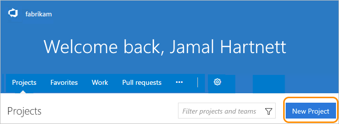

####Q:	Can I create more than one team project?

A:	Yes, multiple team projects help you keep work separate when 
you have development projects for different teams. 
Team Services currently supports one team project collection.

To create team projects, you'll need Team Services 
project collection administrator or account owner permissions. 

If you've [turned on the Account Landing preview](../connect/account-home-pages.md), 
go to your **Projects** page (```https://{youraccount}.visualstudio.com/_projects```).

**Projects page when Account Landing preview is turned on**



> [!NOTE]
> Eventually, the Projects page will be turned on by default, 
> so you can always go there to create new team projects.

Otherwise, go to your account home page (```https://{youraccount}.visualstudio.com```).

**Account home page**


> [!NOTE]
> Your account home page is associated with your team project collection, 
> and not any single team project or team. 
> Eventually, **Projects** page will replace the account home page. 
> so you can always go to the **Projects** page to create new team projects.
