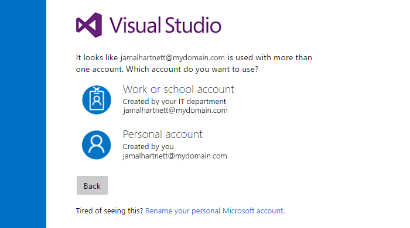

#### Q:	Why do I have to choose between a "work or school account" and my "personal account"?

A:	When you sign in with an email address (for example, jamalhartnett@fabrikam.com) that's shared by your personal Microsoft account and by your work account or school account, you need to choose which account to use. Although both identities use the same sign-in address, they're separate: they have different profiles, security settings, and permissions. When you sign in, you see a page that looks like the following example:

