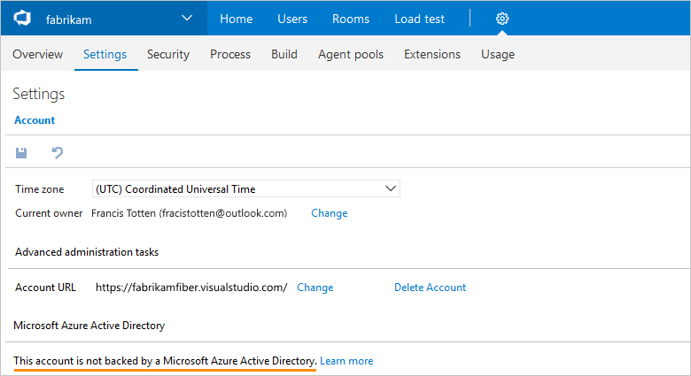

####Q:  How do I find out if my Team Services account controls access with Azure Active Directory (Azure AD)?

A:	If you have at least Basic access, here's how:

0.	Go your Team Services account settings.

	

0.	Under **Settings**, check if your account controls access with Azure AD.

	

	If your account is connected to your organization's directory, 
	this means that only users from your organization's directory can join your account.
	Learn about [controlling account access with Azure AD](https://www.visualstudio.com/docs/setup-admin/team-services/manage-organization-access-for-your-account-vs). 
