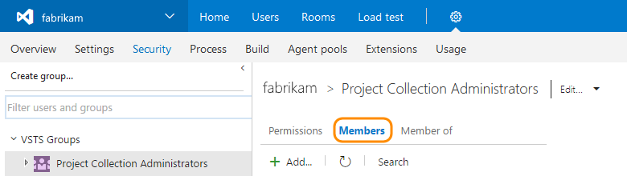

####Q:	How do I find a project collection administrator?

A: You can find your [project collection administrator](../security/set-project-collection-level-permissions.md) 
in your VSTS account's security settings.

	

Under **Security**, view your project collection administrators.

	