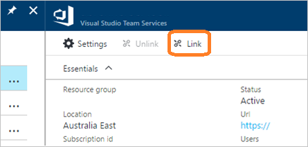

[//]: # (monikerRange: 'vsts')

#	Change Azure AD tenant -- connect your VSTS account to the target directory

**VSTS**

0. Select **Link** to link your VSTS account to the target Azure subscription.

  

0. Select your Azure subscription. 

  

0. Choose **Connect**.

  

0. Choose **Yes** to confirm.

  

0. Your account is now connected to your organization's directory.

  

0.	To check that you finished this task successfully, invite a user from the target directory 
to your VSTS account. Confirm that they can sign in. Learn how to 
[add users and assign access](add-account-users-assign-access-levels.md).

0.	Add the remaining users from the target directory to your VSTS account.

0.	If you use tools that run outside a web browser, like the Git command line tool, 
then your alternate credentials for those tools won't work anymore. 
You must [set up your credentials](http://support.microsoft.com/kb/2991274/en-us)
again for the VSTS account that you connected.

> [!div class="nextstepaction"]
> [Change Azure AD tenant: reassign VSTS account ownership to a directory member](change-azure-ad-vsts-account-reassign-owner.md)

