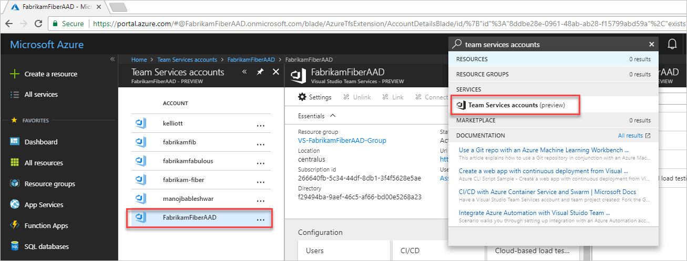

[//]: # (monikerRange: 'vsts')

# Quickstart: Buy cloud-based load testing in VSTS

**VSTS**

In this quickstart, you'll learn how to enable paid load testing.

VSTS offers a cloud-based solution for [load testing your apps](../test/load-test/index.md). You can create load tests using Visual Studio Ultimate 2013, Visual Studio Enterprise 2015, or later versions. You can then run these tests in VSTS.

Load tests are measured and billed in virtual user minutes (VUM) as described in  this Q&A: [What are virtual user minutes (VUMs)? How many minutes will my load test use?](../test/load-test/reference-qa.md#VUM).

If you don't have an Azure subscription, create a [free account](https://azure.microsoft.com/en-us/free/?WT.mc_id=A261C142F) before you begin.

## Prerequisites

Your VSTS organization includes a **Free Tier** of 20,000 virtual user minutes per month for cloud-based load testing.
If you need more than this amount, you must first do the following:

1. [Set up billing for your VSTS organization](set-up-billing-for-your-organization-vs.md).
2. [Enable paid cloud-based load testing](#buy-load-testing) in the [Azure portal](https://portal.azure.com) for your VSTS organization.

The first time that you set up billing for your VSTS organization - whether you do this via the Azure portal or as part of making a purchase in the Visual Studio Marketplace, you will need the following:

* [VSTS project collection administrator or organization owner permissions](vsts-billing-faq.md#find-owner)
* [The **owner** or **contributor** role on your Azure subscription](add-backup-billing-managers.md)

To make subsequent edits to paid quantities in your VSTS organization, you only need the owner or contributor role on your Azure subscription.

## Enable paid load testing

**Azure portal**

1. [Sign in to the Azure portal](https://portal.azure.com/).

   >If you experience browser problems with Azure, make sure that you use a [supported browser](https://azure.microsoft.com/documentation/articles/azure-preview-portal-supported-browsers-devices/).

2. Enter *team services organizations* into the search box, choose **team services organizations** from the dropdown menu, and select your VSTS organization.

   

3. Select **Cloud-based load testing**, to the right of your screen.

    

4. Move the toggle to **PAID** to turn on paid load testing.

    If you want, set a monthly limit on the virtual user minutes that you use by selecting an amount from the **PAID LOAD TESTING LIMIT** dropdown menu. When you're done, choose **Save**.

    

## Billing and free monthly usage

You're charged only for virtual user minutes of cloud-based load testing used above the Free Tier (20,000 virtual user minutes per month).

* The Free Tier resets on the 1st of the month.

* No additional virtual user minutes are included with Visual Studio subscriptions - the free amounts are per VSTS organization, not per user.

* For cloud-based load testing, you're charged for each 
   [virtual user minute](../test/load-test/reference-qa.md#VUM) that exceeds the free monthly usage.

* Graduated discounts for cloud-based load testing are calculated based on your Azure subscription billing cycle.

## Limits on load test runs

There's a limit on the duration for each test run. For cloud-based load testing, the limit depends on where you're running your test.  For details, see [this Q&A](../test/load-test/reference-qa.md#test-limits).

## Clean up resources

To turn off paid cloud-based load testing, go to your account in the Azure portal, choose **Cloud-based load testing**, move the toggle from PAID to **FREE**, and then choose **Save**.

## Next steps

> [!div class="nextstepaction"]
> [Load test your app](../test/load-test/get-started-simple-cloud-load-test.md)

## Related articles

* [VSTS pricing](https://azure.microsoft.com/pricing/details/visual-studio-team-services/)
* [VSTS billing support](https://visualstudio.microsoft.com/team-services/support/)
