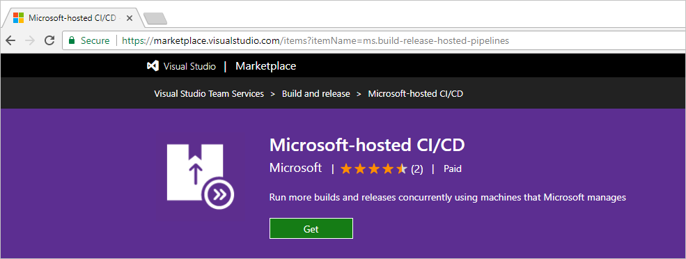
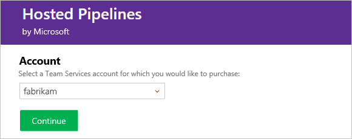
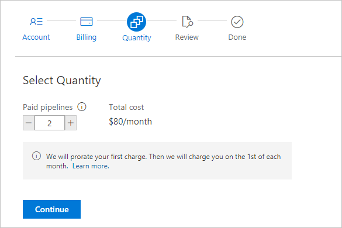
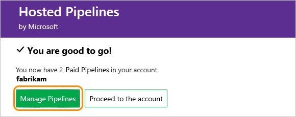
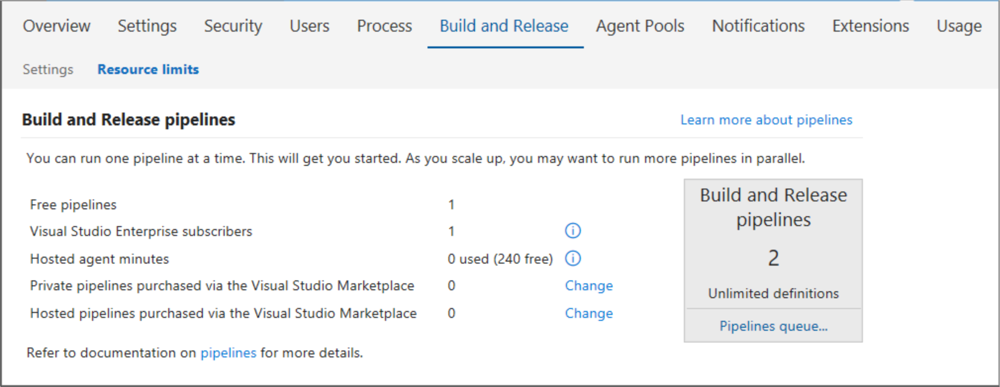

#  How to buy VSTS CI/CD

**VSTS**
<a name="buy-build-release"></a>

With VSTS you can run builds and deploy releases using the Microsoft-hosted CI/CD service, your own machines, or both. 
We offer a **Free Tier** for each.

## Microsoft-hosted CI/CD (formerly Hosted Pipelines)
Each VSTS starts out with the free tier of Microsoft-hosted CI/CD, which provides the ability to run one concurrent build or release job, for 
up to 4 hours per month. If you need to run more than 4 hours per month, or you need to run more than one job at a time, you can switch to 
paid Microsoft-hosted CI/CD. When you pay per concurrent job, there are no monthly time limits for your builds and releases, and the maximum 
runtime for a single job is increased from 30 minutes to 6 hours. With Microsoft-hosted CI/CD, the price includes 
all infrastructure that Microsoft runs (virtual machines, databases, storage, egress, etc.) to deliver this service.

[Buy Microsoft-hosted CI/CD for your account](https://marketplace.visualstudio.com/items?itemName=ms.build-release-hosted-pipelines)

## Self-hosted CI/CD (formerly Private Pipelines)
VSTS also offers you a way to run a Microsoft CI/CD agent on machines that you manage, whether your machines are on premises or in the cloud. 
The free tier is one concurrent job.
Typically you'll choose this option when:
* there is custom software that runs in your build process which is not included in the Microsoft-hosted option above, or
* you already have a TFS build server running, and aren't ready to move your build definitions to VSTS.

[Buy self-hosted CI/CD](https://marketplace.visualstudio.com/items?itemName=ms.build-release-private-pipelines)

## Before you start

The first time that you set up billing for your VSTS account--whether you do this via the Azure portal or as part of making a purchase in the Visual Studio Marketplace, you will need:

0. [VSTS project collection administrator or account owner permissions](../accounts/faq-add-delete-users.md#find-owner)
0. [The **owner** or **contributor** role on your Azure subscription](add-backup-billing-managers.md)

You will also need these same permissions/roles to make subsequent changes, such as changing paid quantities or adding additional paid services in your VSTS account.

## Buying process

0.  As VSTS project collection administrator or account owner,
sign in to either:

  *  [**Visual Studio Marketplace** > **Build and release** > **Hosted pipelines for Build and Release**](https://marketplace.visualstudio.com/items?itemName=ms.build-release-hosted-pipelines)
  *  [**Visual Studio Marketplace** > **Build and release** > **Private pipelines for Build and Release**](https://marketplace.visualstudio.com/items?itemName=ms.build-release-private-pipelines)<p/>

0.  Choose **Get**

  

0.  Select your VSTS account, if you have multiple accounts.

  

  <p><a data-toggle="collapse" href="#expando-why-no-ts-account">Don't see your VSTS accounts? &#x25BC;</a></p>
  <div class="collapse" id="expando-why-no-ts-account">
  <p>To select your VSTS account here, you must have have VSTS
  [project collection administrator or account owner permissions](faq-pay-for-basic-users.md#FindOwnerPCA).
  </div>

0.  Confirm the Azure subscription that you'll use for billing (you'll only see this the first time you set up billing).

  If you have multiple Azure subscriptions,
  select the Azure subscription that you want to use.
  Or if you don't have an Azure subscription,
  create a new subscription now to use for billing.
  [More about Azure subscriptions for billing](faq-pay-for-basic-users.md#billing)

  

  <p><a data-toggle="collapse" href="#expando-why-no-azure-sub">Don't see the Azure subscription that you expect? &#x25BC;</a></p>
  <div class="collapse" id="expando-why-no-azure-sub">
  <p>To use an existing Azure subscription for billing,
  you'll need at least co-administrator permissions for that subscription.
  If you don't have permissions,
  have an Azure Account Administrator or Service Administrator
  [add you as a Co-administrator to the linked Azure subscription](add-backup-billing-managers.md).
  </div>

0.  Select the number of concurrent jobs that you want to buy.
Finish your purchase.

  

0.  To view your current CI/CD capacity, go to your VSTS account.

  

  

  To return to the Build & Release hub in
  your VSTS account at any time,
  go to your VSTS account toolbar,
  then go to **Build and Release**
  (```https://{youraccount}.visualstudio.com/_admin/_buildQueue?_a=resourceLimits```).

<a name="change-paid-pipelines"></a>
## Change your CI/CD capacity

When your team's needs for build or release capacity changes, you can change the number of paid concurrent jobs.

0.  Go to your VSTS account toolbar,
then go to **Build and Release**
(```https://{youraccount}.visualstudio.com/_admin/_buildQueue?_a=resourceLimits```).

  

0.  Choose **Change purchased quantity**
for the paid pipeline that you want to update,
so you can go to the Visual Studio Marketplace.

0.  In the Visual Studio Marketplace,
choose **Buy**, select your VSTS account,
then update your number of paid pipelines.


## Related notes  

- [Build your app](../build-release/apps/index.md)
- [Understanding CI/CD in VSTS](../build-release/concepts/licensing/concurrent-pipelines-ts.md)
- [Understanding CI/CD in Team Foundation Server](../build-release/concepts/licensing/concurrent-pipelines-tfs.md)
- [Marketplace support](../marketplace/marketplace-billing-qa.md)  


## Limits on builds and releases

Your free hosted pipeline includes 4 hours per month
for builds and releases with a maximum duration of 30 minutes per build or deployment.
A paid hosted pipeline increases your maximum duration to 6 hours per build or deployment.


## Billing and free monthly limits

You're charged only for services used above the free monthly limits. Your charges are prorated during the first 
month. After that, you're billed automatically on the 1st day of the calendar month.

*  Free minutes reset on the 1st of the month.

*  Each paid hosted pipeline or private pipeline
includes unlimited minutes per month, within reason.

*  Each connected private XAML controller is counted as one private pipeline,
although a private XAML controller can host more than one agent.

*  For cloud-based load testing, you're charged for each
   [virtual user minute](../load-test/reference-qa.md#VUM).

*   Graduated discounts cloud-based load testing
are calculated based on your Azure subscription billing cycle.

Learn more about [pricing here](https://www.visualstudio.com/team-services/pricing).


## Support

Try the [VSTS forum](https://social.msdn.microsoft.com/Forums/en-us/home?forum=TFService)
or [VSTS Support](https://www.visualstudio.com/team-services/support).

## Additional resources
[Build & Release task-based services](../build-release/concepts/licensing/concurrent-pipelines-ts.md)
[VSTS: Build & Release pipelines](../build-release/concepts/licensing/concurrent-pipelines-ts.md)
[TFS: Build & Release pipelines](../build-release/concepts/licensing/concurrent-pipelines-tfs.md)
[Pricing for Build & Release pipelines](https://www.visualstudio.com/team-services/pricing)


## XAML Build
The hosted XAML build controller is no longer supported.
  Accounts created on or after April 2016 do not have access to it.
  We plan to remove the hosted XAML build controller from all accounts on July 1 2017.

  > **Important:** If you have an account where you still need to run [XAML builds](https://msdn.microsoft.com/en-us/library/ms181709%28v=vs.120%29.aspx),
  > you should set up an [on-premises build server](https://msdn.microsoft.com/en-us/library/ms252495%28v=vs.120%29.aspx)
  > and switch to an [on-premises build controller](https://msdn.microsoft.com/en-us/library/ee330987%28v=vs.120%29.aspx) now.
  > If you used the hosted XAML build controller, you may have been paying for build minutes, which is a model we no longer support.
  > Please purchase concurrent pipelines. See [Buy pipelines for Build & Release](#buy-build-release).
  > We will soon block the hosted pool from using the per-minute billing model.
  > By making this switch, you can run longer builds (unlimited minutes within reason).