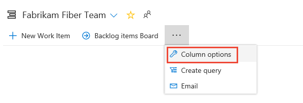
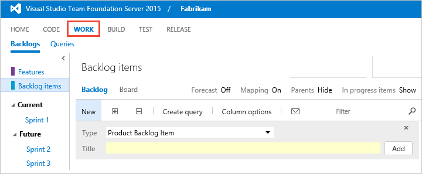
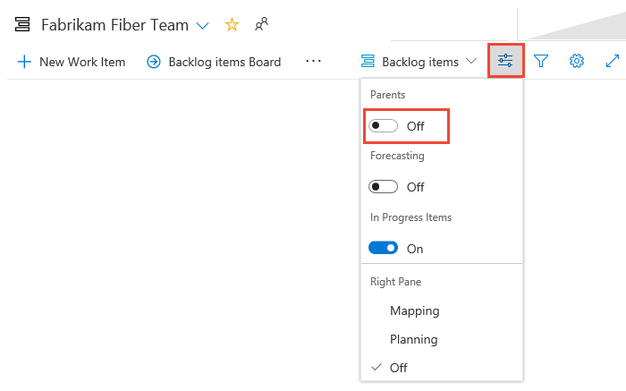
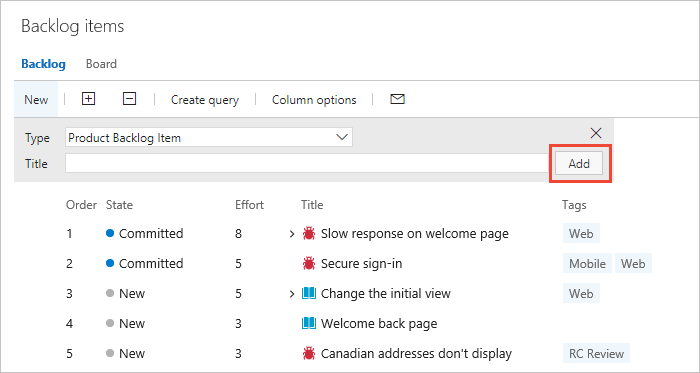

# Create your backlog

[!INCLUDE [temp](../_shared/version-vsts-tfs-all-versions.md)]

Your product backlog corresponds to your project plan, the roadmap for what your team plans to deliver. 
Once defined, you have a prioritized list of features and requirements to build. Your backlog also provides a 
repository of all the information you need to track and share with your team.

Your backlog consists of a list of [work items](add-work-items.md). 
You use work items to share information, assign work to team members, track dependencies, organize work, 
and more. Because the most important work appears at the top of the list, your team always knows what to work on next.

> [!NOTE]  
> Your product backlog is one of three classes of backlogs available to you. For an overview of the features supported on each backlog and the two types of boards, see [Backlogs, boards, and plans](backlogs-boards-plans.md).   


[!INCLUDE [temp](../_shared/prerequisites.md)]

## Open your backlog from the web portal

From your web browser, open your product backlog.  

[!INCLUDE [temp](../../_shared/new-navigation.md)] 

# [New navigation](#tab/new-nav)

::: moniker range="vsts"

0. (1) Check that you have selected the right project, (2) choose **Work>Backlogs**, and then (3) select the correct team from the team selector menu. 

	

	To choose another team, open the selector and select a different team or choose the  **Browse all sprints** option. Or, you can enter a keyword in the search box to filter the list of team backlogs for the project.

	> [!div class="mx-imgBorder"]  
	>  

	> [!TIP]    
	> Choose the  star icon to favorite a team backlog. Favorited artifacts ( favorited icon) appear at the top of the team selector list. 

0. Check that you have selected **Backlog items** (for Scrum), **Stories** (for Agile), or **Requirements** (for CMMI) as the backlog level. 

	> [!div class="mx-imgBorder"]  
	>  

0. (Optional) To choose which columns should display and in what order, choose the  actions icon and select **Column options**. To learn more, see [Change column options](../backlogs/set-column-options.md). 

	> [!div class="mx-imgBorder"]  
	>  

::: moniker-end

::: moniker range=">= tfs-2013 <= tfs-2018"

[!INCLUDE [temp](../_shared/new-agile-hubs-feature-not-supported.md)] 

::: moniker-end


# [Previous navigation](#tab/previous-nav)

::: moniker range=">= tfs-2017"

From your web browser, open your team's product backlog. (1) Select the team from the project/team selector, choose (2) **Work**, (3) **Backlogs**, and then (4) the product backlog, which is **Backlog items** (for Scrum), **Stories** (for Agile), or **Requirements** (for CMMI). 

> [!div class="mx-imgBorder"]
>  

To choose another team, open the project/team selector and select a different team or choose the **Browse** option. 

> [!div class="mx-imgBorder"]  
>  
	
::: moniker-end
::: moniker range=">= tfs-2013 <= tfs-2015"

From your web browser, open your team's product backlog. Select **Work>Backlogs**. 



::: moniker-end


---


## Determine if bugs should appear on your backlog 

You have a choice as to how you want to manage bugs. Some teams like to track bugs along with requirements on the backlog. Other teams like to track bugs as tasks performed in support of a requirement, and have them appear on their [task board](../sprints/task-board.md).

If you're using the Scrum process, your default setup is to track bugs along with PBIs. However, if you're working in a project based on the [Agile or CMMI processes](../work-items/guidance/choose-process.md), bugs don't automatically appear on your backlog.

Talk with your team to determine how they want to manage bugs and then [change your team settings](../../organizations/settings/show-bugs-on-backlog.md) accordingly.

> [!NOTE]    
> Because this setting affects all team members' view of the team backlogs and boards, you must be a team administrator to change the setting. Changing the setting is disabled if you're not a team administrator. Go [here to get added as a team administrator](../../organizations/settings/add-team-administrator.md).
	
# [New navigation](#tab/new-nav)

::: moniker range="vsts"

0. From your team's backlog page, choose the  gear icon to open the common configuration team settings. 

	> [!div class="mx-imgBorder"]  
	>  

0. Choose the **Working with bugs** tab and select from the three options available.

	> [!div class="mx-imgBorder"]  
	>  

	* Choose the first option when your team wants to manage bugs similar to requirements. Bugs can be estimated and tracked against team velocity and cumulative flow. Bugs will be associated with the Requirements category.  

	* Choose the second option when your team wants to manage bugs similar to tasks. Remaining work can be tracked for bugs and tracked against the sprint capacity and burndown. Bugs will be associated with the Task category. 

	* Choose the last option if your team manages bugs separate from requirements or tasks. Bugs will be associated with the Bugs category. 

0. To see the changes, refresh your backlog.
::: moniker-end

::: moniker range=">= tfs-2013 <= tfs-2018"

[!INCLUDE [temp](../_shared/new-agile-hubs-feature-not-supported.md)] 

::: moniker-end


# [Previous navigation](#tab/previous-nav)

1. From your team's backlog page, choose the  gear icon to open the common configuration team settings.  
	::: moniker range=">= tfs-2017"   
	  
	::: moniker-end
	::: moniker range="tfs-2015"  
	**TFS 2015.1**   
	  
	**TFS 2015**  
	Click the , (gear icon) to open the administration page.  

	

	From the Overview tab, choose the team whose settings you want to configure, and then click **Settings**.  
	::: moniker-end
	::: moniker range="tfs-2013"
	Choose the  gear icon to open the administration page. Requires TFS 2013.4 or later version.  

	  

	From the Overview tab, choose the team whose settings you want to configure, and then choose **Settings**.  
	::: moniker-end  

2. Choose the **Working with bugs** tab and select from the three options available.  
	::: moniker range=">= tfs-2018"  
	> [!div class="mx-imgBorder"]  
	>   
	::: moniker-end
	::: moniker range="tfs-2017"  
	
	::: moniker-end
	::: moniker range=">= tfs-2013 <= tfs-2015"  
	
	::: moniker-end 
	* Choose the first option when your team wants to manage bugs similar to requirements. Bugs can be estimated and tracked against team velocity and cumulative flow. Bugs will be associated with the Requirements category.  

	* Choose the second option when your team wants to manage bugs similar to tasks. Remaining work can be tracked for bugs and tracked against the sprint capacity and burndown. Bugs will be associated with the Task category. 

	* Choose the last option if your team manages bugs separate from requirements or tasks. Bugs will be associated with the Bugs category. 

0. To see the changes, refresh your backlog.

---

> [!TIP]  
> If, after refreshing a backlog or board, you don't see bugs where you expect them, review [How backlogs and boards display hierarchical (nested) items](resolve-backlog-reorder-issues.md). Only leaf nodes of nested items will appear on the Kanban or task boards.  


## Convert ideas into backlog items or stories

Your backlog shows work that you are planning to do or have started working on. As soon as the State of a work item is set to Done or Completed, the work item no longer shows up on your backlog. You can use the [backlog controls](product-backlog-controls.md) to filter or change your view. 

> [!TIP]  
> If you've already defined a long list of items, you don't have to reenter them one at a time. Instead, use [Microsoft Excel](../backlogs/office/bulk-add-modify-work-items-excel.md) to quickly import them to your backlog.

# [New navigation](#tab/new-nav)

::: moniker range="vsts"

0. Before you start adding work items, choose the  view options icon and turn the slider for **Parents** and **Forecasting** to Off.  

	> [!div class="mx-imgBorder"]
	>  

0. To add a work item, choose the **New Work Item**, enter a title and then press the Enter key or choose **Add to top**. 

	> [!div class="mx-imgBorder"]
	>  

0. Repeat this step to capture all your ideas as work items.  

::: moniker-end

::: moniker range=">= tfs-2013 <= tfs-2018"

[!INCLUDE [temp](../_shared/new-agile-hubs-feature-not-supported.md)] 

::: moniker-end


# [Previous navigation](#tab/previous-nav)

Begin building your backlog by entering a title and click **Add**. If you don't see the **Add** link, click **New** to open the quick add panel. Repeat this step until you've captured all your main ideas. 

 

---

> [!NOTE]  
> Depending on the process chosen to create your project&mdash;[Agile](../work-items/guidance/agile-process.md), [Scrum](../work-items/guidance/scrum-process.md), or [CMMI](../work-items/guidance/cmmi-process.md)&mdash;
the items in your backlog may be called product backlog items (PBIs), user stories, or requirements. All three are similar: they describe the customer value to be delivered and the work to be performed.   
>
>By default, PBIs and bugs appear on Scrum backlogs, user stories on Agile backlogs, and requirements on CMMI backlogs. 

<a id="move-items-priority-order">  </a>
## Move items into priority order
After you've got some items on your backlog, you can reorder them to create a prioritized list of work. Frequently reviewing and prioritizing your backlog can help your team know what's most important to deliver next.

Reorder your backlog by simply dragging work items. Or, if you prefer the keyboard, hold the Alt key and use the up and down arrows.

> [!div class="mx-imgBorder"]
> 


> [!TIP]  
> You can't sort your backlog on a column. If you want to view a sorted listed, click **Create query**, save and open the query, and then sort the query results. To learn more about queries, see [Use the query editor to list and manage queries](../queries/using-queries.md).


<a id="estimates">  </a>
## Add details and estimates
Getting your backlog built and prioritized provides the high level roadmap. 
However, before your team can actually start work on any item, they'll need 
more details. You capture these details within the work item form.

> [!TIP]  
> To plan a sprint, at a minimum you should estimate the effort involved to implement each backlog item. You capture effort in the following fields within the work item form: Effort (Scrum), Story Points (Agile), or Size (CMMI) fields. 

Open each item (double-click, or press Enter to open the selected item) and add all the info you want to track. Enter as much detail as the team needs to understand the scope, estimate the work required, develop tests, and ensure that the end product meets acceptance criteria.  

> [!div class="mx-imgBorder"]  
>  

<table valign="top" width="100%">
<tbody valign="top" >
<tr>
<th width="20%">Field</th>
<th width="80%">Usage</th>
</tr>
<tr>
<td>[Effort](../queries/query-numeric.md)<br/>
[Story Points](../queries/query-numeric.md)<br/>
[Size](../queries/query-numeric.md)</td> 
<td>
<a name="estimates"></a>
<p>Provide a relative estimate of the amount of work required to complete a PBI. For user stories and requirements, you capture estimates in the Story Points and Size fields.</p> 
<p>Most Agile methods recommend setting estimates for backlog items based on relative size of work. Such methods include powers of 2 (1, 2, 4, 8) and the Fibonacci sequence (1, 2, 3, 5, 8, etc.). Use any numeric unit of measurement your team prefers. </p>
<p>The estimates you set for Effort, Size, or Story Points are used in calculating [velocity](../../report/dashboards/velocity-chart-data-store.md) and [forecasting sprints](../sprints/forecast.md).</p>
</td> 
</tr>

<tr>
<td>[Business Value](../queries/query-numeric.md)</td> 
<td>Specify a priority that captures the relative value of a PBI compared to other PBIs. The higher the number, the greater the business value.<br />Use this field when you want to capture a priority separate from the changeable backlog stack ranking.</td> 
</tr>

<tr>
<td>[Description](../queries/titles-ids-descriptions.md)</td> 
<td>Provide enough detail to create shared understanding of scope and to support estimation efforts. Focus on the user, what they want to accomplish, and why. Don't describe how to develop the product. Do provide sufficient details so that your team can write tasks and test cases to implement the item.</td> 
</tr>

<tr>
<td>[Acceptance Criteria](../queries/titles-ids-descriptions.md) </td> 
<td><p>Define what "Done" means by describing the criteria that the team should use to verify whether the PBI or the bug fix has been fully implemented.</p>
<p>Before work begins on a PBI or bug, describe the [criteria for customer acceptance](best-practices-product-backlog.md#acceptance) as clearly as possible. Conversations between the team and customers to determine the acceptance criteria help ensure a common understanding within the team to meet customers' expectations. Also, this info provides the basis for acceptance testing.</p></td> 
</tr>

</tbody>
</table>
 

## Try this next
Now that you've got a working backlog in place, your team can begin work on the top priority items. From here, it's time to make the decision on how you want to work as a team: Scrum or Kanban? You can use these methods independently or together.

> [!div class="nextstepaction"]
> [Scrum: Schedule sprints](../sprints/define-sprints.md) or [Kanban](../boards/kanban-quickstart.md) 

Teams that want the least overhead in terms of tracking and estimating may prefer Kanban. Teams that like to work at a steady cadence and plot the details of their sprint plan may prefer Scrum and sprint planning.

<!---
With [Kanban](../boards/kanban-basics.md), teams focus on the flow of work from start to finish - limiting work in progress in order to optimize flow and deliver the highest priority items as quickly as possible.

With [Sprint planning](../sprints/assign-work-sprint.md), teams define a sprint schedule: a time-boxed set of periods for planning and developing. Using the sprint backlog, they plan their sprints by assigning items to the sprint and defining the tasks required to develop each item. Task boards, capacity charts, and sprint burndown charts all help to keep the team aware of progress throughout the sprint cycle.
-->

> [!NOTE]  
>Depending on the process chosen to create your project&mdash;[Agile](../work-items/guidance/agile-process.md), [Scrum](../work-items/guidance/scrum-process.md), or [CMMI](../work-items/guidance/cmmi-process.md)&mdash;
the items in your backlog may be called product backlog items (PBIs), user stories, or requirements. All three are similar: they describe the customer value to be delivered and the work to be performed.   
>
>By default, PBIs and bugs appear on Scrum backlogs, user stories on Agile backlogs, and requirements on CMMI backlogs. Each team can [choose how they want to treat bugs: either as requirements or tasks](../../organizations/settings/show-bugs-on-backlog.md). 


## Related articles

- [Groom your backlog](best-practices-product-backlog.md)  
- [Product backlog controls](product-backlog-controls.md)
- [Filter product and portfolio backlogs ](filter-backlogs.md)
- [Backlog priority or stack rank order](stack-rank-backlog-position.md)
- [Backlog keyboard shortcuts](backlogs-keyboard-shortcuts.md)


<!---

The URL follows this pattern: ```https://<OrganizationName>.visualstudio.com/DefaultCollection/<project name>/_backlogs```  
 
### TFS
  

The URL follows this pattern:
```http://{server}:8080/tfs/DefaultCollection/{project name}/_backlogs```

If you don't see the team or project you want, open the project/team drop-down menu and select the project/team that you've recently visited, or choose **Browse all** to browse all projects and teams. 

 

Building your backlog starts by quickly capturing the requirements you want for your product. If you don't have a project yet, create one in [VSTS](../../organizations/accounts/set-up-vs.md) or set one up in an [on-premises TFS](../../organizations/projects/create-project.md).    

-->


<!---

> [!NOTE]  
><b>Feature availability: </b>From the web portal for VSTS and TFS 2017, you'll have access to the [new form with the new work tracking experience](../backlogs/add-work-items.md). For TFS 2015 and earlier versions, the old form is supported.   
	
<p>For details on adding work items using the new form, see [add work items](add-work-items.md).</p>  

  
 
<p>For details on adding work items using the old form, see [add work items (TFS)](add-work-items.md).</p>  

   
-->


