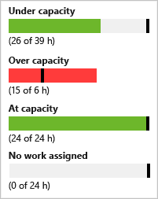
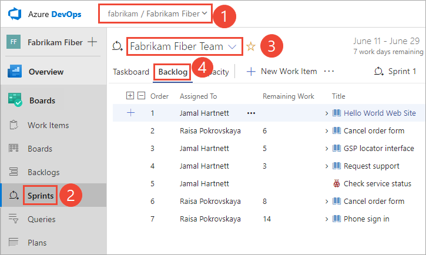
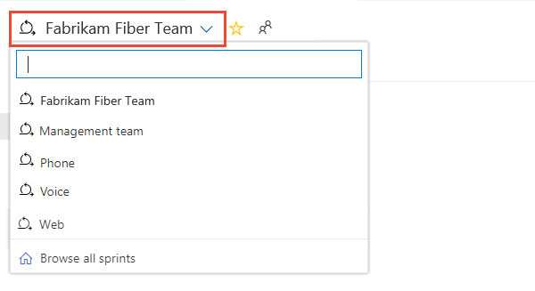
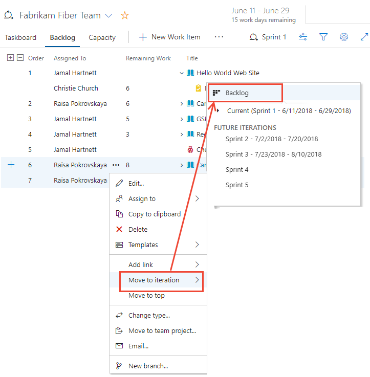
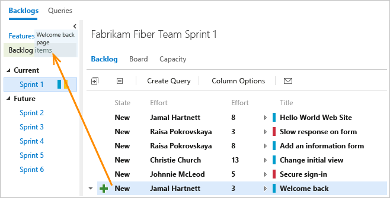

# 4. Adjust work to fit sprint capacity

[!INCLUDE [temp](../../_shared/version-vsts-tfs-all-versions.md)] 

After you've defined all the tasks for all the sprint backlog items, you'll want to check whether your team is at or over capacity. If under capacity, you can consider adding more items onto the sprint. If over capacity, you'll want to remove items out of the backlog.  

Next, check whether any team member is under, at, or over capacity. Or, if someone hasn't even been assigned any work. Use the capacity bars to make these determinations. If you haven't yet [set capacity for your team](set-capacity.md), do that now.

  

> [!div class="checklist"]   
> * Adjust your sprint plan if your team is over or under capacity    
> * Load balance work across your team 
> * Quickly reassign tasks to another team member    

[!INCLUDE [temp](../_shared/prerequisites.md)]

## Open a Sprint backlog for a team 

[!INCLUDE [temp](../../_shared/new-navigation.md)] 

# [New navigation](#tab/new-nav)

::: moniker range="vsts"

0. From your web browser, open the sprint backlog for your team. (1) Check that you have selected the right project, (2) choose **Work>Sprints**, (3) select the correct team from the team selector menu, and lastly (4), choose **Backlog**. 

	

	To choose another team, open the selector and select a different team or choose the  **Browse all sprints** option. Or, you can enter a keyword in the search box to filter the list of team backlogs for the project.

	> [!div class="mx-imgBorder"]  
	>  

0. To choose a different sprint than the one shown, open the sprint selector and choose the sprint you want. 

	> [!div class="mx-imgBorder"]  
	> 

	The system lists only those sprints that have been selected for the current team focus. If you don't see the sprints you want listed, then choose **New Sprint** from the menu, and then choose **Select existing iteration**. For details, see [Define iteration paths (aka sprints)](../../organizations/settings/set-iteration-paths-sprints.md). 

::: moniker-end

::: moniker range=">= tfs-2013 <= tfs-2018"

[!INCLUDE [temp](../_shared/new-agile-hubs-feature-not-supported.md)] 

::: moniker-end

# [Previous navigation](#tab/previous-nav)

0. From your web browser, open your team's product backlog. (1) Select the team from the project/team selector, choose (2) **Work**, (3) **Backlogs**, and then (4) the product backlog, which is **Backlog items** (for Scrum), **Stories** (for Agile), or **Requirements** (for CMMI). 

	> [!div class="mx-imgBorder"]
	>  

	To choose another team, open the project/team selector and select a different team or choose the **Browse** option. 

	> [!div class="mx-imgBorder"]  
	>  

	The set of sprints selected for your team appears in the left pane. If you don't see any sprints listed, you can add sprints or select existing sprints for your team's use. To learn how, see [Define sprints](define-sprints.md). 

0. Choose the sprint you want to plan. 

	> [!div class="mx-imgBorder"]  
	> 

	The system lists only those sprints that have been selected for the current team focus. If you don't see the sprints you want listed, then see [Define iteration paths (aka sprints)](../../organizations/settings/set-iteration-paths-sprints.md). 

---

## Check your team capacity 

To view capacity charts, you'll want to turn **Work details** on for a sprint.

# [New navigation](#tab/new-nav)

::: moniker range="vsts"

> [!div class="mx-imgBorder"]  
> 

::: moniker-end

::: moniker range=">= tfs-2013 <= tfs-2018"

[!INCLUDE [temp](../_shared/new-agile-hubs-feature-not-supported.md)] 

::: moniker-end

# [Previous navigation](#tab/previous-nav)

> [!div class="mx-imgBorder"]  
> 

---

## Team over capacity: move items out of the sprint

If your team's over capacity, you can move items from the sprint backlog back to the product backlog. This will reset the Iteration Path to the default set for your team. Or, you can move the item into the next sprint your team will work in. All the tasks that you've defined for that item will move with the backlog items.   

# [New navigation](#tab/new-nav)

::: moniker range="vsts"

Here we select two items at the bottom of the sprint backlog, open the  action icon for one of the items, choose **Move to iteration**, and then select **Backlog**. 

> [!div class="mx-imgBorder"]  
> 

::: moniker-end

::: moniker range=">= tfs-2013 <= tfs-2018"

[!INCLUDE [temp](../_shared/new-agile-hubs-feature-not-supported.md)] 

::: moniker-end
# [Previous navigation](#tab/previous-nav)

Here we select the last item in the sprint backlog and drag it to the product backlog. 

  

---

> [!TIP]    
> Dragging a backlog item to the backlog or another sprint reassigns all child tasks to the same iteration path. 
> Also, you can multi-select several items and drag them to the backlog or another sprint. 

## Load balance work across the team

To quickly reassign tasks, drag the task onto the new assignee's capacity bar. As you reassign tasks, capacity bars automatically update.  

 

## Try this next
> [!div class="nextstepaction"]
> [5. Share your sprint plan](share-plan.md) 