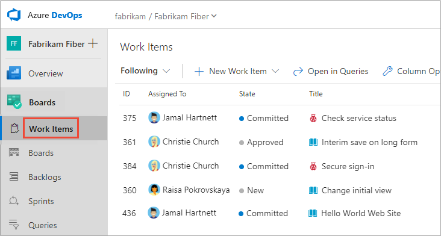
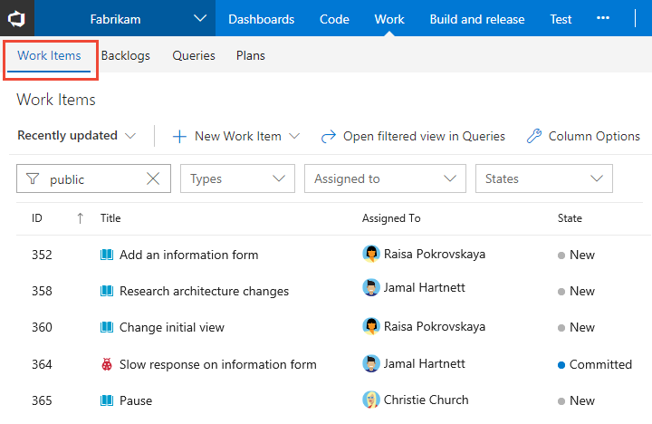
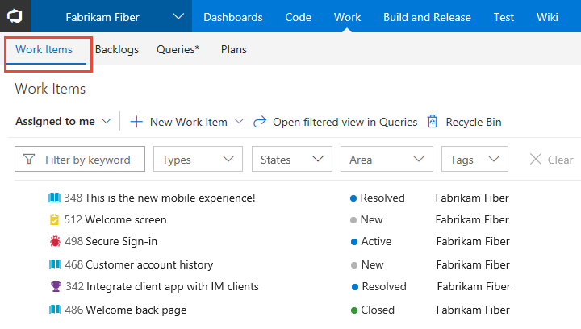
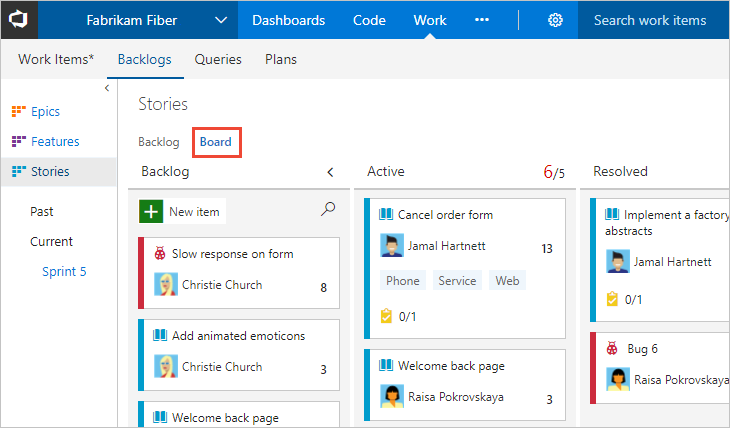
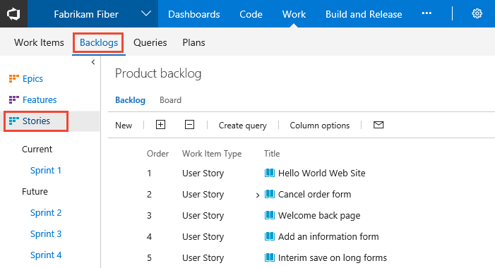
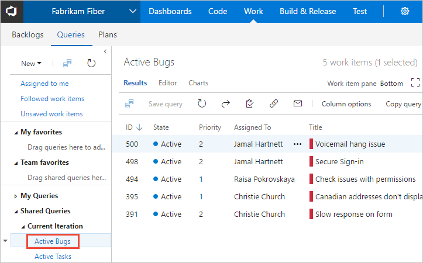
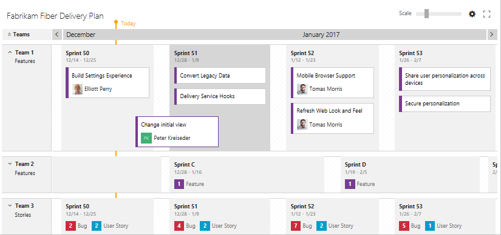

# About Agile tools  

[!INCLUDE [temp](../_shared/version-vsts-tfs-all-versions.md)]

Agile, a term coined in 2001 in the [Agile Manifesto](http://agilemanifesto.org), encompasses approaches to software development that emphasize incremental delivery, team collaboration, continual planning, and continual learning. The set of Agile tools that VSTS and TFS provides are available are designed to support teams working with Agile methodologies, such as Kanban and Scrum. To learn more, see [What is Agile?](/azure/devops/agile/what-is-agile).

All tools support viewing and defining work items. Each work item represents an object stored in the work item data store. Each work item is assigned a unique identifier, an ID, which is unique within an account or project collection. 

Your Agile tool set, available from **Work**, consists of the following main interactive lists and signboards. Each of these pages provide a filtered set of work items. 

[!INCLUDE [temp](../../_shared/new-navigation.md)] 

# [New navigation](#tab/new-nav)

::: moniker range="vsts"
- **Work items**: Use to quickly find work items assigned to you or pivot or filter work items based on other criteria  
- **Boards**: Use to implement Kanban practices and visualize the flow of work for a team 
- **Backlogs**: Use to plan, prioritize, and organize the work for a team to do within a product or portfolio backlogs  
- **Sprints**: Use to plan work for a team to perform during a specific time frame referred to as a sprint 
- **Queries**: Use to define a set of filter criteria to list work items for the purposes of sharing with others or performing bulk updates 
- **Plans**: Use to review the schedule of stories or features your teams plan to deliver. Plans show scheduled work items defined assigned to sprints (iteration path) of selected teams against a calendar view. 
::: moniker-end

::: moniker range=">= tfs-2013 <= tfs-2018"
[!INCLUDE [temp](../_shared/new-agile-hubs-feature-not-supported.md)] 
::: moniker-end

# [Previous navigation](#tab/previous-nav)

::: moniker range=">= tfs-2018"
- **Work items**: Use to quickly find work items assigned to you or pivot or filter work items based on other criteria  
- **Backlogs**: Which provide access to: 
	- **Product and Portfolio backlogs**: Use to plan, prioritize, and organize the work for a team to do within a product or portfolio backlogs  
	- **Boards**: Use to implement Kanban practices and visualize the flow of work for a team 
	- **Sprint backlogs**: Use to plan work for a team to perform during a specific time frame referred to as a sprint 
- **Queries**: Use to define a set of filter criteria to list work items for the purposes of sharing with others or performing bulk updates 
- **Plans**: Use to review the schedule of stories or features your teams plan to deliver. Plans show scheduled work items defined assigned to sprints (iteration path) of selected teams against a calendar view. 
::: moniker-end

::: moniker range="tfs-2017"

- **Backlogs**: Which provide access to: 
	- **Product and Portfolio backlogs**: Use to plan, prioritize, and organize the work for a team to do within a product or portfolio backlogs  
	- **Boards**: Use to implement Kanban practices and visualize the flow of work for a team 
	- **Sprint backlogs**: Use to plan work for a team to perform during a specific time frame referred to as a sprint 
- **Queries**: Use to define a set of filter criteria to list work items for the purposes of sharing with others or performing bulk updates 
- **Plans**: Use to review the schedule of stories or features your teams plan to deliver. Plans show scheduled work items defined assigned to sprints (iteration path) of selected teams against a calendar view. 
::: moniker-end

::: moniker range=">= tfs-2013 <= tfs-2015"

- **Backlogs**: Which provide access to: 
	- **Product and Portfolio backlogs**: Use to plan, prioritize, and organize the work for a team to do within a product or portfolio backlogs  
	- **Boards**: Use to implement Kanban practices and visualize the flow of work for a team 
	- **Sprint backlogs**: Use to plan work for a team to perform during a specific time frame referred to as a sprint 
- **Queries**: Use to define a set of filter criteria to list work items for the purposes of sharing with others or performing bulk updates 
::: moniker-end

---

## Teams and Agile tools
A team refers to a group of project members that work in a particular product area. Those areas are represented as **area paths**, hierarchical paths denoting the possible areas of ownership in an organization. A team is defined by a name, its members, and its area paths.

These Agile tool&mdash;**Boards**, **Backlogs**, **Sprints**, and **Plans**&mdash;rely on team configurations. For example, if you want to add a Kanban board or product backlog, you define a team. For more information on teams, see [About teams and Agile tools](../../organizations/settings/about-teams-and-settings.md). 

::: moniker range="vsts"   
Your view and options available will differ somewhat depending on if you have [enabled the New Navigation feature](../../project/navigation/preview-features.md), which displays a vertical navigation interface along with several changes to navigation of Agile tools. 

::: moniker-end 

## Work Items and work item types

Open **Work Items** to access several personalized pivots and filter functions to focus on work items you care about. You can quickly find work items assigned to you, that you're following, or have viewed or modified recently&mdash;event when defined for different teams and projects. To learn more, see [View and add work items](view-add-work-items.md). 

# [New navigation](#tab/new-nav)
::: moniker range="vsts"
> [!div class="mx-imgBorder"]  
> 
::: moniker-end

::: moniker range=">= tfs-2013 <= tfs-2018"
[!INCLUDE [temp](../_shared/new-agile-hubs-feature-not-supported.md)] 
::: moniker-end

# [Previous navigation](#tab/previous-nav)

::: moniker range="vsts"   
> [!div class="mx-imgBorder"]
> 

::: moniker-end

::: moniker range="tfs-2018"

> [!div class="mx-imgBorder"]
> 

::: moniker-end   

::: moniker range=">=tfs-2013 <= tfs-2017"

The Work Items tab isn't an available feature for TFS 2017 and earlier versions.  
::: moniker-end   
---
 

## Boards 

Boards present work items as cards and support quick status updates through drag-and-drop, similar to sticky notes on a physical whiteboard. Each board supports many Kanban practices such as defining columns and swimlanes, setting Work-in-Progress (WIP) limits, defining the Definition of Done, and more. To get started, see [Kanban quickstart](../boards/kanban-quickstart.md). 

# [New navigation](#tab/new-nav)
::: moniker range="vsts"
   

::: moniker-end

::: moniker range=">= tfs-2013 <= tfs-2018"
[!INCLUDE [temp](../_shared/new-agile-hubs-feature-not-supported.md)] 
::: moniker-end 

# [Previous navigation](#tab/previous-nav)

::: moniker range=">= tfs-2017"   
     
::: moniker-end   
::: moniker range=">= tfs-2013 <= tfs-2015"    
> [!div class="mx-imgBorder"]  
>        
::: moniker-end   

---

## Backlogs

Backlogs present work items as lists. A product backlog represents your project plan, the roadmap for what your team plans to deliver. Your backlog also provides a repository of all the information you need to track and share with your team. Portfolio backlogs allow you to group and organize your backlog into a hierarchy. To get started, see [Create your backlog](../backlogs/create-your-backlog.md). 

# [New navigation](#tab/new-nav)
::: moniker range="vsts"
    
::: moniker-end

::: moniker range=">= tfs-2013 <= tfs-2018"
[!INCLUDE [temp](../_shared/new-agile-hubs-feature-not-supported.md)] 
::: moniker-end 

# [Previous navigation](#tab/previous-nav)

::: moniker range=">= tfs-2017"

::: moniker-end
::: moniker range=">= tfs-2013 <= tfs-2015"

::: moniker-end

---

## Sprints

Sprint backlogs and taskboards provide a filtered view of work items a team has assigned to a specific iteration path, or sprint. Sprints are defined for a project and then selected by teams. From your backlog, you can map work to an iteration path using drag-and-drop, and then view that work in a separate **sprint backlog**. 

# [New navigation](#tab/new-nav)
::: moniker range="vsts"
    
::: moniker-end

::: moniker range=">= tfs-2013 <= tfs-2018"
[!INCLUDE [temp](../_shared/new-agile-hubs-feature-not-supported.md)] 
::: moniker-end 

# [Previous navigation](#tab/previous-nav)

::: moniker range=">= tfs-2017"

::: moniker-end
::: moniker range=">= tfs-2013 <= tfs-2015"

::: moniker-end

---

You can also filter the cards on your taskboard to show only those cards mapped to a given sprint. It is recommended that an entire organization share the same sprint interval in order to align multiple teams in a single org to the same rhythm. A common sprint rhythm is sometimes referred to as the "heartbeat" an org. 

## Queries

Queries are filtered lists of work items based on criteria that you define using a query editor. You use queries to find groups of work items with something in common,to triage a set of items to prioritize or assign them, or to create status and trend charts that you can then add to dashboards. To get started, see [Create a managed query](../queries/using-queries.md). 

## Delivery plans

Delivery plans display work items as cards along a timeline or calendar view. This can be an effective communication tool with managers, partners and stakeholders for a team or for several teams collaborating on specific features or requirements.

## Try this next 

> [!div class="nextstepaction"]
> [View and add work items](view-add-work-items.md)

