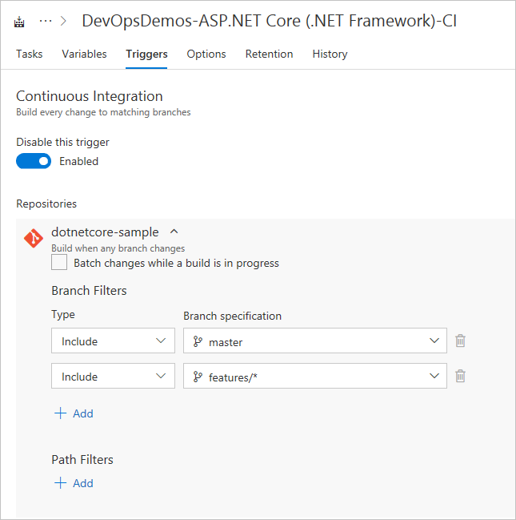
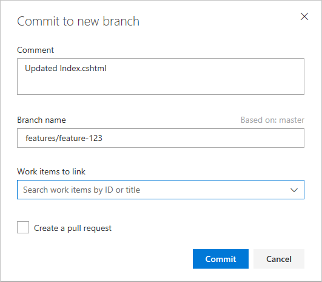
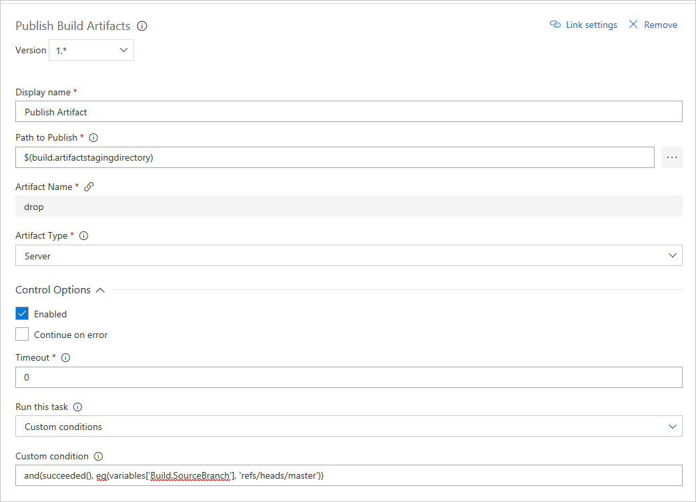

# Define a continuous integration (CI) build process for your Git repo

Visual Studio Team Services (VSTS) and Team Foundation Server (TFS) provide a full-featured Git server for hosting your team's source code. To keep code quality high, add continuous integration (CI) builds to your team's process. CI builds automatically build and test code every time a team member pushes a commit to the server. You can take it a step further with pull request builds.

In this tutorial, you learn how to:

> [!div class="checklist"]
> * Set up a CI trigger for feature branches
> * Execute CI for a topic branch
> * Exclude or include tasks for builds based on the branch being built
> * Keep code quality high by building your pull requests
> * Use retention policies to clean up your completed builds

## Prerequisites
* Git repository in VSTS or TFS
* A working build definition for a Git repository in VSTS
	* If needed, complete one of the following:  [Build and deploy to an Azure Web App](../../build-release/apps/cd/azure/aspnet-core-to-azure-webapp.md), [Build your Java app with Maven](../../build-release/apps/java/build-maven.md), or [Build your Node.js with Gulp](../../build-release/apps/nodejs/build-gulp.md).

## Set up a CI trigger for a topic branch

A common workflow with Git is to create temporary branches from your master branch.  These branches are called topic or feature branches and help you isolate your work.  In this workflow, you create a branch for a particular feature or bug fix.  Eventually, you merge the code back to the master branch and delete the topic branch.  VSTS allows you to create and delete topic branches to take advantage of CI without having to edit the build definition.  You can use naming conventions, wildcards, and branch filters to initiate builds that match a particular pattern.  Follow the steps below to create a CI trigger that will execute a build for feature branches.

1. Select **Build and Release**, and then choose **Builds**.
2. Locate the **Build Definition** that services your master branch.  Select the **ellipsis** to the right of your definition.  Select **Edit**.
3. Select the **Triggers** menu for your build.  Ensure you have **Continuous Integration** enabled.
4. Select the **+ Add** icon under **Branch filters**.
5. Under the **Branch specification** dropdown, type **features/*** in the **Filter my branches** text box and press **Enter**. The trigger now supports CI for all feature branches that match the wildcard as well as the master branch.
    
6. Select the **Save & queue** menu and then Select **Save**.

##  Execute CI for a topic branch

Your build definition is now ready for CI for both the master branch and future feature branches that match the branch pattern.  Every code change for the branch will use an automated build process to ensure the quality of your code remains high.  Follow the steps below to edit a file and create a new topic branch. 

1. Navigate to the **Code** hub in VSTS.
2. Choose your **repository** and Select **Branches**.  Choose the **master branch**.
3. Select the **Files** menu.  Make a quick code change by selecting a file and Selecting **Edit**.  Add some text and Select **Commit**.  For **Branch name**, remove master and type **features/feature-123**.
4. Select **Commit**. This workflow creates a new topic branch under a parent named **features** and commits your code edits to the new branch.    
     
5. Navigate to the **Build and Release** menu in VSTS and Select **Builds**.
6. Select **Queued** under **Build Definitions** to view the queued builds.  You should now see your new build definition executing for the topic branch.  This build was initiated by the trigger you created earlier.  Wait for the build to finish.

Your typical development process typically includes developing code locally and periodically pushing to your remote topic branch.  Each push you make will result in a build process executing in the background.  The build process helps you catch errors earlier and helps you to maintain a quality topic branch that can be safely merged to master.  Practicing CI for your topic branches helps to minimize risk when merging back to master.

## Exclude or include tasks for builds based on the branch being built

The master branch typically produces deployable artifacts such as binaries.  You do not need to spend time creating and storing those artifacts for short-lived feature branches.  You implement custom conditions in VSTS so that certain tasks only execute on your master branch during a build run.  You can use a single build with multiple branches and skip or perform certain tasks based on conditions. 

1. Select **Build and Release** menu and Select **Builds**.
2. Locate the **Build Definition** that services your master branch.  Select the **ellipsis** to the right of your definition.  Select **Edit**.    
3. Choose the **Publish Artifact** task in your build definition.
4. Select **Control Options** on the bottom right hand part of your screen.
5. Select the dropdown for **Run this task** and choose **Custom conditions**.
    
6. Enter the following snippet:
```
and(succeeded(), eq(variables['Build.SourceBranch'], 'refs/heads/master'))
```
7.  Select the **Save & queue** menu, and then select **Save & queue**. 
8.  Choose your **topic branch**.  Select **Queue**.  We are not building the master branch, and the task for **Publish artifacts** will not execute.
9.  Select the build to monitor the progress.  Once the build completes, confirm the build skipped the **Publish artifacts** task step.
     

## Keep code quality high by building your pull requests

Use policies to protect your branches by requiring successful builds before merging pull requests.  You have options to always require a new successful build before merging changes to important branches such as the master branch.  There are other branch policy settings to build less frequently.  You can also require a certain number of code reviewers to help ensure your pull requests are high quality and don’t result in broken builds for your branches.

1.  Navigate to the **Code** hub in VSTS.
2.  Choose your **repository** and Select **Branches**.  Choose the **master branch**.
3.  You will implement a branch policy to protect the master branch.  Select the **ellipsis** to the right of your branch name and Select **Branch policies**.    
4.  Choose the checkbox for **Protect this branch**.  There are several options for protecting the branch.    
5.  Under the **Build validation** menu choose **Add build policy**.
6.  Choose the appropriate **build definition**.
7.  Ensure **Trigger** is set to automatic and the **Policy requirement** is set to required.
8.  Enter a descriptive **Display name** to describe the policy.  
9.  Select **Save** to create and enable the policy.  Select **Save changes** at the top left of your screen.
10. To test the policy navigate to the **Pull Request** menu in VSTS.
11. Select **New pull request**.  Ensure your topic branch is set to merge into your master branch.  Select **create**.
12. Your screen displays the **policy** being executed.  
13. Select the **policy name** to examine the build.  If the build succeeds your code will be merged to master.  If the build fails the merge is blocked.

Once the work is completed in the topic branch and merged to master, you can delete your topic branch.  You can then create additional feature or bug fix branches as necessary.

## Use retention policies to clean up your completed builds

Retention policies allow you to control and automate the cleanup of your various builds.  For shorter-lived branches like topic branches, you may want to retain less history to reduce clutter and storage costs.  If you create CI builds on multiple related branches, it will become less important to keep builds for all of your branches.  

1.  Navigate to the **Build and Release** menu in VSTS.
2.  Select the **Build** that you set up for your topic branch.
3.  Select **Edit** at the top right of your screen.
4.  Under the build definition name, Select the **Retention** tab.  Select **Add** to add a new retention policy.
    
5.  Type **features/*** in the **Branch specification** dropdown.  This ensures any feature branches matching the wildcard will use the policy.
6.  Set **Days to keep** to 1 and **Minimum to keep** to 1.
7.  Select the **Save & queue** menu and then Select **Save**.  

Policies are evaluated in order, applying the first matching policy to each build. The default rule at the bottom matches all builds.  The retention policy will clean up build resources each day.  You retain at least one build at all times.  You can also choose to keep any particular build for an indefinite amount of time.

## Next steps

In this tutorial, you learned how to set up and manage CI with Git and VSTS.

You learned how to:

> [!div class="checklist"]
> * Set up and execute CI for a feature branch
> * Exclude or include tasks for builds based on the branch being built
> * Keep code quality high by building your pull requests
> * Use retention policies to clean up your completed build

> [!div class="nextstepaction"]
> [Deploy to Azure web app](../apps/cd/deploy-webdeploy-webapps.md)
