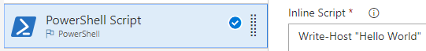

# Build your ASP.NET Core app

**VSTS | TFS 2018 | TFS 2017 Update 3**

[ASP.NET Core](http://www.asp.net/core) is a lean and composable framework for building web and cloud applications. Follow these steps to quickly set up a continuous integration (CI) process for an ASP.NET Core app using Visual Studio Team Services (VSTS) or Team Foundation Server (TFS). The sample app we use here is a Visual Studio solution that has two projects: An ASP.NET Core Web Application project and a Unit Test project (both targeting .Net Core 2.0 framework). This quickstart works for any apps that target the .Net Core 1.1 or 2.0 frameworks.

## Prerequisites

[!INCLUDE [include](../../_shared/ci-cd-prerequisites-vsts.md)]

[!INCLUDE [include](../../_shared/ci-cd-prerequisites-tfs.md)]

## Choose the web interface or configuration as code

Do you want to define your build process in your web browser or configure it as code in YAML?

# [Web](#tab/web)

Advantages include a GUI interface in the web.



# [YAML](#tab/yaml)

Advantages include config as code, parallel processing (fan out and fan in), and the ability to test and debug the process locally.

```YAML
steps:
- script: echo hello world 
```

---

[Learn more about YAML builds](../../actions/build-yaml.md).

## Get the sample code

[!INCLUDE [include](../_shared/get-sample-code-intro.md)]

```
https://github.com/adventworks/dotnetcore-sample
```

Next, choose which kind of Git service you're using:

# [VSTS or TFS repo](#tab/vsts)

[!INCLUDE [include](../_shared/get-sample-code-vsts-tfs-2017-update-2.md)]

# [GitHub repo](#tab/github)

[!INCLUDE [include](../_shared/get-sample-code-github.md)]

---

[!INCLUDE [include](../_shared/get-sample-code-other-repos-vsts.md)]

## Set up continuous integration

[!INCLUDE [include](../../_shared/ci-quickstart-intro.md)]

[//]: # (TODO: Restore use of includes when we get support for using them in a list.)

[//]: # (TODO: [!INCLUDE [include](_shared/create-aspnet-core-build-team-services.md)

[//]: # (TODO: [!INCLUDE [include](_shared/aspnet-core-build-tasks.md)


### Create the definition

# [VSTS or TFS repo](#tab/vsts/web)

1. Create a new build definition.

 Navigate to the **Files** tab of the **Code** hub, and then click **Set up build**.

 

 You are taken to the **Build & Release** hub and asked to **Select a template** for the new build definition.

1. In the right panel, click **ASP.NET Core**, and then click **Apply**.

 

 You now see all the tasks that were automatically added to the build definition by the template. These are the steps that will automatically run every time you check in code.

1. For the **Default agent queue**:

 * **VSTS:** Select _Hosted VS2017_. This is how you can use our pool of agents that have the software you need to build your app.

 * **TFS:** Select a queue that includes a [Windows build agent](../../actions/agents/v2-windows.md).

1. Click **Get sources** and then:

 Observe that the new build definition is automatically linked to your repository.

1. Click the **Triggers** tab in the build definition. Enable the **Continuous Integration** trigger. This will ensure that the build process is automatically triggered every time you commit a change to your repository.

1. Click **Save and queue** to kick off your first build. On the **Queue build** dialog box, click **Queue**.

1. A new build is started. You'll see a link to the new build on the top of the page. Click the link to watch the new build as it happens.

# [VSTS or TFS repo](#tab/vsts/yaml)

To create a definition that is configured as code, you'll modify a YAML file in the repo root that has a well-known name: **.vsts-ci.yml**. The first time you change this file, VSTS automatically uses it to create your build definition.

1. Navigate to the **Code** hub, choose the **Files** tab, and then choose the repository you created in the above steps.

2. Choose the **.vsts-ci.yml** file, and then click **Edit**.

3. Replace the contents of the file with the following:

   [!code-yaml[code](../../actions/_shared/yaml-build-definition-aspnet-core.md)]

4. Commit your change to the master branch.

5. Navigate to the **Build and Release** hub.

6. Observe that there's a new build definition named _{name-of-your-repo} YAML CI_. A build is queued; its status could be either not started or running. Click the number of the build: _{year}{month}{day}.1_.

7. In the left column of the running build, click **Job**. After a hosted agent is assigned to your job and the agent is initialized, then you'll see information about the build in the console.

For this example, to learn some of the basics, you changed the YAML file to use the  `dotNetCoreCLI` task instead of calling the `dotnet` command directly in a script. The changes you made affect how the build output is organized. Each step is shown and can be inspected in the build summary, instead of all the output combined in one log from a single script.

The changes you made also modified what the build does. For example, the `dotnet restore` command you replaced creates .DLL files, but it doesn't create a web deployment file. After you've completed the above steps, your build instead uses the `dotNetCoreCLI` task, which in addition to creating the .DLL file, also creates a web deployment package (a .ZIP file) that is more efficient to deploy.

# [GitHub repo](#tab/github/web)

1. Create a new build definition.

 Navigate to the **Builds** tab of the **Build and Release** hub in VSTS or TFS, and then click **+ New**. You are asked to **Select a template** for the new build definition.

1. In the right panel, click **ASP.NET Core**, and then click **Apply**.

 

 You now see all the tasks that were automatically added to the build definition by the template. These are the steps that will automatically run every time you check in code.

1. For the **Default agent queue**:

 * **VSTS:** Select _Hosted VS2017_. This is how you can use our pool of agents that have the software you need to build your app.

 * **TFS:** Select a queue that includes a [Windows build agent](../../actions/agents/v2-windows.md).

1. Click **Get sources** and then:

 Select your version control repository. You'll need to authorize access to your repo.

1. Click the **Triggers** tab in the build definition. Enable the **Continuous Integration** trigger. This will ensure that the build process is automatically triggered every time you commit a change to your repository.

1. Click **Save and queue** to kick off your first build. On the **Queue build** dialog box, click **Queue**.

1. A new build is started. You'll see a link to the new build on the top of the page. Click the link to watch the new build as it happens.

# [GitHub repo](#tab/github/yaml)

To create a definition that is configured as code, you'll modify a YAML file in the repo root that has a well-known name: **.vsts-ci.yml**. You'll then create a build definition that points to the YAML file.

In GitHub:

1. Edit the **.vsts-ci.yml** file in the root of your repo, and replace the contents of the file with the following:

   [!code-yaml[code](../../actions/_shared/yaml-build-definition-aspnet-core.md)]

1. Commit your change to the master branch.

In VSTS:

1. Navigate to the **Builds** tab of the **Build and Release** hub, and then click **+ New**. You are asked to **Select a template** for the new build definition.

1. Select **YAML**, and then select **Apply**.

1. Select **Get sources**, select **GitHub**, and then select your version control repository. You'll need to authorize access to your repo.

1. Select **Process**.

1. For the **Agent queue** select _Hosted VS2017_. This is how you can use our pool of agents that have the software you need to build your app.

1. For the **Yaml path**, select the **.vsts-ci.yml** file in the root of your repo.

1. Select the **Triggers** tab, and then enable continuous integration (CI).

1. Save and queue the build, and then click the number of the build: _{year}{month}{day}.1_ that has been queued.

1. In the left column of the running build, click **Job**. After a hosted agent is assigned to your job and the agent is initialized, then you'll see information about the build in the console.

---

[//]: # (TODO:> [!TIP])
[//]: # (TODO:> To learn more about GitHub CI builds, see [Define CI build process for your Git repo](#)

## View the build summary

[!INCLUDE [include](../_shared/view-build-summary.md)]

## Next steps

[!INCLUDE [include](../_shared/ci-web-app-next-steps-with-containers.md)]