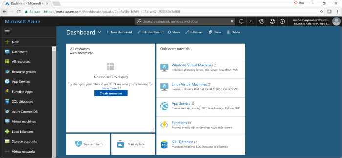
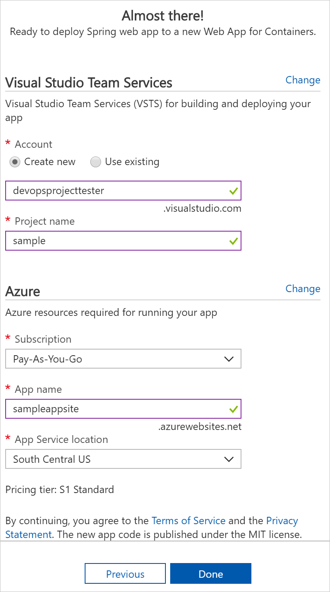
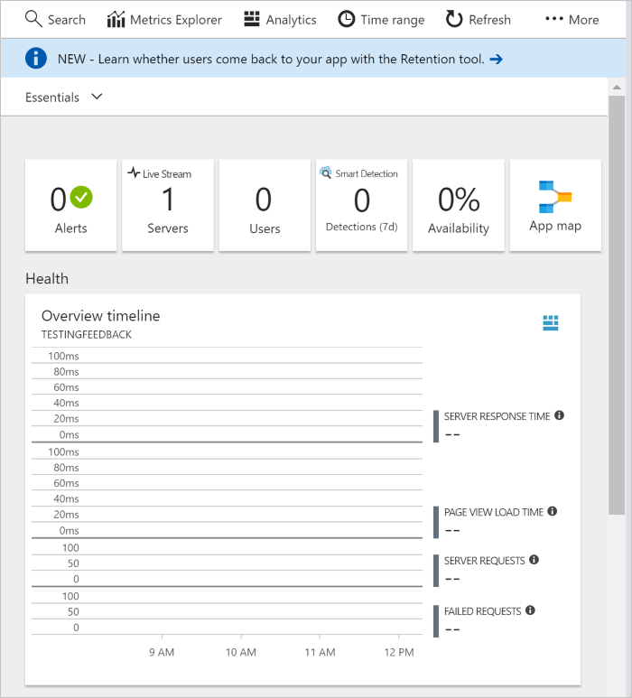

# Create a CI/CD pipeline for PHP with the Azure DevOps Project

The Azure DevOps Project presents a simplified experience which creates Azure resources and sets up a continuous integration (CI) and continuous delivery (CD) pipeline for your PHP app in Visual Studio Team Services (VSTS), which is Microsoft's DevOps solution for Azure.  

If you don't have an Azure subscription, you can get one free through [Visual Studio Dev Essentials](https://www.visualstudio.com/dev-essentials/).

## Sign in to the Azure portal

The Azure DevOps Project creates a CI/CD pipeline in VSTS.  You can create a free **new VSTS** account or use an **existing account**.  The DevOps Project also creates **Azure resources** in the **Azure subscription** of your choice.

1. Sign into the [Microsoft Azure portal](https://portal.azure.com).

1. Choose the **+ New** icon in the left navigation bar, then search for **DevOps project**.  Choose **Create**.

   	

## Select a sample application and Azure service

1. Select the **PHP** sample application.  The PHP samples include a choice of several application frameworks.

1. The default sample framework is **Laravel**. Select a framework or leave the default setting.  When you're done, choose **Next**.  

1. **Web App For Containers** is the default deployment target.  The application framework, which you chose on the previous steps, dictates the type of Azure service deployment target available here.  Select the **target service** of your choice.  When you're done, choose **Next**.
 
## Configure VSTS and an Azure subscription 

1. Create a **new** VSTS account or choose an **existing** account.  Choose a **name** for your VSTS project.  Select your **Azure subscription**, **location**, and choose a **name** for your application.  When you're done, choose **Done**.

   	

1. In a few minutes, the **project dashboard** loads in the Azure portal.  A sample application is set up in a repository in your VSTS account, a build executes, and your application deploys to Azure.  This dashboard provides visibility into your **code repository**, **VSTS CI/CD pipeline**, and your **application in Azure**.  On the right side of the dashboard, select **Browse** to view your running application.

   	 
	
The Azure DevOps project automatically configures a CI build and release trigger.  You're now ready to collaborate with a team on a PHP app with a CI/CD process that automatically deploys your latest work to your web site.

## Commit code changes and execute CI/CD

The Azure DevOps project created a Git repository in your VSTS or GitHub account.  Follow the steps below to view the repository and make code changes to your application.

1. On the left-hand side of the DevOps project dashboard, select the link for your **master** branch.  This link opens a opens a view to the newly created Git repository.

1. To view the repository clone URL, select **Clone** from the top right of the browser. You can clone your Git repository in your favorite IDE.  In the next few steps, you can use the web browser to make and commit code changes directly to the master branch.

1. On the left-hand side of the browser, navigate to the **views/index.pug** file.

1. Select **Edit**, and make a change to the h2 heading.  For example, type **Get started right away with the Azure DevOps Project** or make some other change.

1. Choose **Commit**, then save your changes.

1. In your browser, navigate to the **Azure DevOps project dashboard**.  You should now see a build is in progress.  The changes you just made are automatically built and deployed via a VSTS CI/CD pipeline.

## Examine the VSTS CI/CD pipeline

The Azure DevOps project automatically configured a full VSTS CI/CD pipeline in your VSTS account.  Explore and customize the pipeline as needed.  Follow the steps below to familiarize yourself with the VSTS build and release definitions.

1. Select **Build Pipelines** from the **top** of the Azure DevOps project dashboard.  This link opens a browser tab and opens the VSTS build definition for your new project.

1. Move the mouse cursor to the right of the build definition next to the **Status** field. Select the **ellipsis** that appears.  This action opens a menu where you can perform several activities such as queue a new build, pause a build, and edit the build definition.

1. Select **Edit**.

1. From this view, **examine the various tasks** for your build definition.  The build performs various tasks such as fetching sources from the Git repository, restoring dependencies, and publishing outputs used for deployments.

1. At the top of the build definition, select the **build definition name**.

1. Change the **name** of your build definition to something more descriptive.  Select **Save & queue**, then select **Save**.

1. Under your build definition name, select **History**.  You see an audit trail of your recent changes for the build.  VSTS keeps track of any changes made to the build definition, and allows you to compare versions.

1. Select **Triggers**.  The Azure DevOps project automatically created a CI trigger, and every commit to the repository initiates a new build.  You can optionally choose to include or exclude branches from the CI process.

1. Select **Retention**.  Based on your scenario, you can specify policies to keep or remove a certain number of builds.

1. Select **Build and Release**, then choose **Releases**.  The Azure DevOps project created a VSTS release definition to manage deployments to Azure.

1. On the left-hand side of the browser, select the **ellipsis** next to your release definition, then choose **Edit**.

1. The release definition contains a **pipeline**, which defines the release process.  Under **Artifacts**, select **Drop**.  The build definition you examined in the previous steps produces the output used for the artifact. 

1. To the right-hand side of the **Drop** icon, select the **Continuous deployment trigger**.  This release definition has an enabled CD trigger, which executes a deployment every time there is a new build artifact available.  Optionally, you can disable the trigger, so your deployments require manual execution. 

1. On the left-hand side of the browser, select **Tasks**.  The tasks are the activities your deployment process performs.  In this example, a task was created to deploy to **Azure App service**.

1. On the right-hand side of the browser, select **View releases**.  This view shows a history of releases.

1. Select the **ellipsis** next to one of your releases, and choose **Open**.  There are several menus to explore from this view such as a release summary, associated work items, and tests.

1. Select **Commits**.  This view shows code commits associated with the specific deployment. 

1. Select **Logs**.  The logs contain useful information about the deployment process.  They can be viewed both during and after deployments.

## Configure Azure Application Insights monitoring

With Azure Application insights, you can easily monitor your application's performance and usage.  The Azure DevOps project automatically configured an Application Insights resource for your application.  You can further configure various alerts and monitoring capabilities as needed.

1. Navigate to the **Azure DevOps Project** dashboard in the Azure portal.  On the bottom-right of the dashboard, choose the **Application Insights** link for your app.

1. The **Application Insights** blade opens in the Azure portal.  This view contains usage, performance, and availability monitoring information for your app.

     

1. Select **Time range**, and then choose **Last hour**.  Select **Update** to filter the results.  You now see all activity from the last 60 minutes.  Select the **x** to exit time range.

1. Select **Alerts**, then select **+ Add metric alert**.  

1. Enter a **Name** for the alert.

1. Select the drop-down for **Source Alter on**.  Choose your **App Service resource.**

1. The default alert is for a **server response time greater than 1 second**.  Select the **Metric** drop-down to examine the various alert metrics.  You can easily configure a variety of alerts to improve the monitoring capabilities of your app.

1. Select the check-box for **Notify via Email owners, contributors, and readers**.  Optionally, you can perform additional actions when an alert fires by executing an Azure logic app.

1. Choose **Ok** to create the alert.  In a few moments, the alert appears as active on the dashboard.  **Exit** the Alerts area, and navigate back to the **Application Insights blade**.

1. Select **Availability**, then select **+ Add test**. 

1. Enter a **Test name**, then choose **Create**.  A simple ping test is created to verify the availability of your application.  After a few minutes, test results are available, and the Application Insights dashboard displays an availability status.

## Clean up resources

When no longer needed, you can delete the Azure App service and related resources created in this quickstart by using the **Delete** functionality on the Azure DevOps project dashboard.

## Next steps

When you configured your CI/CD process in this quickstart, a build and release definition were automatically created in your VSTS project. You can modify these build and release definitions to meet the needs of your team. To learn more see this tutorial:

> [!div class="nextstepaction"]
> [Customize CD process](../../../actions/define-multistage-release-process.md)
