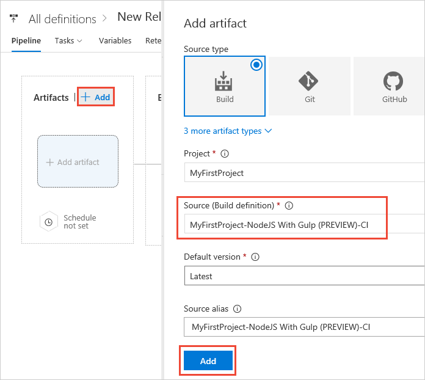
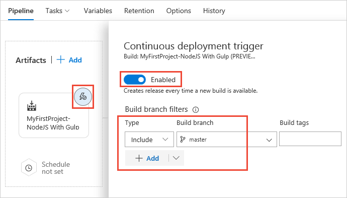
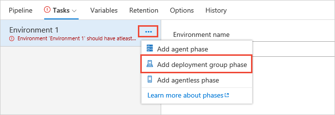
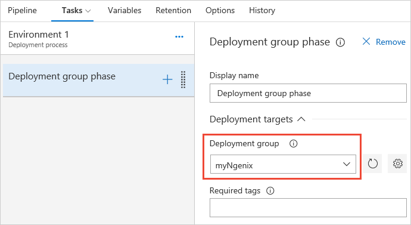
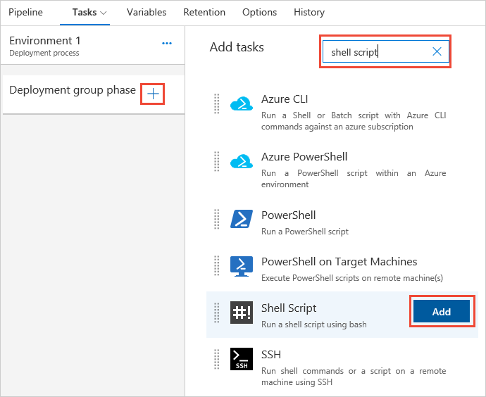

[//]: # (monikerRange: ">= tfs-2017")

# Deploy to a Linux Virtual Machine

**VSTS | TFS 2018**

We'll show you how to set up continuous deployment of your app to an nginx web server running on Ubuntu using
Visual Studio Team Services (VSTS) or Team Foundation Server (TFS) 2018. You can use the steps in this
quickstart for any app as long as your continuous integration process publishes a web deployment package.

After you commit and push a code change, it is automatically built and then deployed. The results will
automatically show up on your site.

## Define your CI build process

You'll need a continuous integration (CI) build process that publishes your web application, as well as
a deployment script that can be run locally on the Ubuntu server. To set up a CI build process, see:

* [Build your Node app with Gulp](../nodejs/build-gulp.md)

> Make sure you follow the additional steps in that topic for creating a build to deploy to Linux.

## Prerequisites

You'll need a Linux VM with Nginx web server to deploy the app. The deployment scripts used in the sample repositories
have been tested on Ubuntu 16.04, and we recommend you use the same version of Linux VM for this quickstart.
If you don't already have a Linux VM with Nginx, create one now in Azure using the steps in
[this example](https://docs.microsoft.com/en-us/azure/virtual-machines/linux/quick-create-cli).

[!INCLUDE [create-linux-deployment-group](../_shared/create-linux-deployment-group.md)]

## Define your CD release process

Your CD release process picks up the artifacts published by your CI build and then deploys them to your nginx servers.

1. Do one of the following to start creating a release definition:

   * If you've just completed a CI build then, in the build's **Summary** tab under **Deployments**,
     choose **Create release** followed by **Yes**. This starts a new release definition that's automatically linked to the build definition.

    

   * Open the **Releases** tab of the **Build &amp; Release** hub, open the **+** drop-down
     in the list of release definitions, and choose **Create release definition**.

     

1. In the **Create release definition** wizard, select **Empty process**.

1. If you created your new release definition from a build summary, check that the build definition and artifact
   is shown in the **Artifacts** section on the **Pipeline** tab. If you created a new release definition from
   the **Releases** tab, choose the **+ Add** link and select your build artifact.

   

1. Choose the **Continuous deployment** icon in the **Artifacts** section, check that the
  continuous deployment trigger is enabled, and the **master** branch is selected. If not, set these options now.

  

  > Continuous deployment is not enabled by default when you create a new release definition from the **Releases** tab.

1. Open the **Tasks** tab, select the **Agent phase**, and choose **Remove** to remove this phase.

  

1. Choose **...** next to the **Environment 1** deployment process and select **Add deployment group phase**.

  

1. For the **Deployment Group**, select the deployment group you created earlier such as **myNginx**.

  

   The tasks you add to this phase will run on each of the machines in the deployment group you specified.

1. Choose **+** next to the **Deployment group phase** and, in the task catalog, search for and add a
   **Shell Script** task.

  

1. In the properties of the **Shell Script** task, use the **Browse** button for the **Script Path** to select
   the path to the **deploy.sh** script in the build artifact. For example, when you use the **nodejs-sample**
   repository to build your app, the location of the script is  
   `$(System.DefaultWorkingDirectory)/nodejs-sample/drop/deploy/deploy.sh`

  

1. Save the release definition.

   

## Create a release to deploy your app

You're now ready to create a release, which means to start the process of running the release definition
with the artifacts produced by a specific build. This will result in deploying the build.

1. To test the release definition, choose **Release** and then **Create release**.

   

1. In the Create new release panel, choose **Create**. Then choose the link near the top
   of the window that indicates a new release was created.

   

1. Open the **Logs** tab to watch the live logs from the deployment as it happens.
   Wait for the release to be deployed to the Azure web app.

   

1. After deployment is complete, open your web browser and test your web app using the URL
   `http://<publicIpAddress>`, where `<publicIpAddress>` is the IP address of the web site
   on your nginx web server.

## Next steps

* [Dynamically create and remove a deployment group](howto-webdeploy-iis-deploygroups.md#depgroup)
* [Apply environment-specific configurations](howto-webdeploy-iis-deploygroups.md#envirconfig)
* [Perform a safe rolling deployment](howto-webdeploy-iis-deploygroups.md#rolling)
* [Deploy a database with your app](howto-webdeploy-iis-deploygroups.md#database)
