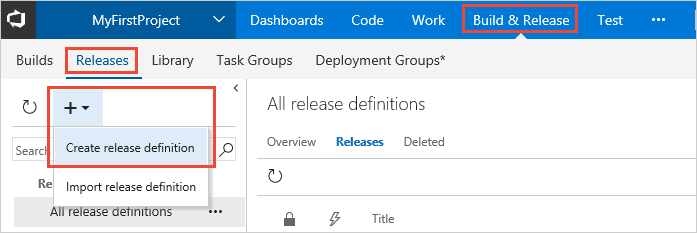
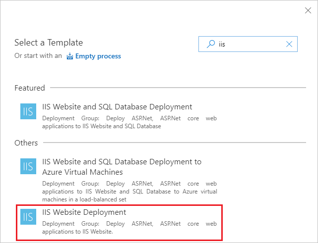

[//]: # (monikerRange: ">= tfs-2017")

# Deploy to a Windows Virtual Machine

**VSTS | TFS 2018**

We'll show you how to set up continuous deployment of your ASP.NET or Node app to an IIS web server running on Windows using
Visual Studio Team Services (VSTS). You can use the steps in this quickstart as long as your continuous integration process publishes a web deployment package.

After you commit and push a code change, it is automatically built and then deployed. The results will automatically show up on your site.

## Define your CI build process

You'll need a continuous integration (CI) build process that publishes your web deployment package. To set up a CI build process, see:

* [Build your ASP.NET 4 app](../aspnet/build-aspnet-4.md)

* [Build your ASP.NET Core app](../aspnet/build-aspnet-core.md)

* [Build your Node app with Gulp](../nodejs/build-gulp.md)

## Prerequisites

### IIS configuration

The configuration varies depending on the type of app you are deploying.

#### ASP.NET app

[!INCLUDE [prepare-aspnet-windows-vm](../_shared/prepare-aspnet-windows-vm.md)]

#### ASP.NET Core app

[!INCLUDE [prepare-aspnetcore-windows-vm](../_shared/prepare-aspnetcore-windows-vm.md)]

#### Node app

Follow the instructions in [this topic](https://github.com/tjanczuk/iisnode) to install and configure IISnode on IIS servers.

[!INCLUDE [create-deployment-group](../_shared/create-deployment-group.md)]

## Define your CD release process

Your CD release process picks up the artifacts published by your CI build and then deploys them to your IIS servers.

1. Do one of the following:

   * If you've just completed a CI build then, in the build's **Summary** tab under **Deployments**,
     choose **Create release** followed by **Yes**. This starts a new release definition that's automatically linked to the build definition.

    

   * Open the **Releases** tab of the **Build &amp; Release** hub, open the **+** drop-down
     in the list of release definitions, and choose **Create release definition**.

     

1. In the **Create release definition** wizard, select **IIS Website Deployment** template, and then click **Apply**.

 

1. Click the **Tasks** tab, and then click the **IIS Deployment** phase. For the **Deployment Group**, click the deployment group you created earlier, such as *myIIS*.

 

1. Save the release definition.

## Create a release to deploy your app

You're now ready to create a release, which means to start the process of running the release definition with the artifacts produced by a specific build. This will result in deploying the build:

1. To test the release definition, choose **Release** and then **Create release**.

1. In the Create new release panel, choose **Create**. Choose the link near the top of the window that indicates a new release was created.

1. Open the **Logs** tab to watch the live logs from the deployment as it happens. Wait for the release to be deployed to the Azure web app.

1. Once deployment has completed, open your web browser and test your web app: `http://<publicIpAddress>`, where `<publicIpAddress>` is the IP address of your web site on your IIS web server.

## Next steps

* [Dynamically create and remove a deployment group](howto-webdeploy-iis-deploygroups.md#depgroup)
* [Apply environment-specific configurations](howto-webdeploy-iis-deploygroups.md#envirconfig)
* [Perform a safe rolling deployment](howto-webdeploy-iis-deploygroups.md#rolling)
* [Deploy a database with your app](howto-webdeploy-iis-deploygroups.md#database)
