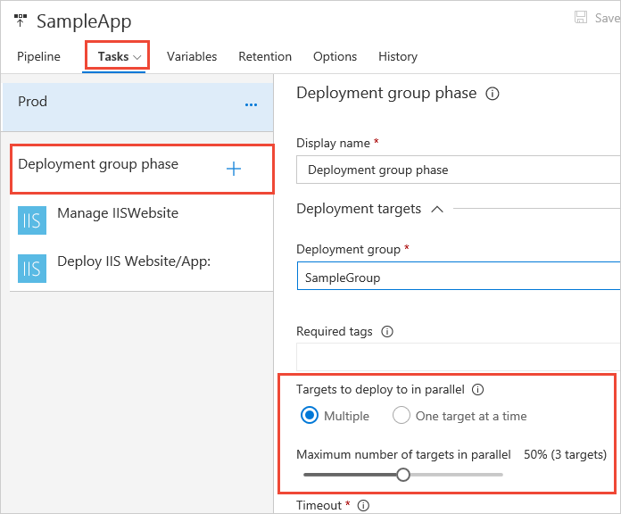

# How To: Extend your deployments to IIS Deployment Groups

You can quickly and easily deploy your ASP.NET or Node app to an IIS Deployment Group using
Visual Studio Team Services (VSTS) or Microsoft Team Foundation Server (TFS),
as demonstrated in [this example](deploy-webdeploy-iis-deploygroups.md).
In addition, you can extend your deployment in a range of ways
depending on your scenario and requirements. This topic shows you how to:

* [Dynamically create and remove a deployment group](#depgroup)
* [Apply environment-specific configurations](#envirconfig)
* [Perform a safe rolling deployment](#rolling)
* [Deploy a database with your app](#database)

## Prerequisites

You should have worked through the example [CD to an IIS Deployment Group](deploy-webdeploy-iis-deploygroups.md) before you attempt any of these steps.
This ensures that you have the release definition, build artifacts, and websites required.

## Dynamically create and remove a deployment group

You can create and remove deployment groups dynamically if you prefer by using
the [Azure Resource Group Deployment task](https://aka.ms/argtaskreadme)
to install the agent on the machines in a deployment group using ARM templates.
See [Provision deployment group agents](../../concepts/definitions/release/deployment-groups/howto-provision-deployment-group-agents.md).  

## Apply environment-specific configurations

If you deploy releases to multiple environments, you can substitute configuration settings in **Web.config** and other configuration files of your website using these steps:

1. Define environment-specific configuration settings in the **Variables** tab of an environment in a release definition; for example,
   `<connectionStringKeyName> = <value>`.

1. In the **IIS Web App Deploy** task, select the checkbox for **XML variable substitution** under **File Transforms and Variable Substitution Options**.

   > If you prefer to manage environment configuration settings in
   your own database or Azure keyvault, add a task to the environment to read and emit those values using
   `##vso[task.setvariable variable=connectionString;issecret=true]<value>`.

   > At present, you cannot apply a different configuration to individual IIS servers.

## Perform a safe rolling deployment

If your deployment group consists of many IIS target servers, you can deploy to a subset of servers at a time.
This ensures that your application is available to your customers at all times.
Simply select the **Deployment group phase** and use the slider to configure the **Maximum number of targets in parallel**.

## Deploy a database with your app

To deploy a database with your app:

1. Add both the IIS target servers and database servers to your deployment group.
   Tag all the IIS servers as `web` and all database servers as `database`.

1. Add two machine group phases to environments in the release definition, and a task in each phase as follows:

   **First [Run on deployment group phase](../../concepts/process/phases.md)** for configuration of web servers.
   
   - **Deployment group**: Select the deployment group you created in the [previous example](deploy-webdeploy-iis-deploygroups.md).
   
   - **Machine tags**: `web`

   
   Then add an **IIS Web App Deploy** task to this phase.
   
   **Second [Run on deployment group phase](../../concepts/process/phases.md)** for configuration of database servers.
   
   - **Deployment group**: Select the deployment group you created in the [previous example](deploy-webdeploy-iis-deploygroups.md).
   
   - **Machine tags**: `database`

   
   Then add a **SQL Server Database Deploy** task to this phase.
