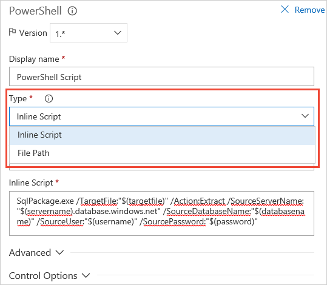

[//]: # (monikerRange: ">= tfs-2015")

# Perform SQL server actions in VSTS or TFS

[!INCLUDE [temp](../../_shared/version-rm-dev14.md)]

VSTS and TFS include a SQL task named [SQL Azure Dacpac Deployment](https://github.com/Microsoft/vsts-tasks/tree/master/Tasks/SqlAzureDacpacDeployment)
that helps you publish to SQL server.
However, you may want to perform other SQL server actions
as part of your release workflow.

At present, the SQL task does not support other actions. 
Instead, you can use the [PowerShell task]()
in your workflow to execute a SQL script.
The SQL script can be specified either as an artifact or as an inline script. 



## Basic Syntax 

`<Path of SQLPackage.exe> <Arguments to SQLPackage.exe>`

You can use any of the following SQL scripts based on the action that you want to perform

## Extract

Creates a database snapshot (.dacpac) file from a live SQL server or Microsoft Azure SQL Database.

**Command Syntax:**

```command
SqlPackage.exe /TargetFile:"<Target location of dacpac file>" /Action:Extract
/SourceServerName:"<ServerName>.database.windows.net"
/SourceDatabaseName:"<DatabaseName>" /SourceUser:"<Username>" /SourcePassword:"<Password>"
```

or

```command
SqlPackage.exe /action:Extract /tf:"<Target location of dacpac file>"
/SourceConnectionString:"Data Source=ServerName;Initial Catalog=DatabaseName;Integrated Security=SSPI;Persist Security Info=False;"
```

**Example:**

```command
SqlPackage.exe /TargetFile:"C:\temp\test.dacpac" /Action:Extract /SourceServerName:"DemoSqlServer.database.windows.net"
 /SourceDatabaseName:"Testdb" /SourceUser:"ajay" /SourcePassword:"SQLPassword"
```

**Help:**

```command
sqlpackage.exe /Action:Extract /?
```

## Publish

Incrementally updates a database schema to match the schema of a source .dacpac file. If the database does not exist on the server, the publish operation will create it. Otherwise, an existing database will be updated.

**Command Syntax:**

```command
SqlPackage.exe /SourceFile:"<Dacpac file location>" /Action:Publish /TargetServerName:"<ServerName>.database.windows.net"
/TargetDatabaseName:"<DatabaseName>" /TargetUser:"<Username>" /TargetPassword:"<Password> "
```

**Example:**

```command
SqlPackage.exe /SourceFile:"E:\dacpac\ajyadb.dacpac" /Action:Publish /TargetServerName:"DemoSqlServer.database.windows.net"
/TargetDatabaseName:"Testdb4" /TargetUser:"ajay" /TargetPassword:"SQLPassword"
```

**Help:**

```command
sqlpackage.exe /Action:Publish /?
```

## Export

Exports a live database, including database schema and user data, from SQL Server or Microsoft Azure SQL Database to a BACPAC package (.bacpac file).

**Command Syntax:**

```command
SqlPackage.exe /TargetFile:"<Target location for bacpac file>" /Action:Export /SourceServerName:"<ServerName>.database.windows.net"
/SourceDatabaseName:"<DatabseName>" /SourceUser:"<Username>" /SourcePassword:"<Password>"
```

**Example:**

```command
SqlPackage.exe /TargetFile:"C:\temp\test.bacpac" /Action:Export /SourceServerName:"DemoSqlServer.database.windows.net"
/SourceDatabaseName:"Testdb" /SourceUser:"ajay" /SourcePassword:"SQLPassword"
```

**Help:**

```command
sqlpackage.exe /Action:Export /?
```

## Import

Imports the schema and table data from a BACPAC package into a new user database in an instance of SQL Server or Microsoft Azure SQL Database.

**Command Syntax:** 

```command
SqlPackage.exe /SourceFile:"<Bacpac file location>" /Action:Import /TargetServerName:"<ServerName>.database.windows.net"
/TargetDatabaseName:"<DatabaseName>" /TargetUser:"<Username>" /TargetPassword:"<Password>"
```

**Example:**

```command
SqlPackage.exe /SourceFile:"C:\temp\test.bacpac" /Action:Import /TargetServerName:"DemoSqlServer.database.windows.net"
/TargetDatabaseName:"Testdb" /TargetUser:"ajay" /TargetPassword:"SQLPassword"
```

**Help:**

```command
sqlpackage.exe /Action:Import /?
```

## DeployReport

Creates an XML report of the changes that would be made by a publish action.

**Command Syntax:** 

```command
SqlPackage.exe /SourceFile:"<Dacpac file location>" /Action:DeployReport /TargetServerName:"<ServerName>.database.windows.net"
/TargetDatabaseName:"<DatabaseName>" /TargetUser:"<Username>" /TargetPassword:"<Password>" /OutputPath:"<Output XML file path for deploy report>"
```

**Example:**

```command
SqlPackage.exe /SourceFile:"E: \dacpac\ajyadb.dacpac" /Action:DeployReport /TargetServerName:"DemoSqlServer.database.windows.net"
/TargetDatabaseName:"Testdb" /TargetUser:"ajay" /TargetPassword:"SQLPassword" /OutputPath:"C:\temp\deployReport.xml" 
```

**Help:**

```command
sqlpackage.exe /Action:DeployReport /?
```

## DriftReport

Creates an XML report of the changes that have been made to a registered database since it was last registered.

**Command Syntax:** 

```command
SqlPackage.exe /Action:DriftReport /TargetServerName:"<ServerName>.database.windows.net" /TargetDatabaseName:"<DatabaseName>"
/TargetUser:"<Username>" /TargetPassword:"<Password>" /OutputPath:"<Output XML file path for drift report>"
```

**Example:**

```command
SqlPackage.exe /Action:DriftReport /TargetServerName:"DemoSqlServer.database.windows.net" /TargetDatabaseName:"Testdb"
/TargetUser:"ajay" /TargetPassword:"SQLPassword" /OutputPath:"C:\temp\driftReport.xml"
```

**Help:**

```command
sqlpackage.exe /Action:DriftReport /?
```

## Script

Creates a Transact-SQL incremental update script that updates the schema of a target to match the schema of a source.

**Command Syntax:**

```command
SqlPackage.exe /SourceFile:"<Dacpac file location>" /Action:Script /TargetServerName:"<ServerName>.database.windows.net"
/TargetDatabaseName:"<DatabaseName>" /TargetUser:"<Username>" /TargetPassword:"<Password>" /OutputPath:"<Output SQL script file path>"
```

**Example:**

```command
SqlPackage.exe /Action:Script /SourceFile:"E:\dacpac\ajyadb.dacpac" /TargetServerName:"DemoSqlServer.database.windows.net"
/TargetDatabaseName:"Testdb" /TargetUser:"ajay" /TargetPassword:"SQLPassword" /OutputPath:"C:\temp\test.sql"
/Variables:StagingDatabase="Staging DB Variable value"
```

**Help:**

```command
sqlpackage.exe /Action:Script /?
```

## See also

* [Deploy your database to Azure SQL Database using DACPACs](deploy-dacpac-sqlpackage.md)
* [Deploy your database to Azure SQL database using SQL scripts](deploy-database-sqlscripts.md)
* [SQL Azure Dacpac Deployment task on GitHub](https://github.com/Microsoft/vsts-tasks/tree/master/Tasks/SqlAzureDacpacDeployment)

[!INCLUDE [rm-help-support-shared](../../_shared/rm-help-support-shared.md)]
