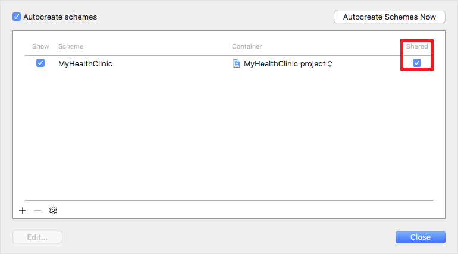

# Build your Xcode app

**VSTS | TFS 2017 Update 2**

Visual Studio Team Services (VSTS) and Team Foundation Server (TFS) provide a highly customizable continuous integration (CI) process to automatically build and package your Xcode app whenever your team pushes or checks in code. In this tutorial you learn how to define your CI process.

## Prerequisites

[!INCLUDE [include](../../_shared/ci-cd-prerequisites-vsts.md)]

* While the simplest way to try this quickstart is to use a VSTS account, you can also use a TFS server instead of a VSTS account.

* You need a build agent configured on a Mac machine. Simply open the OSX Terminal app on your Mac and follow these [setup instructions](../../actions/agents/v2-osx.md). The agent will automatically register itself with VSTS / TFS when you start up the agent for the first time.

* Your Mac also needs to have Node.js, Xcode, and [xcpretty](https://github.com/supermarin/xcpretty) (for testing) installed.

## Get the sample code

[!INCLUDE [include](../_shared/get-sample-code-intro.md)]

```
https://github.com/adventworks/xcode-sample
```

# [VSTS or TFS repo](#tab/vsts)

[!INCLUDE [include](../_shared/get-sample-code-vsts-tfs-2017-update-2.md)]

# [GitHub repo](#tab/github)

[!INCLUDE [include](../_shared/get-sample-code-github.md)]
 
---

The sample provided here is an iOS app, but the concepts described here essentially translate to other Xcode builds. Results from running tests are published to VSTS using **[xcpretty](https://github.com/supermarin/xcpretty)**. That is why you will need to have xcpretty installed on the OSX machine as this is not part of Xcode itself.

## Set up continuous integration

[!INCLUDE [include](../../_shared/ci-quickstart-intro.md)]

1. Create a new build definition.

 # [VSTS or TFS repo](#tab/vsts) 

 Navigate to the **Files** tab of the **Code** hub, and then click **Set up build**.

 

 You are taken to the **Build & Release** hub and asked to **Select a template** for the new build definition.

 # [GitHub repo](#tab/github)

 Navigate to the **Builds** tab of the **Build and Release** hub in VSTS or TFS, and then click **+ New**. You are asked to **Select a template** for the new build definition.

 ---

1. In the right panel, click **Xcode**, and then click **Apply**.

 You now see all the tasks that were automatically added to the build definition by the template. These are the steps that will automatically run every time you check in code.

1. For the **Default agent queue**, select a queue that includes the Mac agent you set up.

1. Click **Get sources** and then:

 # [VSTS or TFS repo](#tab/vsts) 

 Observe that the new build definition is automatically linked to your repository.

 # [GitHub repo](#tab/github)

 Select your version control repository. You'll need to authorize access to your repo. 

 > [!TIP]
 > To learn more about GitHub CI builds, see [Define CI build process for your Git repo](../../actions/ci-build-git.md).

 ---

1. Set the following parameters for the **Xcode test** task:

  * **Scheme**: Name of the scheme shared.
  * **Advanced &gt; Create App Package**: Unchecked.
  * **Advanced &gt; Use xcpretty**: Checked.
  * **Advanced &gt; Xcode Developer Path**: allows you to specify the path of a different version of Xcode than is installed by default. Ex: /Applications/Xcode6.4.app/Contents/Developer.

  > **Troubleshooting Tip**: The "Release" configuration is not testable by default. You'll either need to use "Debug" or enable testability in for the configuration in Xcode. Also, be sure to pay attention to capitalization as "Debug" will work but "debug" may not.

1. Set the following parameters for the **Xcode build** task:

 * Scheme: Name of the scheme shared.

1. On the **Variables** tab in the build definition, add the following variables:

 * **Configuration**: Debug or Release
 * **SDK**: iphoneos
 * **TestSDK**: iphonesimulator

1. Click the **Triggers** tab in the build definition. Enable the **Continuous Integration** trigger. This will ensure that the build process is automatically triggered every time you commit a change to your repository.

1. Click **Save and queue** to kick off your first build. On the **Queue build** dialog box, click **Queue**.

1. A new build is started. You'll see a link to the new build on the top of the page. Click the link to watch the new build as it happens.

 > **Troubleshooting Tip**: If you encounter a "User interaction not allowed" error when running the agent as a launch agent, you will either need check the "Unlock default keychain" option or switch to referencing signing certificates using a file. See **[Simple, Secure CI App Signing](secure-certs.md)** for details.

 > **Troubleshooting Tip**: If you run into issues with your tests hanging and/or not being able to start the iOS Simulator at times you can opt to add a Command Line task for the "killall" tool with "iOS\ Simulator" as an argument (killall iOS\ Simulator). This will force shut down the simulator in the event it is hung. Exercise care when running the command if you have multiple agents running for the same user and that you do not accidently kill other processes.   


## View the build summary

[!INCLUDE [include](../_shared/view-build-summary.md)]

## Next steps

If you plan to use your own Xcode project for this quickstart, there is really only one additional step required for configuring the project for a CI environment that is not done by default when you create the Xcode project. Xcode has the concept of schemes and you'll need to set one of these as "Shared" and add it to source control so it can be used during your CI builds.  Follow these steps:

1. In Xcode, open your project and go to **Product Scheme Manage Schemes...**

2. Check **Shared** next to the Scheme you want to use during CI. Remember the name of the scheme you shared as we will reference it later.

3. Now add the new files and folders in your .xcodeproj folder (specifically the xcsharedata folder to source control).

 

To sign your application with a certificate as part of CI, see [How to: Secure Xcode App](secure-certs.md).
