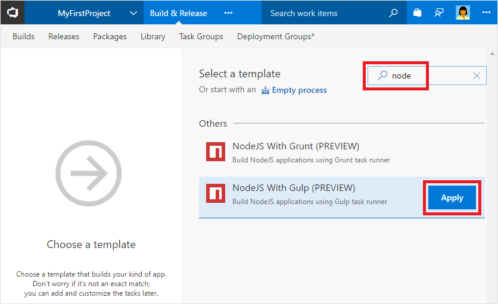

# Build your Node.js app with Gulp

Follow these steps to quickly set up a CI process for your Node.js app using VSTS. The sample app we use here is a Node server that echoes "Hello world". Tests for the app are written using mocha framework. A gulp file is used to run the tests and to convert the results into junit format so that they can be published to VSTS or TFS.

## Prerequisites

[!INCLUDE [include](../../_shared/ci-cd-prerequisites-vsts.md)]

## Get sample app code

[!INCLUDE [include](../_shared/get-sample-code-intro.md)]

```
https://github.com/adventworks/nodejs-sample
```

Choose your version control system to get specific instructions for copying the sample app code:

# [VSTS Git](#tab/vstsgit)

[!INCLUDE [include](../_shared/get-sample-code-vsts-tfs-2017-update-2.md)]

# [GitHub](#tab/github)

[!INCLUDE [include](../_shared/get-sample-code-github.md)]

---

[!INCLUDE [include](../_shared/get-sample-code-other-repos-vsts.md)]

## Set up CI - build process

[!INCLUDE [include](../_shared/setup-ci-build-process-intro.md)]

# [YAML](#tab/yaml/vstsgit)

The sample app already has the .vsts-ci.yml file. View this file in your version control repository and notice the steps for building, archiving, and publishing the app.

# [YAML](#tab/yaml/github)

[!INCLUDE [include](../_shared/setup-ci-build-process-yaml.md)]

# [Editor](#tab/editor/vstsgit)

1. Navigate to the **Files** tab of the **Code** hub, and then click **Set up build**.

  

  You are taken to the **Build & Release** hub and asked to **Select a template** for the new build definition.

1. In the right panel, search for `node`, select **NodeJS with Gulp**, and then click **Apply**.

  

  You now see all the tasks that were automatically added to the build definition by the template. These are the steps that will automatically run every time you check in code.

1. For the **Default agent queue**, select _Hosted VS2017_. This is how you can use our pool of agents that have the software you need to build your app.

1. Select the **Run gulp** task from the tasks. On the right side, you see the parameters for the task. Under the section JUnit Test Results, select the option to **Publish to TFS/VSTS**.

1. Click the **Triggers** tab in the build definition. Enable the **Continuous Integration** trigger. This will ensure that the build process is automatically triggered every time you commit a change to your repository.

# [Editor](#tab/editor/github)

1. Navigate to the **Builds** tab of the **Build and Release** hub in VSTS or TFS, and then click **+ New**. You are asked to **Select a template** for the new build definition.

1. In the right panel, search for `node`, select **NodeJS with Gulp**, and then click **Apply**.

  

  You now see all the tasks that were automatically added to the build definition by the template. These are the steps that will automatically run every time you check in code.

1. For the **Default agent queue**, select _Hosted VS2017_. This is how you can use our pool of agents that have the software you need to build your app.

1. Click **Get sources**. Select your version control repository. You'll need to authorize access to your repo.

1. Select the **Run gulp** task from the tasks. On the right side, you see the parameters for the task. Under the section JUnit Test Results, select the option to Publish to TFS/VSTS.

1. Click the **Triggers** tab in the build definition. Enable the **Continuous Integration** trigger. This will ensure that the build process is automatically triggered every time you commit a change to your repository.

---

## Set up CI - publishing artifacts

The build process you set up in the previous section creates a **zip archive** by default. This is convenient if you plan to deploy the app to an Azure web app or to an IIS server. However, if your goal is to deploy the app to a Linux machine, then you can publish the build as a simple **folder**. Or, if your goal is to deploy the app to Azure web apps for containers or a Kubernetes cluster, then you can publish the app as a **container**. See the instructions below to customize your build process for each of these scenarios.

# [Zip archive](#tab/zip/yaml)

The build process you set up in the previous section already publishes a zip archive file for your Node.js web app.

# [Zip archive](#tab/zip/editor)

The build process you set up in the previous section already publishes a zip archive file for your Node.js web app.

# [Folder](#tab/folder/yaml)

Edit the file in the version control editor and remove the **ArchiveFiles** task by deleting the following lines from .vsts-ci.yml file.

```
- task: ArchiveFiles@1
  inputs:
    rootFolder: $(Build.SourcesDirectory)
    archiveFile: $(Build.ArtifactStagingDirectory)/$(Build.BuildId).zip
```

# [Folder](#tab/folder/editor)

Remove the **Archive files** task from the build definition.

# [Container](#tab/container/yaml)

This is not yet supported in YAML. It will be supported soon.

# [Container](#tab/container/editor)

Before packaging the app and publishing it as a container, you need access to a container registry. In the instructions here, we will use Azure Container Registry, but you can also use another Docker registry.

1. Remove the **Archive files** task and the **Publish artifacts** task from the build definition.

1. Select **+ Add Task** to add another task to the build definition. From the displayed task catalog, select **Docker** task. Change the parameters for this task as follows:

   * **Azure subscription:** Select a connection from the list under **Available Azure Service Connections** or create a more restricted permissions connection to your Azure subscription. If you are using VSTS and if you see an **Authorize** button next to the input, click on it to authorize VSTS to connect to your Azure subscription. If you are using TFS or if you do not see
     the desired Azure subscription in the list of subscriptions, see [Azure Resource Manager service endpoint](../../concepts/library/service-endpoints.md#sep-azure-rm) to manually set up the connection.

   * **Azure Container Registry:** Select the Azure container registry that you created above.

   * **Action:** Build an image.

1. Select **+ Add Task** to add another **Docker** task to the build definition.
   Make sure that the task is inserted _after_ the previous **Docker** task. Change the parameters for this task as follows:

   * **Azure subscription:** Same as in previous task.

   * **Azure Container Registry:** Same as in previous task.

   * **Action:** Push an image.

---

## Run a build

# [YAML](#tab/yaml)

1. If you made any changes in the .vsts-ci.yml file, commit those changes to version control. Or else, make a simple change by adding a comment to it.

1. Navigate to the **Builds** tab in **Build and Release** hub and notice that a build definition has been automatically started.

# [YAML](#tab/editor)

1. Click **Save and queue** to kick off your first build. On the **Queue build** dialog box, click **Queue**.

1. A new build is started. You'll see a link to the new build on the top of the page. Click the link to watch the new build as it happens.

---

## View the build summary

[!INCLUDE [include](../_shared/view-build-summary.md)]

## Next steps

[!INCLUDE [include](../_shared/ci-web-app-next-steps.md)]
