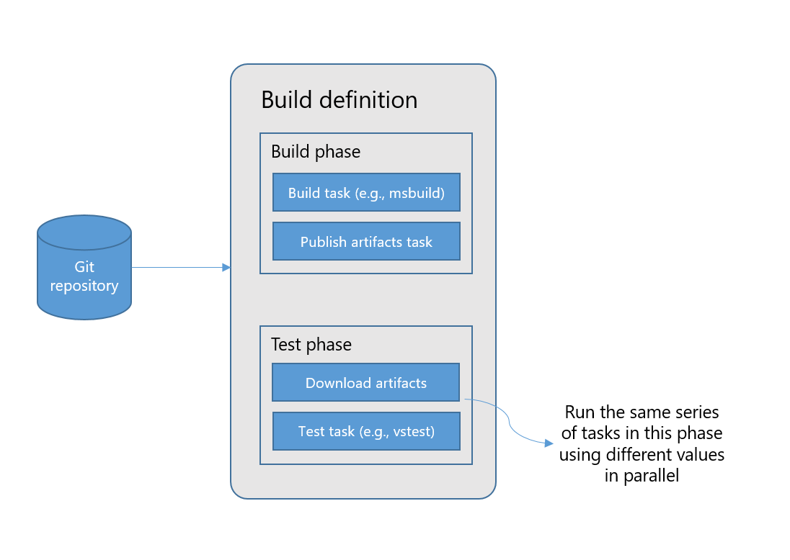
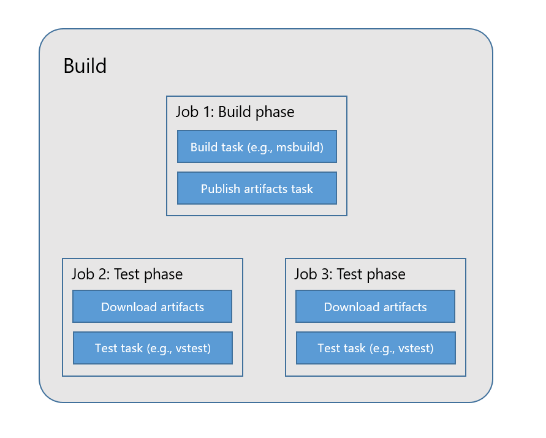

# Build definitions

You start using the build features in VSTS or TFS by authoring a build definition for your application. A **build definition** defines the build and validation process for the code in your application. To author a build definition, you must specify the input to the build process, the process itself, and the output of the build process.

The input to the build process is the source code for your application checked into a [**repository**](repository.md). You can use Git or Team Foundation Version Control repositories in VSTS or TFS, Subversion, GitHub, Bitbucket, or any other Git repository to manage your source code.

You define the automated **build process** using [**phases**](../../process/phases.md) and [**tasks**](../../process/tasks.md). At the core of the build process, you run tasks to compile your application code and to run tests. You use [**variables**](variables.md) to generalize your automation process and [**triggers**](triggers.md) to control when you would like to kick off this automation. For instance, you can trigger the process every time a change is made to your code. To run the build process, you need an [**agent**](../../agents/agents.md). So, another aspect of defining the build process is identifying the [**agent queue**](../../agents/pools-queues.md) that must be used to run builds.

You then identify the [**artifacts**](artifacts.md) to be published at the end of a build. Examples of artifacts include packages that you publish to a feed, web deployable packages that you deploy to a web site, or symbols that you need for debugging build failures.

An example of a build process that can be modeled through a build definition in shown below:

This example shows a build definition to validate every commit to the Fabrikam Git repository. The build process consists of two phases - one to build the commit and publish output as an artifact, and one to test that artifact on multiple test configurations. Breaking up the definition into two phases allows us to target a different set of agents in each phase - thereby running the build on an agent with one set of capabilities, and testing the build on agents with another set of capabilities.

Besides the process, build definitions also have various [options](options.md), [permissions](../../policies/permissions.md#build-permissions) and [policies](../../policies/retention.md) that can be customized.

A **build** is the result of executing the build process. It is created either because you manually queued a new build or by of one of the automatic triggers configured in the build definition. A build has a clear status indicating whether it passed or failed. A build is considered passed if all the tasks in the build process succeed. A build also contains the following data:

- The list of commits and work items since the last successful build on the same branch of the same repository
- The logs resulting from execution of the build process
- The results of running tests
- The results of running code coverage
- The artifacts that were published
- Any other results that were published or added to the build summary through extensions

When a build runs, it creates **jobs**. A job is a unit of work that runs on an agent. If you have a simple build definition with a single phase, the build will have a single job. But, if you have multiple phases or phases that build multiple configurations, then your build will have multiple jobs.

The figure below shows how the build process from the definition is unfolded into multiple jobs.

> [!NOTE]
> Phases are only available in VSTS at present. They are not available in TFS 2015, TFS 2017, or TFS 2018.

## Related topics

* [Repositories](repository.md)
* [Variables](variables.md)
* [Triggers](triggers.md)
* [Artifacts](artifacts.md)
* [Options](options.md)
* [Build history](history.md)
* [Build retention](../../policies/retention.md)
* [Build security](../../policies/permissions.md#build-permissions)
