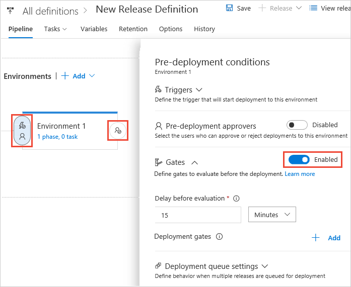
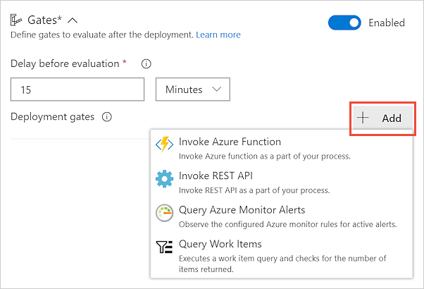
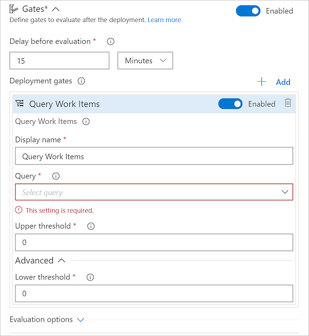
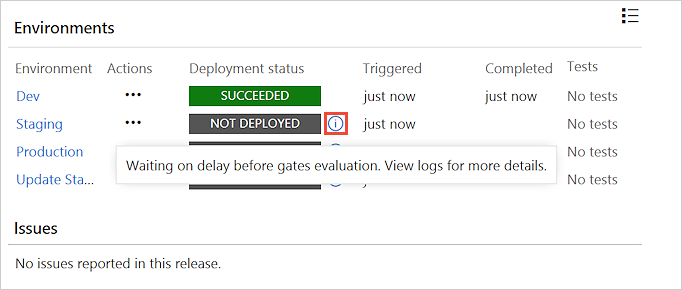
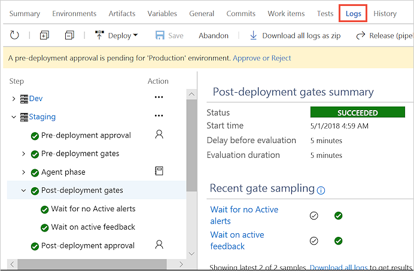

# Release deployment control using gates 

**VSTS**

Gates allow automatic collection of health signals from external services and promote the release when all the signals are successful at the same time, or stop the deployment on timeout. 
Typically gates work with incident management, problem management, change management, monitoring and external approval systems. 
Following are some use cases for gates -

  * **Incident and issues management** Ensure the required status for workitems, incidents and issues, like no P0 bugs before deployment and no active incidents after the deployment. 
  * **Seek approvals outside VSTS** Notify non-VSTS users like LCA, auditor or IT managers about a deployment approval collaboration systems like Microsoft Teams or Slack, and wait for the approval to complete.
  * **Quality validation** Query test metrics (test pass %, code coverage etc.) for the build being deployed till they meet the requirement threshold(s).
  * **Security scan on artifacts** Ensure the build artifacts have completed the security scans like anitu-virus, code sign, policy check etc. A gate might initiate the scan and wait for it to complete, or only check for completion.
  * **User experience relative to baseline** Using product telemetry, ensure the user experience hasn't regressed from the baseline state. The experience level before the deployment could be considered a baseline.
  * **Change management** Wait for change management procedure in a ITSM system like ServiceNow to complete before the deployment.
  * **Infrastructure health** Execute monitoring and compliance rules against the infrastructure after the deployment. Wait for a healthy resource utilization and positive security report.  

Most of the health parameters vary over time, changing their status from healthy to unhealthy and vice versa. 
In order to account for such variations, all the gates are periodically re-evaluated until all of them are successful at the same time. 
The release does not proceed further if gates do not succeed in the timeout interval.

## Define a gate for an environment

1. Enable gates in the **Pre-deployment conditions** or **Post-deployment conditions** panel for an environment. 

   

1. Specify the required **Delay before evaluation**. This is a time delay at the beginning of gate evaluation 
   process that allows the gates to initialize, stabilize, and begin providing accurate results
   for the current deployment. See [Gate evaluation flows](#eval-examples).

   

   As an example:

   * For **pre-deployment gates**, the delay would be the time required for all bugs to be logged
     against the artifacts being deployed.  
   * For **post-deployment gates**, the delay would be the maximum of the time taken for the deployed app
     to reach a steady operational state, the time taken for execution of all the required tests on
     the deployed environment, and the time it takes for incidents to be logged after the deployment.

1. Choose **+ Add**, and select the type of release gate you require.

   

   The following gates are provided out of the box. [More gates can be added](https://github.com/Microsoft/vsts-tasks/blob/master/docs/authoring/gates.md) with marketplace extensions.

   * **Invoke Azure function**: Trigger execution of an Azure function and ensure a successful completion.
     For more details, see [Azure function task](../../../../tasks/utility/azure-function.md).
   * **Query Azure monitor alerts**: Observe the configured Azure monitor alert rules for active alerts.
     For more details, see [Azure monitor task](../../../../tasks/utility/azure-monitor.md).
   * **Invoke REST API**: Make a call to a REST API and continue if it returns a successful response.
     For more details, see [HTTP REST API task](../../../../tasks/utility/http-rest-api.md).
   * **Query Work items**: Ensure the number of matching work items returned from a query is within a threshold.
     For more details, see [Work item query task](../../../../tasks/utility/work-item-query.md).
   
1. Select and enter the required gate arguments, depending on the type of gate chosen.

   

1.  Set the evaluation options that apply to all the gates added:

   * **Time between re-evaluation of gates**. The time interval between to successive evaluation of 
     the gates. At each sampling interval, new requests are sent concurrently to each gate
     for fresh results. It is recommended that the sampling interval is greater than the longest
     typical response time of the configured gates, to allow time for all responses to be received for evaluation.     

   * **Timeout after which gates fail**. The maximum evaluation period for all gates. 
     The deployment will be rejected if the timeout is reached before all gates succeed during the same sampling interval. 

   * **Gates and approvals**. Select the required order of execution for gates and approvals if you have configured both.
     For pre-deployment conditions, the default is to prompt for manual (user) approvals first, then evaluate gates afterwards.
     This saves the system from evaluating the gate functions if the release is rejected by the user. 
     For post-deployment conditions, the default is to evaluate gates and prompt for manual approvals only when all gates are successful.
     This ensures the approvers have all the information required for a sign-off. 

   
   
### Gate evaluation flow examples

The following diagram illustrates the flow of gate evaluation where, after the
initial stabilization delay period and three sampling intervals, the deployment is approved.

The following diagram illustrates the flow of gate evaluation where, after the
initial stabilization delay period, not all gates have succeeded at each sampling interval. In
this case, after the timeout period expires, the deployment is rejected.

## View and monitor gate results
 
1. Open the **Summary** page for your release. As the release executes, the pop-up message when you choose
   the  icon for an environment indicates the current status of your deployment to each environment.

   

1. Open the **Logs** page for your release. During and after a deployment, it shows comprehensive information
about the evaluation of all the gates you configured for the release.

   

## Related topics

* [Approvals and gates overview](index.md)
* [Manual intervention](../../../../tasks/utility/manual-intervention.md)
* [Use approvals and gates to control your deployment](../../../../actions/deploy-using-approvals.md)
* [Environments](../environments.md)
* [Triggers](../triggers.md)

## See also

* [Video: Deploy quicker and safer with gates in VSTS](https://channel9.msdn.com/Events/Connect/2017/T181)
* [Configure your release pipelines for safe deployments](https://blogs.msdn.microsoft.com/visualstudioalm/2017/04/24/configuring-your-release-pipelines-for-safe-deployments/)
* [Tutorial: Use approvals and gates to control your deployment](../../../../actions/deploy-using-approvals.md)
* [Twitter sentiment as a release gate](https://blogs.msdn.microsoft.com/bharry/2017/12/15/twitter-sentiment-as-a-release-gate/)
* [Github issues as a release gate](https://www.visualstudiogeeks.com/DevOps/github-issues-as-deployment-gate-in-vsts-rm)
* [Author custom gates](https://github.com/Microsoft/vsts-tasks/blob/master/docs/authoring/gates.md). [Library with examples](https://github.com/Microsoft/vsts-rm-extensions/tree/master/ServerTaskHelper/DistributedTask.ServerTask.Remote.Common) 

[!INCLUDE [rm-help-support-shared](../../../../_shared/rm-help-support-shared.md)]
