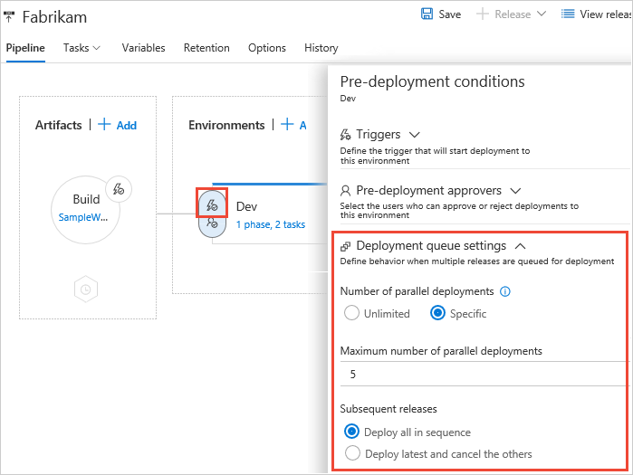
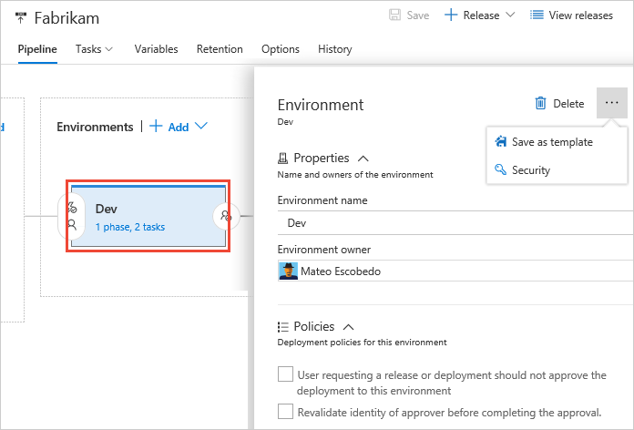

[//]: # (monikerRange: ">= tfs-2015")

# Environments in Release Management

[!INCLUDE [version-rm-dev14](../../../_shared/version-rm-dev14.md)]

<a name="introduction"/>
An **environment** is a _logical_ and _independent_ entity that
represents where you want to deploy a release generated from a release
definition. We'll examine these two characteristics in more detail
to help you understand how to divide your release process into
environments.

First, an environment in a release definition is a **logical** entity.
It can represent any physical or real environment that you need.
For example, the deployment in an environment may be to a collection of servers,
a cloud, or multiple clouds. In fact, you can even use an environment to represent
shipping the software to an app store, or the manufacturing process of a boxed product.

Second, you must be able to deploy to an environment **independently** of other environments in the definition.
For example, your definition might consist of two environments A and B, and Release Management could deploy Release 2
to A and Release 1 to B. If you make any assumptions in B about the existence of a certain release in A, the
two environments are not independent. 

Here are some suggestions and examples for environments:

* **Dev, QA, Prod** - As new builds are produced, they can be deployed to Dev. They can then be promoted to QA, and finally to Prod.
  At any time, each of these environments may have a different release (set of build artifacts) deployed to them. 
  This is a good example of the use of environments in a release definition.

* **Customer adoption rings** (for example, early adopter ring, frequent adopter ring, late adopter ring) -
  You typically want to deploy new or beta releases to your early adopters more often than to other users.
  Therefore, you are likely to have different releases in each of these rings. This is a good example of the use of environments in a definition.

* **Database and web tiers of an application** - These should be modeled as a single environment
  because you want the two to be in sync. If you model these as separate environments, you risk
  deploying one build to the database environment and a different build to the web tier environment.

* **Staging and production slots of a web site** - There is clearly an interdependence between these two slots.
  You do not want the production slot to be deployed independently of the build version currently deployed to the
  staging slot. Therefore, you must model the deployment to both the staging and production slots as a single environment.

* **Multiple geographic sites with the same application** - In this example, you want to deploy your website to many geographically distributed sites around the globe
  and you want all of them to be the same version. You want to deploy the new version of your application to a staging slot in all the sites, test it,
  and - if all of them pass - swap all the staging slots to production slots.
  In this case, given the interdependence between the sites, you cannot model each site as a different environment.
  Instead, you must model this as a single environment with parallel deployment to multiple sites
  (typically by using [phases](../../process/phases.md)).

* **Multiple test environments to test the same application** - Having one or more release definitions,
  each with multiple environments intended to run test automation for a build, is a common practice.
  This is fine if each of the environments deploys the build independently, and then runs tests.
  However, if you set up the first environment to deploy the build, and subsequent environments to test
  the same shared deployment, you risk overriding the shared environment with a newer build while testing
  of the previous builds is still in progress.

The deployment process of a release to an environment is defined in terms of [phases](../../process/phases.md) and [tasks](../../process/tasks.md).
The physical deployment of a release to an environment is controlled through  
[approvals and gates](approvals/index.md), [deployment conditions and triggers](triggers.md#env-triggers),
and [queuing policies](#queuing-policies).

## Queuing policies

In some cases, you may be generating builds more quickly than
they can be deployed. Alternatively, you may configure multiple
[agents](../../agents/agents.md) and, for example, be creating releases from the same release definition
for deployment of different artifacts. In such cases, it's useful to
be able to control how multiple releases are queued into an
environment. **Queuing policies** give you that control.

The options you can choose for a queuing policy are:

* **Maximum number of deployments that can proceed at one time**:
  Use this option if you dynamically provision new resources
  in your environment and it is physically capable of handling
  the deployment of multiple releases in parallel, but you want
  to limit the number of parallel deployments.

* If you specify a maximum number of deployments, two more options appear:

  - **Deploy all of them in order of request**:
    Use this option if you want to deploy all the releases
    sequentially into the same shared physical resources.
    By deploying them in turn, one after the other, you
    ensure that two deployment jobs do not target the same
    physical resources concurrently, even if there are
    multiple build and release agents available. You
    also ensure that pre-deployment approval requests for the
    environment are sent out in sequence.

  - **Deploy only the latest request and cancel the older ones**:
    Use this option if you are producing releases faster
    than builds, and you only want to deploy the latest build.

To understand how these options work, consider a scenario
where releases **R1**, **R2**, **...**, **R5** of a
single release definition are created in quick succession
due to new builds being produced rapidly. Assume that
the first environment in this definition is named **QA**
and has both pre-deployment and post-deployment approvers
defined.

* If you do not specify a limit for the number of parallel deployments,
  all five approval requests will be sent out as soon as
  the releases are created. If the approvers grant approval for all of the
  releases, they will all be deployed to the **QA** environment in parallel.
  (if the **QA** environment did not have any pre-deployment
  approvers defined, all the five releases will automatically
  be deployed in parallel to this environment).

* If you specify a limit and **Deploy all of them in order of request**,
  and the limit has already been reached, the pre-deployment approval for
  release **R1** will be sent out first. After this
  approval is completed, the deployment of release **R1** to the
  **QA** environment begins. Next, a request for
  post-deployment approval is sent out for release **R1**. It is
  only after this post-deployment approval is completed that
  execution of release **R2** begins and its pre-deployment
  approval is sent out. The process continues like this for
  all of the releases in turn.

* If you specify a limit and **Deploy only the latest request and cancel the older ones**,
  and the limit has already been reached, releases **R2**, **R3**, and **R4** will be
  skipped, and the pre-deployment approval for **R5** in
  the **QA** environment will be sent out immediately
  after the post-deployment approval for release **R1** is completed.

<h2 id="options">Environment general options</h2>

While the most important part of defining an environment is the
automation tasks, you can also configure several properties and options
for an environment in a release definition. You can:

* Edit the name of the environment here if required.

* Designate a single user or a single
  group to be the environment owner. Environment owners are
  notified whenever a deployment of a release is completed to that
  environment. Environment owners are not automatically assigned
  any addition permissions.

* Prevent the user who created a release or started the deployment from approving
  his or her own release. This is often useful to ensure
  compliance with corporate audit requirements.
  
* Force the identity of the user to be re-evaluated
  before the approval is processed and accepted.

* Delete the environment from the pipeline.

* Save a copy of the environment as a template.

* Manage the security settings for the environment.

## Q&A

### Why do we call these _environments_ instead of _stages_?

Primarily, to communicate the intent that they must be independent in a release definition.
We felt that this term implies that you can have two different
releases (sets of build artifacts) deployed to two environments
within a definition at the same time. Release Management also allows
you to deploy to multiple environments in parallel, and to directly
deploy to any environment within the definition provided you have
appropriate permission. It also helps you answer the question "Which release
is currently deployed to a specific environment?".

"Stage" would be a more appropriate term if we implemented a model
where a release, once created, must start in the first stage and
complete all the stages before the next release can be created.
Stages usually imply more dependencies. In other words, what you
do in the second stage could be dependent on what you did in the
first stage.

### Isn't environment more of a physical entity than a logical entity?

Unfortunately, the term environment is often also used to represent
the real set of resources that are being deployed to, and this does
cause some confusion with our choice of the term. We are exploring ways
of clarifying this, or other alternatives to the term "environment".

### I need to deploy two Azure resource groups in order to deploy my application. Is that one environment or two?

An environment is a logical entity that represents an independent
unit of deployment for your application, so you can deploy both the
resource groups using a single environment. For more guidance on
environments see the [introductory section](#introduction) above.

### At the end of my pipeline, I update the binaries in an app store. I really do not have any environment in this case. How do I model this in a release definition?

An environment is a logical entity that can be used to perform any
automation. It doesn't need to map to any physical resources.
Therefore, you can add an environment to your release definition
and add tasks to it to upload your binaries to the app store.

## Related topics

* [Environment triggers](triggers.md#env-triggers)
* [Tasks](../../process/tasks.md)
* [Environment security](../../policies/permissions.md#release-permissions)

[!INCLUDE [rm-help-support-shared](../../../_shared/rm-help-support-shared.md)]
