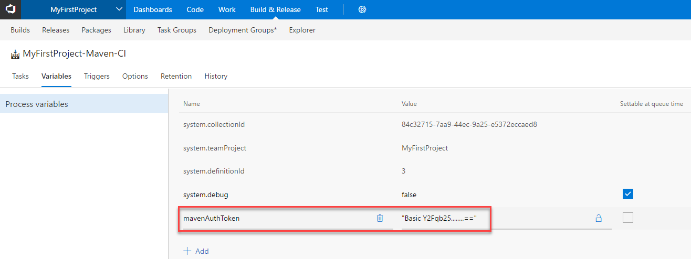

# Set up Team Build and Maven

This guide covers the basics of using Team Build to work with Maven packages in Package Management feeds.  The Maven build task will be doing most of the legwork here, but we'll have to take some extra steps to ensure that the build can authenticate to VSTS feeds. 
 
This walkthrough assumes that you've already Added the correct build service identity to your feed. 

1. In the repository where you store your Maven source code, add a `settings.xml` to the root of your repository, replacing *${mavenAuthToken}* with the authentication token:
```xml
<settings> 
    <servers> 
        <server> 
            <id>calvinpackageplayground-visualstudio.com-calvinmavenfeed</id> 
            <configuration> 
                <httpHeaders> 
                    <property> 
                        <name>Authorization</name> 
                        <value>${mavenAuthToken}</value> 
                    </property> 
                </httpHeaders> 
            </configuration> 
        </server> 
    </servers> 
</settings> 
```
<br>

2. Create a new build definition and select the **Maven** template.
<br>
3. Fill in the path to your `POM.xml`, configure the Maven goal you'd like for your build, then add
<br>
`-s settings.xml -DmavenAuthToken=$(mavenAuthToken)`
<br>
under *Options*.  This is telling Maven to use your customized `settings.xml` and enables us to pass in the password using a build variable. 
<br><br>
4. We'll need to pass the auth token to the Build.  Navigate to the **Maven** tab of **Connect to Feed**, click *Generate Maven credentials*, paste the result into your favorite text editor, and copy everything inside the `<value>` tag. 
<br><br>
5. In the "Variables" tab of the Build editor, create a new variable, name it **mavenAuthToken**, and paste the auth token inside quotes into the **value** field (see screenshot below).  Then click the **lock** button to make it a secure build variable. 



>[!NOTE]
>Note that this authentication model is not fully secure.  Anyone with access to your build can output your
>token in plain text.  We are working on improving this experience. 
 
