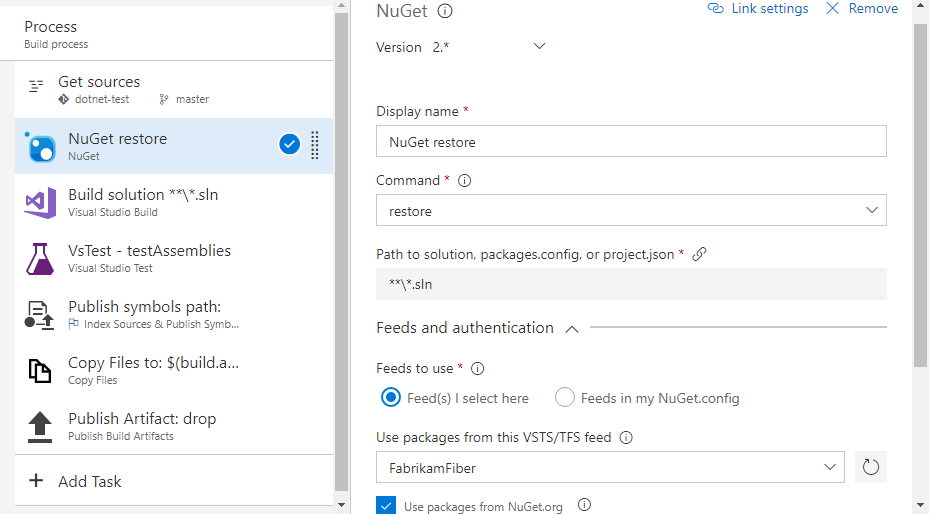

# Restore Package Management NuGet packages in Team Build

**VSTS | TFS 2018 | TFS 2017**

This walkthrough will cover setting up an existing build to restore NuGet packages from Package Management feeds. It assumes that you've already:

- [Set up your solution](/vsts/package/nuget/consume) to consume packages from a Package Management feed
- [Created a build](/vsts/build-release/) for that solution
- [Added the correct build service identity](/vsts/package/feeds/common-identities) to your feed

To build a solution that relies on NuGet packages from Package Management feeds, add the **NuGet** task (if one is not already present). 

First, click **Add build step...**, select the **Package** category, and add the **NuGet** task. Then drag to order the task above any build tasks that require your packages. 

Next, configure these options:

- **Command:** restore
- **Path to solution, packages.config, or project.json:** The path to the file that specifies the packages you want to restore

Then, select feeds to use:

- If you've checked in a [NuGet.config](http://docs.nuget.org/Consume/NuGet-Config-File), select **Feeds in my NuGet.config** and select the file from your repo.
- If you're using a single VSTS/TFS feed, select the **Feed(s) I select here** option and select your feed from the dropdown.



Finally, save your build.

## Specifying sources in NuGet.config

The NuGet.config you check in should list all the package sources you want to consume.
The example below demonstrates how that might look.

```xml
<?xml version="1.0" encoding="utf-8"?>
<configuration>
  <packageSources>
    <!-- remove any machine-wide sources with <clear/> -->
    <clear />
    <!-- add a VSTS feed -->
    <add key="MyGreatFeed" value="https://fabrikam.pkgs.visualstudio.com/DefaultCollection/_packaging/MyGreatFeed/nuget/v3/index.json" />
    <!-- also get packages from the NuGet Gallery -->
    <add key="nuget.org" value="https://www.nuget.org/api/v2/" />
  </packageSources>
  <activePackageSource>
    <add key="All" value="(Aggregate source)" />
  </activePackageSource>
</configuration>
```

## Q & A

### Why can't my build restore packages?

NuGet restore can fail due to a variety of issues. One of the most common issues is the introduction of a new project in your solution that requires a [target framework](https://docs.microsoft.com/en-us/nuget/schema/target-frameworks) that isn't understood by the version of NuGet your build is using. This issue generally doesn't present itself on a developer machine because Visual Studio updates the NuGet restore mechanism at the same time it adds new project types. We're looking into similar features for VSTS. In the meantime though, the first thing to try when you can't restore packages is to update to the latest version of NuGet.

### How do I use the latest version of NuGet?

::: moniker range=">= tfs-2018" 

If you're using VSTS or the upcoming TFS 2018 release, new template-based builds will work automatically thanks to a new "NuGet Tool Installer" task that's been added to the beginning of all build templates that use the NuGet task. We periodically update the default version that's selected for new builds around the same time we install Visual Studio updates on the Hosted build agents.

For existing builds, just add or update a NuGet Tool Installer step to select the version of NuGet for all the subsequent steps. You can see all available versions of NuGet [on nuget.org](https://dist.nuget.org/tools.json).


::: moniker-end 

::: moniker range="tfs-2017" 

#### TFS 2017 and earlier

Because the NuGet Tool Installer is not available in TFS versions prior to TFS 2018, there is a recommended workaround to use versions of NuGet > 4.0.0 in Team Build.

1. Add the task, if you haven't already. If you have a "NuGet Restore" step in the catalog (it may be in the Deprecated tasks section), insert it into your build. Otherwise, insert a "NuGet" step.
1. For your NuGet/NuGet Installer step, use the version selector under the task name to select version "0.*".
1. In the Advanced section, set the NuGet Version to "Custom" and the Path to NuGet.exe as
$(Build.BinariesDirectory)\nuget.exe
1. Before your NuGet step, add a "PowerShell" step, select "Inline Script" as the Type, enter this PowerShell script as the Inline Script, and enter "4.3.0" (or any version of NuGet from this list) as the Arguments.

Our thanks to [GitHub user leftler](https://github.com/Microsoft/vsts-tasks/issues/3756#issuecomment-288185011) for creating the original version of the PowerShell script linked above.

::: moniker-end 
