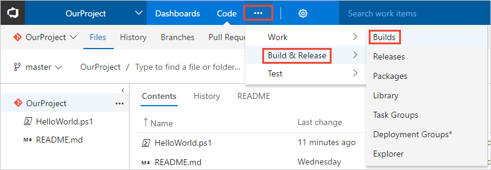
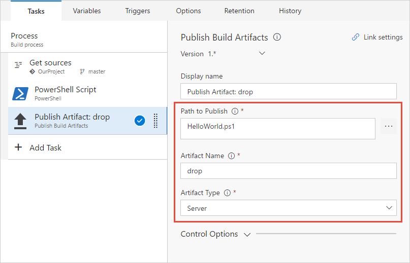
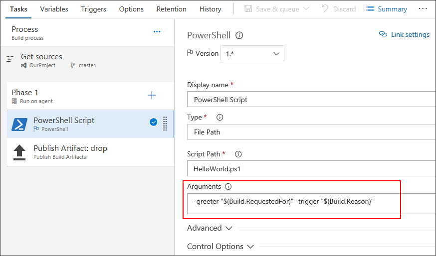
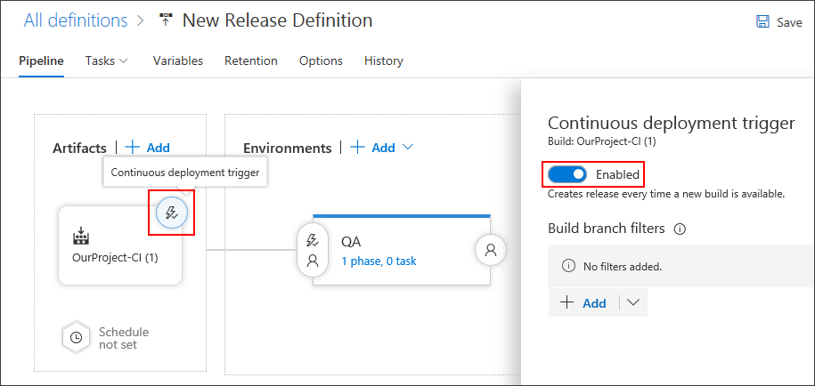

# Create your first build and release

::: moniker range="vsts"

We'll show you how to use VSTS pipelines to create a build that prints "Hello world" and then automatically creates a release that does the same. By the time you finish here, you'll see an end-to-end process run every time you push new code into your team project. You'll also become familiar with all the basic concepts of VSTS pipelines.

::: moniker-end

::: moniker range="< vsts"

We'll show you how to use TFS to create a build that prints "Hello world" and then automatically creates a release that does the same. By the time you finish here, you'll see an end-to-end process run every time you push new code into your team project. You'll also become familiar with all the basic concepts of build and release in TFS.

::: moniker-end

## Prerequisites

::: moniker range="vsts"

[!INCLUDE [include](_shared/ci-cd-prerequisites-vsts.md)]

::: moniker-end

::: moniker range="< vsts"

* An [agent](actions/agents/v2-windows.md) that can run build and release jobs. You must have Powershell installed on the agent machine.

::: moniker-end

## Add a script to your repository

Create a PowerShell script that prints `Hello world`.

::: moniker range="vsts"

1. Go to the **Code** hub in the VSTS web UI.

::: moniker-end

::: moniker range="< vsts"

1. Go to the **Code** hub in the TFS web UI.

::: moniker-end

1. Add a file.

 ::: moniker range="vsts"

  

 ::: moniker-end

 ::: moniker range=">= tfs-2017 < vsts"

 

 ::: moniker-end

1. In the dialog box name your new file.
 ```
HelloWorld.ps1
```

1. Copy and paste this script.
 ```ps
Write-Host "Hello world"
 ```

1. **Commit** (save) the file.

> In this tutorial, our focus is on CI/CD, so we're keeping the code part simple. We're working in a VSTS Git repository directly in your web browser.
>
> When you're ready to begin building and deploying a real app, you can use a wide range of version control clients and services with VSTS CI builds. [Learn more](#version-control).

## Create a build pipeline

Create a build pipeline that prints "Hello world."

 ::: moniker range="vsts"

1. Select the **Build and Release** hub in your VSTS project, and then choose **Builds**.

   

1. Create a new build pipeline.

   

1. Make sure that the **source**, **team project**, **repository**, and default **branch** match the location in which you created the script.

1. Start with an **empty process**.

1. Click **Process** and specify whatever **Name** you want to use. For the **Agent queue**, select **Hosted VS2017**.

1. On the left side, select the plus sign **( + )** for Phase 1 to add a task to the phase, and then on the right side select the **Utility** category, select the **PowerShell** task, and then choose **Add**.

   

1. On the left side click your new **PowerShell** script task.

1. For the **Script Path** argument, click the <span style="background-color: rgb(244,244,244);font-weight:bold;padding:5px">...</span> button to browse your repository and select the script you created.

   

1. Click **Save & queue**, and then click **Save**.

 ::: moniker-end

 ::: moniker range=">= tfs-2017 < vsts"

1. Select the **Build and Release** hub in your VSTS project, and then the **Builds** tab.

 

1. Create a new definition.

 

1. Start with an **empty process**.

1. Click **Process** and specify whatever **Name** you want to use. For the **Agent queue**, select **Default** or whichever queue you want to use that has Windows build agents.

1. Make sure that **Get sources** is set with the **Repository** and **Branch** in which you created the script.

1. On the left side click **Add Task**, and then on the right side click the **Utility** category, click the select the **PowerShell** task, and then click **Add**.

1. On the left side click your new **PowerShell** script task.

1. For the **Script Path** argument, click the <span style="background-color: rgb(244,244,244);font-weight:bold;padding:5px">...</span> button to browse your repository and select the script you created.

   

1. Click **Save & queue**, and then click **Save**.

 ::: moniker-end

> A build pipeline is the entity through which you define your automated build process. In the build pipeline, you compose a set of tasks, each of which perform a step in your build. The task catalog provides a rich set of tasks for you to get started. You can also add PowerShell or shell scripts to your build pipeline.

## Publish an artifact from your build

A typical build produces an artifact that can then be deployed to various environments in a release. Here to demonstrate the capability in a simple way, we'll simply publish the script as the artifact.

::: moniker range="vsts"

1. On the **Tasks** tab, select the plus sign **( + )** for Phase 1 to add a task to the phase.

1. Click the **Utility** category, click the **Publish Build Artifacts** task, and then click **Add**.

   

   **Path to publish**: Click the <span style="background-color: rgb(244,244,244);font-weight:bold;padding:5px">...</span> button to browse and select the script you created.

   **Artifact name**

   ```
   drop
   ```

   **Artifact publish location**: **Visual Studio Team Services/TFS**.

::: moniker-end

::: moniker range=">= tfs-2017 < vsts"

1. On the **Tasks** tab, click **Add Task**.

1. Click the **Utility** category, click the **Publish Build Artifacts** task, and then click **Add**.

 

 **Path to Publish**: Click the <span style="background-color: rgb(244,244,244);font-weight:bold;padding:5px">...</span> button to browse and select the script you created.

 **Artifact Name**

 ```
drop
```

 **Artifact Type**: **Server**.

::: moniker-end

> Artifacts are the files that you want your build to produce. Artifacts can be nearly anything your team needs to test or deploy your app. For example, you've got a .DLL and .EXE executable files and .PDB symbols file of a C# or C++ .NET Windows app.
>
> To enable you to produce artifacts, we provide tools such as copying with pattern matching, and a staging directory in which you can gather your artifacts before publishing them. See [Artifacts in Team Build](concepts/definitions/build/artifacts.md).

## Enable continuous integration (CI)

1. Click the **Triggers** tab.

1. Enable **Continuous integration**.

>  A continuous integration trigger on a build pipeline indicates that the system should automatically queue a new build whenever a code change is committed. You can make the trigger more general or more specific, and also schedule your build (for example, on a nightly basis). See [Build triggers](concepts/definitions/build/triggers.md).

## Save and queue the build

Save and queue a build manually and test your build pipeline.

::: moniker range="vsts"

1. Click **Save & queue**, and then click **Save & queue**.

1. On the dialog box click **Save & queue** once more.

   This queues a new build on the hosted agent. 
   
1. You see a link to the new build on the top of the page. 

   

   Choose the link to watch the new build as it happens. Once the agent is allocated, you'll start seeing the live logs of the build. Notice that the PowerShell script is run as part of the build, and that "Hello world" is printed to the console.

   

1. Go to the build summary.

   

1. On the **Artifacts** tab of the build notice that the script is published as an artifact.

   

::: moniker-end

::: moniker range=">= tfs-2017 < vsts"

1. Click **Save & queue**, and then click **Save & queue**.

1. On the dialog box click the **Queue** button.

   This queues a new build on the agent. Once the agent is allocated, you'll start seeing the live logs of the build. Notice that the PowerShell script is run as part of the build, and that "Hello world" is printed to the console.

   

1. Go to the build summary.

   

1. On the **Artifacts** tab of the build notice that the script is published as an artifact.

   

::: moniker-end

> You can view a summary of all the builds or drill into the logs for each build at any time by navigating to the **Builds** tab in the **Build and Release** hub. For each build, you can also view a list of commits that were built and the work items associated with each commit. You can also run tests in each build and analyze the test failures.

## Add some variables and commit a change to your script

We'll pass some build variables to the script to make our process a bit more interesting. Then we'll commit a change to a script and watch the CI process run automatically to validate the change.  

1. Edit your build pipeline.

1. On the **Tasks** tab, click the PowerShell script task.

1. Add these arguments.

 ::: moniker range="vsts"
 
 ::: moniker-end
 ::: moniker range=">= tfs-2017 < vsts"
 
 ::: moniker-end

 **Arguments**

 ```
-greeter "$(Build.RequestedFor)" -trigger "$(Build.Reason)"
```

1. Save the build pipeline.

1. Go to the **Code** hub, **Files** tab.

1. Select the **HelloWorld.ps1** file, and then **Edit** the file.

1. Change the script as follows:

 ```ps
Param(
   [string]$greeter,
   [string]$trigger
)
Write-Host "Hello world" from $greeter
Write-Host Trigger: $trigger
```

1. **Commit** (save) the script.

1. Go to the **Build and Release** hub, and notice that a build is automatically triggered by the change that you committed.

1. Select the new build that was created and view its log.

1. Notice that the person who changed the code has their name printed in the greeting message. You also see printed that this was a CI build.

 

> We just introduced the concept of build variables in these steps. We printed the value of a variable that is automatically predefined and initialized by the system. You can also define custom variables and use them either in arguments to your tasks, or as environment variables within your scripts. To learn more about variables, see [Build variables](../concepts/definitions/build/variables.md).

## You've got a build pipeline. What's next

You've just created a build pipeline that automatically builds and validates whatever code is checked in by your team. At this point you can continue to the next section to learn about release pipelines. Or, if you prefer, you can [skip ahead](#next-steps) to create a build pipeline for your app.

## Create a release pipeline

Now you're ready to define a release pipeline that runs a script in two environments. This will give you a basic idea of how to create a release pipeline, how it it is triggered, and how it gets files from your build pipeline.

::: moniker range="vsts"

1. Go to the **Build and Release** tab, and then select **Releases**.

1. Select the action to create a **New release pipeline**.

1. Select the action to start with an **empty process**.

1. Name the environment **QA**.

1. In the Artifacts panel, select **+ Add** and specify a **Source (Build definition)**. Select **Add**.

1. Select the **Lightning bolt** to trigger continuous deployment and then enable the **Continuous deployment trigger** on the right.

   

1. Select the **Tasks** tab and select your **QA** environment.

1. Select the plus sign **( + )** for the phase to add a task to the phase.

1. On the **Add tasks** dialog box, click **Utility**, locate the **PowerShell** task, and then click its **Add** button.

1. For the **Script Path** argument, click the <span style="background-color: rgb(244,244,244);font-weight:bold;padding:5px">...</span> button to browse your artifacts and select the script you created.

1. Add these **Arguments**:

   ```
   -greeter "$(Release.RequestedFor)" -trigger "$(Build.DefinitionName)"
   ```

1. On the **Pipeline** tab, select the **QA** environment and select **Clone**.

   

1. Rename the cloned environment **Production**.

1. Rename the release pipeline **Hello world**.

   

1. Save the release pipeline.

::: moniker-end

::: moniker range=">= tfs-2017 < vsts"

1. Go to the **Build and Release** hub, and then to the **Releases** tab.

1. Select the action to create a **New definition**.

1. On the dialog box, select the **Empty** template and click **Next**.

1. Make sure that your **Hello world** build definition that you created above is selected. Select **Continuous deployment**, and then click **Create**.

1. Click **Add tasks** in the environment.

1. On the **Task catalog** dialog box, click **Utility**, locate the **PowerShell** task, and then click its **Add** button. Click the **Close** button.

1. For the **Script Path** argument, click the <span style="background-color: rgb(244,244,244);font-weight:bold;padding:5px">...</span> button to browse your artifacts and select the script you created.

1. Add these **Arguments**:

 ```
-greeter "$(Release.RequestedFor)" -trigger "$(Build.DefinitionName)"
```

1. Rename the environment **QA**.

 

1. **Clone** the **QA** environment.

 

 Leave **Automatically approve** and **Deploy automatically...** selected, and click **Create**.

1. Rename the new environment **Production**.

1. Rename the release definition **Hello world**.

 

1. Save the release definition.

::: moniker-end

> A release pipeline is a collection of environments to which the application build artifacts are deployed. It also defines the actual deployment process for each environment, as well as how the artifacts are promoted from one environment to another.
>
> Also, notice that we used some variables in our script arguments. In this case, we used [release variables](concepts/definitions/release/variables.md) instead of the build variables we used for the build pipeline.

## Deploy a release

Run the script in each environment.

 ::: moniker range="vsts"

1. Create a new release.

 

1. Define the trigger settings and artifact source for the release and then select **Create**.

1. Open the release that you just created.

 

1. View the logs to get real-time data about the release.

 

 ::: moniker-end

 ::: moniker range=">= tfs-2017 < vsts"

1. Create a new release.

 

1. Open the release that you just created.

 

1. View the logs to get real-time data about the release.

 

 ::: moniker-end

> You can track the progress of each release to see if it has been deployed to all the environments. You can track the commits that are part of each release, the associated work items, and the results of any test runs that you've added to the release process.

## Change your code and watch it automatically deploy to production

We'll make one more change to the script. This time it will automatically build and then get deployed all the way to the production environment.

1. Go to the **Code** hub, **Files** tab, edit the **HelloWorld.ps1** file, and change it as follows:

 ```ps
Param(
   [string]$greeter,
   [string]$trigger
)
Write-Host "Hello world" from $greeter
Write-Host Trigger: $trigger
Write-Host "Now that you've got CI/CD, you can automatically deploy your app every time your team checks in code."
```

1. **Commit** (save) the script.

1. Click the **Builds** tab to see the build queued and run.

1. After the build is completed, click the **Releases** tab, open the new release, and then go to the **Logs**.

 Your new code automatically is deployed in the **QA** environment, and then in the **Production** environment.

 ::: moniker range="vsts"

 

 ::: moniker-end

 ::: moniker range=">= tfs-2017 < vsts"

 

 ::: moniker-end

> In many cases, you probably would want to edit the release process so that the production deployment happens
  only after some testing and approvals are in place. See [Approvals and gates overview](concepts/definitions/release/approvals/index.md).

<a name="next-steps"></a>
## Next steps

You've just learned the basics to create and run a build pipeline and a release pipeline in your web browser.

Now you're ready to learn how to configure your build pipeline for the programming language you're using.
Go ahead and create a new build pipeline, and this time, use one of the following templates.

| Language | Repository with sample application | Template to use | More documentation |
|----------|------------------------------------|-----------------|--------------------|
| C++ | `https://github.com/adventworks/cpp-sample` | .NET Desktop | Doc link |
| C# | `https://github.com/adventworks/dotnetcore-sample` | ASP.NET Core | Doc link |
| Go | `https://github.com/adventworks/go-sample` | Go | Doc link |
| Java | `https://github.com/adventworks/java-sample` | Gradle | Doc link |
| JavaScript | `https://github.com/adventworks/nodejs-sample` | NodeJS with Gulp | Doc link |
| Swift | `https://github.com/adventworks/xcode-sample` | Xcode | Doc link |