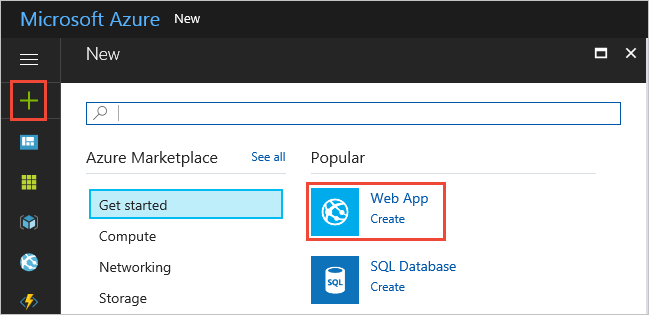
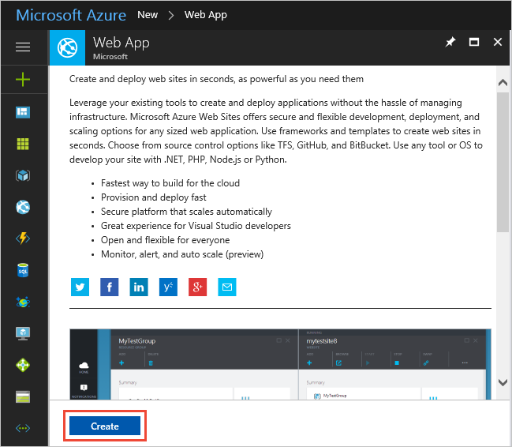
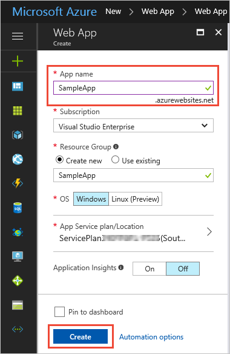
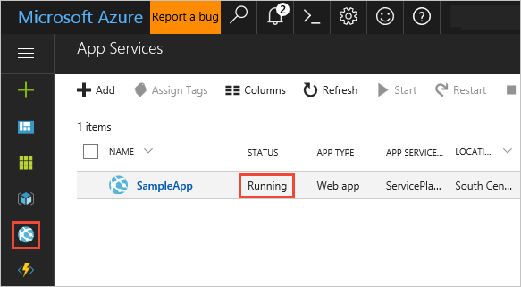
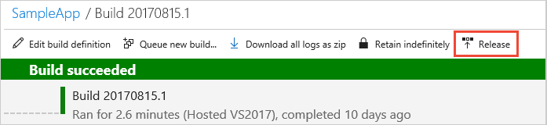
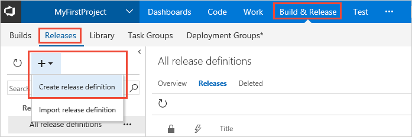
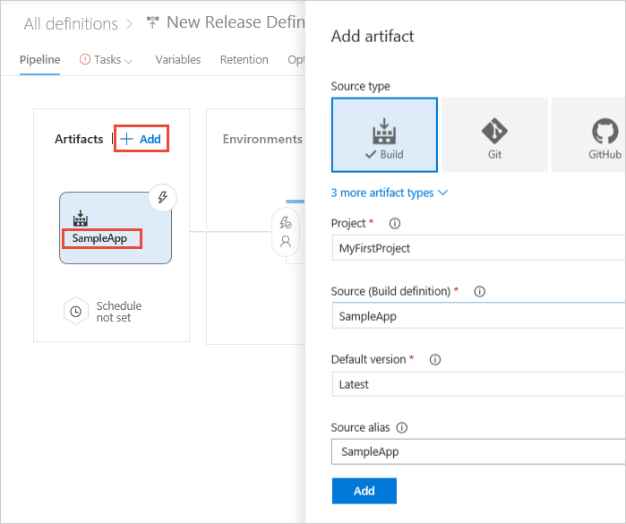
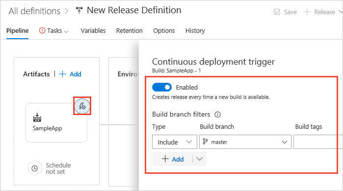
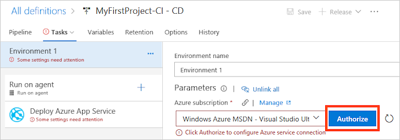

# Deploy a VSTS build

VSTS allows you to set up a release pipeline that continuously deploys builds as they are produced. If you are building an application package, you can deploy it to one of many Azure resources, to on-premises servers, or to any other cloud. If you are building a library, you can publish it to a package feed service. For the example here, we will start with a build that produces a Web Deploy package and deploy it to Azure App Service.

As a pre-requisite, make sure you have completed the following quickstart to create a build that publishes a Web Deploy package.

* Build a repo without YAML

## Create an Azure web app using the portal

You'll also need an Azure web app where you will deploy the app.

> [!NOTE]
> If you already have a web app that you want to use, you can skip this and move to the next section.

1. Sign into the [Microsoft Azure portal](https://portal.azure.com).

1. Choose the **+** icon in the left navigation bar, then choose **Web App**.
 
   

   >If you don't see **Web App** in the list, use the search box to find it.

1. If you see the introduction page, choose **Create**.

   

1. Enter a name for the new web app. You'll see a green checkmark when the name is unique.
   Then choose **Create**.  

   

1. Choose the **App Services** icon in the left navigation bar.
   After a few minutes, you'll see the new web app appear in the list.
   Ensure that it is running. 

   

## Define your release pipeline

Your release pipeline picks up the artifacts published by your VSTS build and then deploys them to your Azure web site.

1. Do one of the following to start creating a release definition:

   * If you've just completed a build, open the build summary (for example, _Build 20170815.1_).
     Then choose **Release** to start a new release pipeline that's automatically linked to the build pipeline.

     

   * Open the **Releases** tab of the **Build &amp; Release** hub, open the **+** drop-down
     in the list of release pipelines, and choose **Create release pipeline**.

     

1. The easiest way to create a release definition is to use a template. Select the **Azure App Service Deployment** template. Then choose **Apply**.

   > If you are deploying a Node app, select the **Deploy Node.js App to Azure App Service** template. The only difference between these templates is that Node template configures the task to generate a **web.config** file containing a parameter that starts the **iisnode** service.

1. If you created your new release definition from a build summary, check that the build definition and artifact
   is shown in the **Artifacts** section on the **Pipeline** tab. If you created a new release definition from
   the **Releases** tab, choose the **+ Add** link and select your build artifact.

   

1. Choose the **Continuous deployment** icon in the **Artifacts** section, check that the
   continuous deployment trigger is enabled, and add a filter to include the **master** branch.

   

   > Continuous deployment is not enabled by default when you create a new release definition from the **Releases** tab.

1. Open the **Tasks** tab and, with **Environment 1** selected, configure the task property variables as follows:

   * **Azure Subscription:** Select a connection from the list under **Available Azure Service Connections** or create a more restricted permissions connection to your Azure subscription.
     If you are using VSTS and if you see an **Authorize** button next to the input, click on it to authorize VSTS to connect to your Azure subscription. If you are using TFS or if you do not see
     the desired Azure subscription in the list of subscriptions, see [Azure Resource Manager service endpoint](../concepts/library/service-endpoints.md#sep-azure-rm) to manually set up the connection.

     

   * **App Service Name**: Select the name of the web app from your subscription.

   > **NOTE**: Some settings for the tasks may have been automatically defined as
   [environment variables](../concepts/definitions/release/variables.md#custom-variables)
   when you created a release definition from a template.
   These settings cannot be modified in the task settings; instead you must 
   select the parent environment item in order to edit these settings.

1. Save the release definition.

## Create a release to deploy your app

You're now ready to create a release, which means to start the process of running the release definition with the artifacts produced by a specific build. This will result in deploying the build:

1. Choose **+ Release** and select **Create Release**.

1. In the **Create new release** panel, check that the artifact version you want to use is selected and choose **Create**.

1. Choose the release link in the information bar message. For example: "Release **Release-1** has been created".

1. Open the **Logs** tab to watch the release console output.

1. After the release is complete, navigate to your site running in Azure using the Web App URL `http://{web_app_name}.azurewebsites.net`, and verify its contents.

## Next steps

* Deploy to a staging slot and then swap to production
* Deploy multiple apps in the same release
* Apply environment-specific configurations
* Deploy to a Government cloud or Azure Stack instead of a public cloud