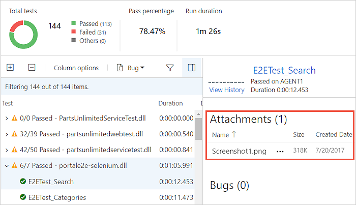

# Collect screenshots, video, logs, and attachments in continuous tests

[!INCLUDE [version-header-vs-vsts-tfs](_shared/version-header-vs-vsts-tfs.md)]

When running tests in a CI/CD pipeline, collecting diagnostic data such as
screenshots, video, logs, and attachments is often useful to help troubleshoot failures.

## Collect screenshots, logs, and attachments

1. Add the file you want to include in the test results as a **TestResult** file. 

   ```csharp
   Screenshot ss = ((ITakesScreenshot)driver).GetScreenshot();
   string path = Directory.GetCurrentDirectory() + "SearchTestScreenshot.png";
   ss.SaveAsFile(path);
   this.TestContext.AddResultFile( path); 
   ```

1. Define the **TestContext** in your test class. 

   ```csharp
   private TestContext testContextInstance;
   
   public TestContext TestContext
   {
     get
     {
       return testContextInstance;
     }
     set
     {
       testContextInstance = value;
     }
   }
   ``` 

1. View the test results and the collected files as attachments to your test results in VSTS or TFS. 

   

## Collect video using the Visual Studio Test task

1. To collect video, specify the data collector you want to use in a [runsettings file](https://docs.microsoft.com/visualstudio/test/configure-unit-tests-by-using-a-dot-runsettings-file#video-data-collector).
   The video data collector captures a screen recording when tests are run.

1. In the [Visual Studio Test](https://github.com/Microsoft/vsts-tasks/blob/master/Tasks/VsTest/README.md) task,
   specify the location of the runsettings file.

    

## Publish attachments when not using the Visual Studio Test task

If you are not using the **Visual Studio Test** task, you must publish attachments in your test results in a different way:

* If you are running tests in the build (CI) pipeline, you can use the
  [Copy and Publish Build Artifacts](../tasks/utility/copy-and-publish-build-artifacts.md) task to publish any additional files created in your tests.
  These will appear in the **Artifacts** tab in your build summary. 

* Use the REST APIs to publish the necessary attachments. Code samples can be found
  in [this GitHub repository](https://github.com/ManojBableshwar/VstsTestRestApiSamples/blob/master/PublishResultsFromCsvWithAttachments/PublishResultsFromCsvWithAttachments.cs). 

The NUnit and JUnit test result formats do not have a formal definition for attachments in the results schema,
so the **Publish Test Results** task cannot publish attachments when these formats are used. 

## See also

* [Continuous testing scenarios and capabilities](index.md)
* [Set up continuous testing for your builds](set-up-continuous-testing-builds.md)
* [Test with unified agents and phases](test-with-unified-agent-and-phases.md)
* [Pass parameters to tests from a build or release pipeline](reference-qa.md#pass-params)

[!INCLUDE [help-and-support-footer](_shared/help-and-support-footer.md)] 
 
