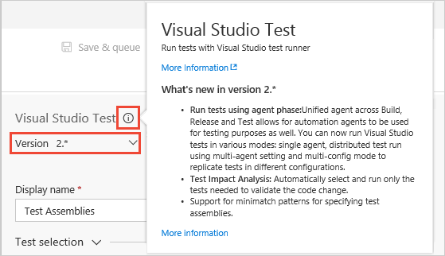
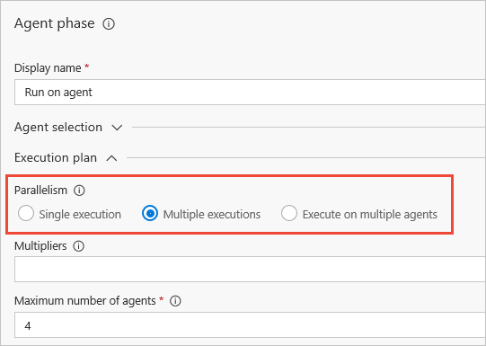
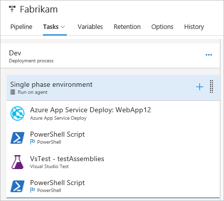
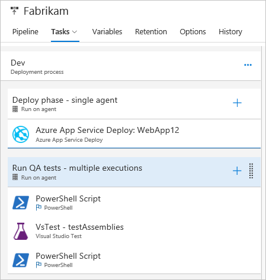
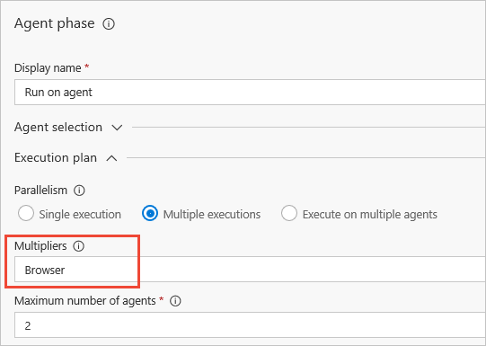
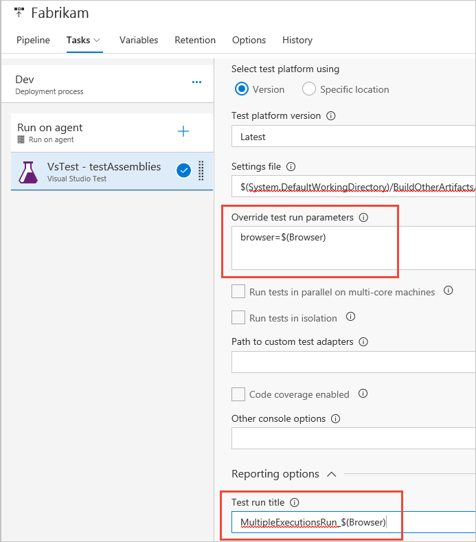
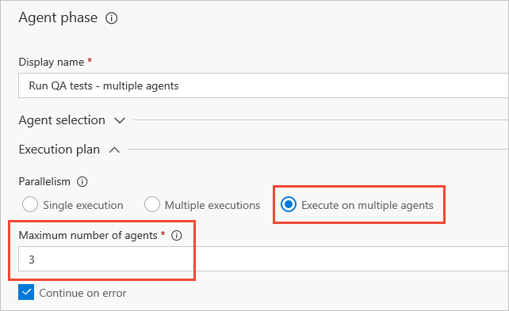
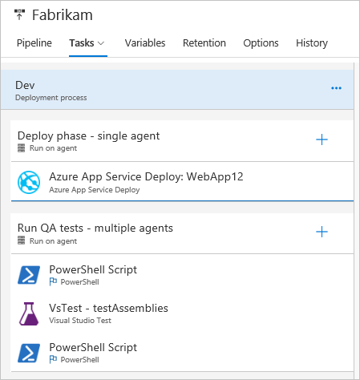

[//]: # (monikerRange: ">= tfs-2015")

# Testing with unified agents and phases

[!INCLUDE [version-header-ts-tfs](_shared/version-header-ts-tfs.md)]

Version 2 of the **Visual Studio Test** task uses the unified Build and Release
agent, instead of a different custom agent as was the case with version 1.
The new version of the task also integrates intelligently with
[task phases](../../build-release/concepts/process/phases.md).
This topic explores how you can use this task, and explains how
it works in a range of scenarios.  

For more information about the tasks see:

* [Visual Studio Test version 1](https://github.com/Microsoft/vsts-tasks/blob/releases/m109/Tasks/VsTest/README.md)
* [Visual Studio Test version 2](https://github.com/Microsoft/vsts-tasks/blob/master/Tasks/VsTest/README.md)

You select the [specific version](../../build-release/concepts/process/tasks.md#task-versions)
of a task you want to use in the **Version** list at the top
of the task properties pane. Use the **i** icon to show more information about the task or
a selected property setting. 

## Advantages of using the unified agent

* You no longer need to use dedicated machines for testing (as was required by the **Run Functional Tests** task). 
  With the unified agent, you can leverage the common agent pool.
  Administrators can set up a reusable pool of machines, making management much easier.

* You can use the unified agent for single machine as well multi-machine distributed execution.

* You no longer need the **Visual Studio Test Agent Deployment** task step.
  This task is based on WinRM, which imposes several limitations.

* You no longer need any "copy files" task steps because all execution is now local to the
  automation agent, and task phases download the artifacts to the target machines automatically.
  There is no requirement to copy test assemblies and their dependencies when running tests remotely
  using the **Run Functional Tests** task.

## How test tasks run in phases

You can add [different types of phases](../../build-release/concepts/process/phases.md)
to a release definition. The properties of these phases include settings for
**Parallelism**.

The following sections describe how this setting affects the operation
of the **Visual Studio Test** and **Run Functional Tests** tasks.
For a full description of the operation for all tasks, see
[Parallel execution using agent phases](../../build-release/concepts/process/phases.md#parallelexec).

### No parallelism

A single agent from the specified queue will be allocated to this phase.
This is the default, and all tasks in the phase will run on that agent.
The **Visual Studio Test** task runs in exactly the same way as version
1 with single agent test execution.

For example, you could deploy an Azure web app and run a small number
of quick tests on it (for which a single agent is sufficient), along
with some pre- and post-test setup and cleanup activities, using an
environment configured as follows:

### Multiple executions

This mode is driven by 'multipliers', in much the same way as a multi-configuration Build or Release.
You define the multipliers as variables. Based on the values for these variables, the various configurations
are run.

In the case of Build, you typically use **BuildPlatform** and **BuildConfiguration** as multipliers.
The same logic applies to testing. For example, you could deploy a web app to Azure and run
cross-browser tests on IE and Firefox by configuring an environment to use two phases - one
for the deploy phase and one for the test phase: 

The test phase is set up as a multiple executions process using a variable named **Browser**, which
has the values `IE` and `Firefox`. The phase will run twice using these two configurations - one
agent is assigned the value `IE` for its **Browser** variable, and one with the value `Firefox`.

In the tasks for the environment, the **Browser** value could be used to instantiate the appropriate
browser for the tests. For example, you might pass the values as **Test Run Parameters** and access them
using **TestContext** in the test code. You could also use the values to provide appropriate titles
for your test runs so that, if a test fails in a particular configuration, you can easily tell which run it came from.

The execution results might look like this:

### Multiple agents

Multiple agents will be allocated to the phase. You specify the number of agents to be allocated
from the pool, and the set of tasks in that phase will be distributed across all these agents.

In this mode, the Visual Studio Test task runs in a special way. It recognizes that its a multiple agents
phase, and runs tests in a distributed manner across all the allocated agents. Because other tasks run
across all agents, any pre- and post-test steps also run equally on all the agents. Therefore, all the
agents are prepared and cleaned up in a consistent manner.
In addition, test execution does not require all agents to be available at the same time. If some agents
are busy with another release or build, the phase can still start with the available number of agents
that match the demand, and test execution starts. As additional agents become available, they can pick
up any remaining tests that have not yet run.

For example, the log from a multiple agents test run, where some tests have failed, might look like this:

Artifacts are automatically downloaded when the phase starts, so the test assemblies and other files
are already located on the agent, and no "copy files" task is required. So, to publish an Azure web app
and run a large number of tests with fast test execution, you could model the environment as two phases -
one being the deploy phase (which runs on a single agent because you don't want multiple agents to deploy
the same app concurrently), and the other a test phase that uses multiple agents mode to achieve test distribution.

This also means that you can use different agent queues for the two phases, allowing you to manage agents
for different purposes separately if required.

## FAQs

### Q: How do I do this with Build? 

**A**: The phases capability is currently available only in Release Management. It will become available in Build soon.

### Q: Does the Visual Studio Test version 1 task behave the same way as the version 2 task?

**A**: No, the version 1 task cannot be used for test distribution. On the single agent (the default,
no parallelism) setting, the task will run in the same way as on the previous test agent. In the
multiple executions and multiple agents modes, it is replicated on the agents, in the same way as all other tasks.

### Q: What is required to run UI tests?

**A**: To run UI tests, you must run the agent in [interactive mode](../../build-release/concepts/agents/agents.md#account).
Agents set to run as a service cannot run UI tests.
However, at present, interactive agents will be stopped if the machine reboots for any reason.
Enhancements to the agent to survive reboots in interactive mode will be implemented in the future.

Also disable any screensaver and unlock the machine so that UI actions in the test are not blocked.
Automatic configuration of agents to do this will be implemented in the future.

### Q: Can I run UI tests on the hosted agents?

**A**: No, running UI tests on the [hosted agents](../../build-release/concepts/agents/agents.md#hosted-agents) is not possible at present.

### Q: What does the 'Test mix contains UI tests' checkbox do?

**A**: Currently, it is there only as a reminder to run agents interactively
if you are running UI tests. If you are using an agent pool with a mix of
interactive and 'running as service' agents, you may also want to add an
'Interactive' capability to your agents demand that in your test phase
to ensure the appropriate set of agents that can run UI tests are used.
See [Build and Release agent capabilities](../../build-release/concepts/agents/agents.md#capabilities).

### Q: In multiple executions mode, do I get distribution of tests as well?

**A**: No, multiple executions mode assigns only one agent per configuration.

### Q: How do I map the configuration in multiple executions mode to my Test Configurations using tcm.exe?

**A**: Currently this is not possible.

### Q: How else can I use multiple executions mode?

**A**: This mode can be used whenever you need multiple agents to execute jobs in parallel.
For more examples, see [Parallel execution using agent phases](../../build-release/concepts/process/phases.md#parallelexec).

### Q: Has the Run Functional Tests task also changed?

**A**: No, the Run Functional Tests (RFT) task has not changed. If you are using this task
you _do_ need the **Deploy Test Agent** task step. Note that, because tasks are replicated
in the multiple agents and multiple executions mode, using the Run Functional Tests task in this
mode will lead to undesirable effects.

### Q: Do I need to install Visual Studio on all the machines to use the Visual Studio Test version 2 task?

**A**: Currently, yes. An alternate means for running tests without requiring Visual Studio
on the agent machine is under consideration, which will allow you to create a separate pool
of agents for testing purposes.

### Q: I am using my own test runner (not the Visual Studio Test task) in the pipeline. What happens to it?

**A**: In the multiple agents and multiple executions mode, the task will be replicated on each
of the agents. You can use the multiple executions mode to partition your tests on different
configuration using the configuration variable. For example, if you have a configuration variable
named **Platform** that has values `x86` and `x64`, you can run the two sets of tests on two
agents in parallel by referring to your test assemblies using `**\$(Platform)\*test*.dll`

### Q: How does the Visual Studio Test version 2 task run on deployment groups?

**A**: Yes, the task can be used to run on [deployment groups](../../build-release/concepts/definitions/release/deployment-groups/index.md).

If you have scenarios that necessitate running tests on machines in the deployment group
where the app is deployed, you can use the Visual Studio Test version 2 task.
If multiple machines are selected (using, for example, tags) in a **Run on Deployment Group**
phase, the tests will be replicated to each of the machines.

## See Also

* [Associate automated tests with test cases](associate-automated-test-with-test-case.md)
* [Associate automated test results with requirements](associate-automated-results-with-requirements.md)
* [Run automated tests from test plans in the Test hub](run-automated-tests-from-test-hub.md)
* [Speed up testing with Test Impact Analysis](test-impact-analysis.md)
* [Run tests in parallel](run-tests-in-parallel.md)
* [Continuous testing scenarios and capabilities](index.md)

[!INCLUDE [help-and-support-footer](_shared/help-and-support-footer.md)] 
