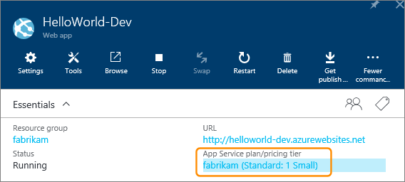
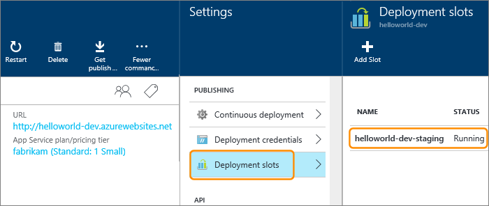

# Implement continuous deployment of your app to an Azure web site

[!INCLUDE [temp](../../_shared/version-rm-dev14.md)]

Continuous deployment (CD) means starting an automated deployment process whenever a new successful build is available.
Here we'll show you how to set up continuous deployment of your ASP.NET or Node app to an Azure web site using Release Management.

You can also use these steps to deploy your app to an Azure Government Cloud
by creating a suitable service endpoint for your Azure Government Cloud subscription.
For more details, see the [Azure Government Cloud deployments](../../concepts/library/government-cloud.md).

## Get set up

### Begin with a CI build

Before you begin, you'll need a CI build that publishes your Web Deploy package. To set up CI for your specific type of app, see:

* [Build your ASP.NET 4 app](../aspnet/ci/build-aspnet-4.md)

* [Build your ASP.NET Core app](../aspnet/ci/build-aspnet-core.md)

* [Build your Node app with Gulp](../node/nodejs-to-azure.md)

[!INCLUDE [azure-web-app-setup](../_shared/azure-web-app-setup.md)]

[!INCLUDE [create-release](../_shared/create-release.md)]

## Next steps

### Deploy multiple apps in the same release

If your CI build process builds multiple apps, you can deploy them in the same release.
To do this, configure a separate instance of the **Azure App Service Deploy** task for each app. In each instance of the task:

* Specify a unique value for **App Service Name**

* Specify the **Web Deploy Package** with a reference to a specific app. For example, replace the default value with a more specific value such as `$(build.stagingDirectory)\**\WebApplication1.zip`

### Configure the environment

If you deploy releases to multiple environments, you can substitute configuration settings in **Web.config** and other configuration files of your website using these steps:

1. Define environment-specific configuration settings in the **Variables** tab of an environment in a release definition; for example,
   `connectionString = <value>`.

1. In the **Azure App Service Deploy** task, select the check box for **XML variable substitution** under **File Transforms and Variable Substitution Options**.
   This option is present only in version **3.\*** and above of the task. It is not yet available in TFS.
   
> If you prefer to manage environment configuration settings in your own database or Azure keyvault, add a task to the environment to read and emit those values using `##vso[task.setvariable variable=connectionString;issecret=true]<value>`.
   
For more details, see [Managing Configuration & App Settings for Multiple Environments in Your CD Pipeline](https://blogs.msdn.microsoft.com/visualstudioalm/2017/04/05/managing-configuration-app-settings-for-multiple-environments-in-your-cd-pipeline/).   

### Swap deployment slots

If you want to deploy to a staging slot in an Azure Web Apps, and then swap the staging and production slots, perform these steps.

1. Ensure that your Azure web app has a standard or
   premium app service plan. This is required to configure deployment slots.

   

1. Configure a **Staging** slot in the Azure web app.

   

   You do not need to configure a **Production** slot because it is implicitly present in all Azure web apps.

   >For more information on configuring deployment slots, see
   [Set up staging environments for web apps in Azure App Service](https://azure.microsoft.com/documentation/articles/web-sites-staged-publishing)
   on the Azure website.

1. Configure the tasks in the environment of the release definition as follows:

   | Task step | Parameters |
   | --------- | ---------- |
   |  [Deploy: Azure App Service Deploy](../../steps/deploy/azure-app-service-deploy.md) Deploy the app to Azure App Services. | **Azure Subscription**: Select your Azure subscription **App Service name**: Select your App Service. **Deploy to slot**: `Checked`. **Slot**: `Staging` |
   |  [Deploy: Azure App Service Manage](../../steps/deploy/azure-app-service-manage.md) Swap slots. | **Azure Subscription**: Select your Azure subscription **Action**: `Swap slots` **App Service name**: Select your App Service. **Resource group**: Select the resource group to which your App Service belongs. **Source slot**: `Staging` |
   
You might also consider [Configuring Auto Swap](https://docs.microsoft.com/en-us/azure/app-service-web/web-sites-staged-publishing#Auto-Swap)
for your Azure App Services web app to automatically swap the app into production after successful deployment.

## Q&A

<!-- BEGINSECTION class="md-qanda" -->

[!INCLUDE [temp](../../_shared/qa-versions.md)]

<!-- ENDSECTION -->

[!INCLUDE [rm-help-support-shared](../../_shared/rm-help-support-shared.md)]
