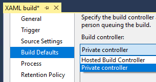

# Hosted agents

**Team Services**

If you use Visual Studio Team Services, to build or deploy your app, then it's more convenient to use our hosted agents, but some limitations apply. 

> [!TIP]
>
> You can try a hosted agent for no charge. If it doesn't work, the issues will be reported in the build or release logs.

## Use a hosted agent

To use a hosted agent, while [editing your build definition](../../get-started/ci-cd-part-1.md), on the **Options** or **General** tab, for the **Default agent queue**, and then select either:

* **Hosted** 

* **Hosted VS2017** if your team uses Visual Studio 2017

> If your team uses Linux, select **Hosted Linux Preview**. During the preview, we provide only one of these agents at a time.

## Capabilities and limitations

Hosted agents:

* Run as a service.

* Have [this software](#software). You can also add software using our [tool installers](../process/tasks.md#tool-installers).

* Provide 10GB of storage.

Hosted agents do not offer:

* Interactive mode.

* Administrator privileges.

* The ability to log on.

* The ability to [drop artifacts to a UNC file share](../../concepts/definitions/build/artifacts.md#unc-file-share).

* The ability to run [XAML builds](https://msdn.microsoft.com/en-us/library/ms181709%28v=vs.120%29.aspx).

* The potential performance benefits of running incremental builds on a private agent. For example, if you use a private agent and you define a CI build process that does not clean the repo and does not perform a clean build, your builds will typically run faster. When you use a hosted agent, you don't get these benefits because the agent is destroyed after the build or release process is completed. 

If our hosted agents don't meet your needs, then you can [deploy your own private agents](agents.md#install).

## Avoid hard coded references

When you use a hosted agent, you should always use [variables](../../define/variables.md) to construct any references to resources used by your build. We recommend you avoid making hard-coded presumptions about resources provided by the hosted agent (for example, the drive letter of folder that contains the repo).

<h2 id="software">Software</h2>

[!INCLUDE [temp](_shared/hosted-software.md)]

## Q & A
<!-- BEGINSECTION class="md-qanda" -->

### I can't select the hosted queue and I can't queue my build or deployment. How do I fix this?

By default, all project contributors in an account have access to the hosted queue. But, your account administrator may have limited the access of hosted queue to select users or projects. Ask the owner of your Team Services account to grant you permission to use the queue. See [agent queue security](pools-queues.md#security).

### I need more agents. What can I do?

A: The hosted pool provides all Visual Studio Team Services accounts with a single agent and a limited number of free minutes each month. If you need more minutes, or need to run more than one build or release concurrently, then you can buy [concurrent pipelines](../../concepts/licensing/concurrent-pipelines-ts.md).

### I'm looking for the hosted XAML build controller. Where did it go?

The hosted XAML build controller is no longer supported.
Accounts created on or after April 2016 do not have access to it.
We will remove the hosted XAML build controller from all accounts
on July 1 2017.

> [!IMPORTANT]
>
> If you have an account in which you still need to run [XAML builds](https://msdn.microsoft.com/en-us/library/ms181709%28v=vs.120%29.aspx), you should set up a [private build server](https://msdn.microsoft.com/en-us/library/ms252495%28v=vs.120%29.aspx) and switch to a [private build controller](https://msdn.microsoft.com/en-us/library/ee330987%28v=vs.120%29.aspx) now.
>
> 

<!-- ENDSECTION -->
