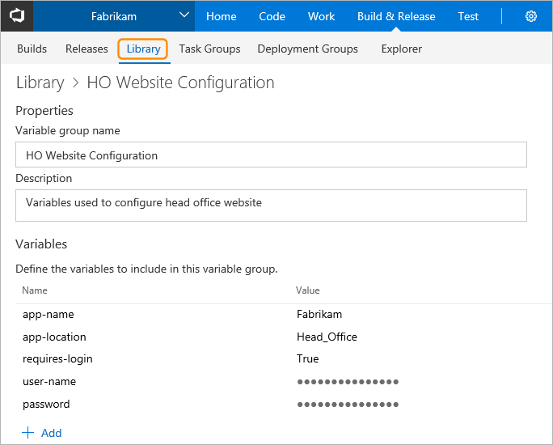
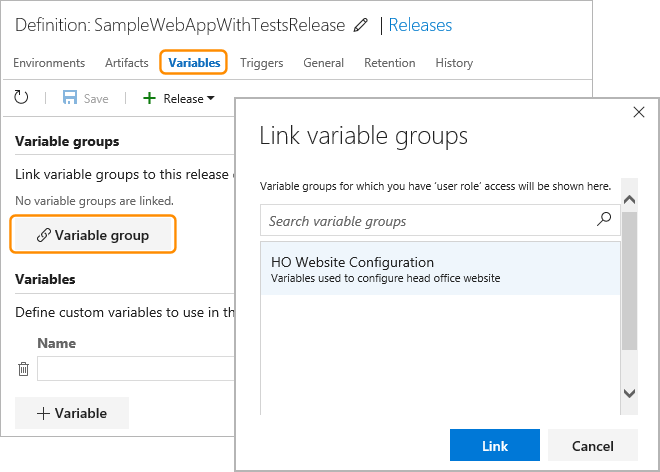

# Variable groups

**TFS 2017 | Team Services**

Use a variable group to store values that you want to make available across
multiple build and release definitions. Variable groups are defined and managed in the **Library** tab of the
**Build &amp; Release** hub.

> Variable groups can only be used in release definitions in TFS 2017 and Team Services at present. They cannot yet be used in build definitions.

To use a variable group in a release definition, open the definition, select the **Variables**
tab, and then choose **Link variable group(s)**. When a variable group is linked to a release definition,
all the variables in the group are available for use in all environments of that definition.

> You cannot link a variable group to a specific environment in a release definition at present.

Any changes made centrally to a variable group, such as a change in the value of a variable or the addition of new variables, will automatically be made available to all the release definitions in which the variable group is used.

Variable groups follow the [library security model](index.md#security).

[!INCLUDE [rm-help-support-shared](../../_shared/rm-help-support-shared.md)]
