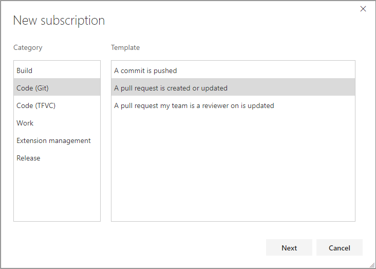

# Manage notifications for a team

<b>VSTS | TFS 2018 | TFS 2017.1 | [Previous versions](../work/track/alerts-and-notifications.md)</b> 

> [!NOTE]  
> This topic applies to VSTS and to TFS 2017.1 and later versions. If you work from an on-premises TFS 2017 or ealier versions, see [Set alerts, get notified when changes occur](../work/track/alerts-and-notifications.md). For on-premises TFS, [you must configure an SMTP server](../tfs-server/admin/setup-customize-alerts.md) in order for team members to see the Notifications option from their account menu and to receive notifications. 
 
As changes occur to work items, code reviews, pull requests, source control files, and builds, your team can be notified via email. For example, when a high priority work item is assigned to your team's area path, an email can be sent to the team.

## Manage 

## Create a custom subscription

A subscription lets you control what your team should be notified about and how the team will receive those notifications.

1. Open the Notifications hub under team settings: `https://{account}.visualstudio.com/{project}/{team}/_admin/_notifications`
	
	

2. Click **New subscription**. If you're not a team administrator, [get added as one](../work/scale/add-team-administrator.md). You need to be a team, project, or project collection administrator to create team alerts.

	
	
3. Select the type of activity you want your team to be notified about.
	
	

4. Provide a description to help you identify the subscription later.

	

5. Choose which team members should receive a notification:

	

   You can choose one of the following delivery options:

   * **Members of team by role**: only team members with a certain relationship to the change or artifact receive a notification. For example, you can choose to have only the current assignee of a changed work item receive a notification.
   * **Team preference**: use the team's default delivery preference. Learn how to [manage delivery settings below.](#manage)
   * **Custom email address**: send an email to a specified email address, like the team's distribution list alias.
   * **Members of team**: send an individual email to each member of the team.

   > [!NOTE]   
   > Using the **Members of team by role** option is a good way to reduce the volume of notifications sent to your team and to ensure team members are only notified about changes relevant to them.

   For certain activities and when **Members of team by role** is selected, you can choose to have the user that initiated the activity receive a notification. This is controlled by the **Skip initiator** checkbox. By default, this box is checked meaning the user that initiates the change will not be notified about it.

6. Choose whether you want to receive notifications about activity in all projects or only a specific project.

	

7. Optionally configure additional filter criteria

	

	> [!NOTE]   
    > Use filters to reduce the volume of notifications generated by the subscription. For example, add an Area Path filter condition so this subscription only generates notifications when there is a change to a work item in your team's area path.

7. Click **Finish** to save the new subscription.

<a name="manage" />

## Manage team delivery settings

Choose the default method for your team to receive notifications by updating the **team delivery settings**.

1. Open the Notifications hub under team settings: `https://{account}.visualstudio.com/{project}/_admin/_notifications?view=contents`
	
	

2. Choose **Delivery settings**:

	

3. Choose which option best fits your team's needs:

	

## Related topics

- [Manage personal notification settings](../notifications/manage-personal-notifications.md)  

