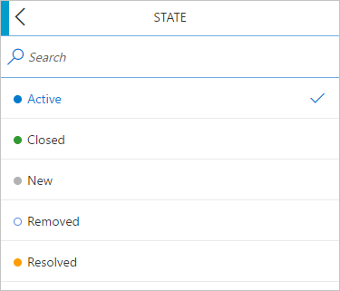
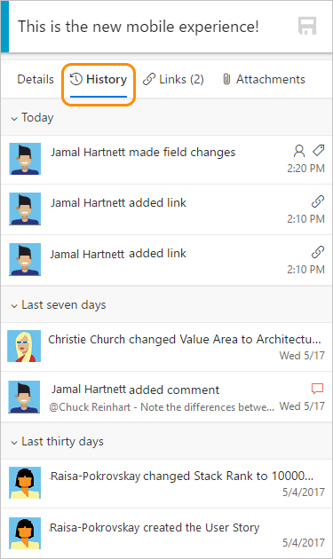
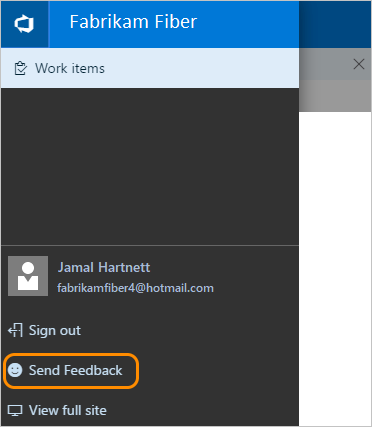

#  Mobile work item form 

**Team Services**

>[!NOTE]  
><b>Feature availability: </b>The mobile work item form is in preview and available from Team Services. 

With the mobile work item form, you gain on-the-go features to stay on top of the latest updates made to work tracking. When you click any work item link on your mobile device, it will open a mobile-friendly version of the work item.   
 
   

##Open the mobile work item form  

The mobile work item form will open when you click **View work item** from an email you receive from your mobile device. You'll receive this type of email under these circumstances:  

- Changes were made to a work item you're following
- You were **@mentioned** in a discussion
- A notification is sent based on the work item alerts you've set using [Manage personal notifications](manage-personal-notifications.md). 

	 

## Mobile form controls  

Mobile form controls operate as follows: 

Editing any field will trigger full-screen experiences. For example, some of the most common actions such as changing the state of an item, moving to a different area path, adding an attachment, and creating/removing tags are all supported. 

**Update status (change State):**
 
  

**Add or remove tags:**
 

**View history:**
 

## Related notes  

Additional experiences are in the works to improve and expand on the mobile experience. For more information, see the blog post: [The mobile work item form (preview)](https://blogs.msdn.microsoft.com/visualstudioalm/2017/01/24/the-mobile-work-item-form/).
  
- [Set personal notifications](manage-personal-notifications.md)  
- [Set team notifications](manage-team-notifications.md)  
- [Follow a work item](follow-work-items.md)    
- [Productivity tips](../work/productivity/productivity-tips.md)  

### Give us feedback  

Click **Send Feedback** at the top of the mobile work item form to provide feedback on your experience.

