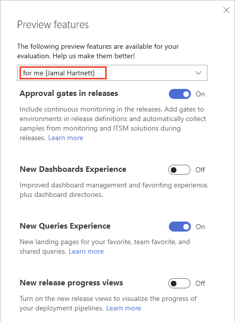
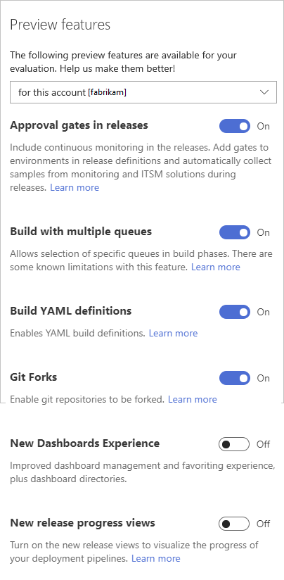

# Enable preview features 

<b>VSTS</b>

As new features are introduced, you can turn them on or off. That way, you can try them out, provide feedback, and work with those features that meet your requirements.  

Some features provide a new user interface and functionality, which can be managed per user or team member. Others support a default experience for the account and are managed by an account administrator. 
 
> [!NOTE]   
> You can turn on or off select features for VSTS. Preview features become available first on VSTS and then subsequently are made available with an update to TFS. At some point, the preview feature will be moved out of preview status and become a regular feature of the web portal.  

> [!div class="mx-tdBreakAll"] 
> |[Preview features per user](#user-level)  |[Preview features per account](#account-level)  |
> |-------------|----------|
> |- [Approval gates in releases](../pipelines/release/approvals/index.md) - [New Dashboards Experience](../report/dashboards/dashboards.md) - [New Queries Experience](../work/track/view-run-query.md) - [New release progress views](../pipelines/preview/new-release-summary.md) |- [Build with multiple queues](https://github.com/Microsoft/vsts-agent/blob/master/docs/preview/yamlgettingstarted.md) - [Build YAML Definitions](../pipelines/get-started-yaml.md) - [Git Forks](../git/concepts/forks.md) - [New Dashboards Experience](../report/dashboards/dashboards.md) - [New release progress views](../pipelines/preview/new-release-summary.md) |

## Enable features for your use  

From time to time, a new feature is introduced in Preview mode, which allows you to turn it on or off. 

0. To access the Preview features options, open your user account menu, and select **Preview features**. 

	     

0. To enable or disable a feature, click the slider. 

	> [!div class="mx-imgBorder"]  
	>  

## Enable features at the account level (for all users)  

When you enable a feature at the account level, you essentially turn it on for all users of your account. Each user can then disable the feature if they so choose.

> [!TIP]  
> If you don't see the user/account menu option, then you aren't an account administrator. To get added as one, see [Add administrators, set permissions at the team project or collection level](../security/set-project-collection-level-permissions.md).  

	> [!div class="mx-imgBorder"]  
	> 

## Features now enabled for all accounts 
- [Combine email recipients](manage-team-notifications.md) 
- [New Account Landing page](../user-guide/account-home-pages.md)  
- [New experience in Code, Work Item, & Wiki search](https://docs.microsoft.com/vsts/release-notes/2017/oct-06-vsts#code)   
- [New Release Definition Editor](../pipelines/release/define-multistage-release-process.md) 
- [New Work Items Hub](../work/work-items/view-add-work-items.md)   
- [NuGet.org upstream sources](../package/nuget/upstream-sources.md) 
- [Out of the box notifications](../notifications/manage-personal-notifications.md).   
- [Pull Request Status Policy](../git/how-to/pr-status-policy.md) 
- [Symbol server](../pipelines/symbols/index.md)  
- [Streamlined User Management](../accounts/add-account-users-assign-access-levels.md)   
- [Task tool installers](../pipelines/process/tasks.md#tool-installers) 
- [Team expansion for notifications](manage-team-notifications.md)
- [Updated package experience](../package/index.md) 
- [Wiki](add-edit-wiki.md)  

<!---

## Wiki 

You can enable a built-in Wiki for your team project. This feature is in preview and when enabled adds a **Wiki** hub from which you can [view and edit wiki pages](add-edit-wiki.md). If you were using the Wiki Marketplace extension, you can [migrate your existing pages to the new team project wiki](migrate-extension-wiki-pages.md). 

## Out of the box notifications 

With out-of-the-box notifications, users automatically receive notifications for events such as:

* The user is assigned a work item  
* The user is added or removed as a reviewer to a pull request  
* The user has a pull request that is updated  
* The user has a build that completes  

These subscriptions appear in the new user notifications experience, and users can easily choose to opt out of any of them. To learn more, see [Manage personal notifications](../notifications/manage-personal-notifications.md). 

## Team expansion for notifications 

Enable this feature for your account when you want notifications to be sent by default for all team-associated events. Such events include when pull requests are created or updated. Team admins can choose to opt-out of these notifications. See [Manage team notifications](manage-team-notifications.md).  
 

### Task tool installers

You can use tool installer tasks to enable your build or release process to lazily install tool sets. So now you can install dependencies on hosted agents and test and validate your app on multiple versions of a tool set. 

-->

