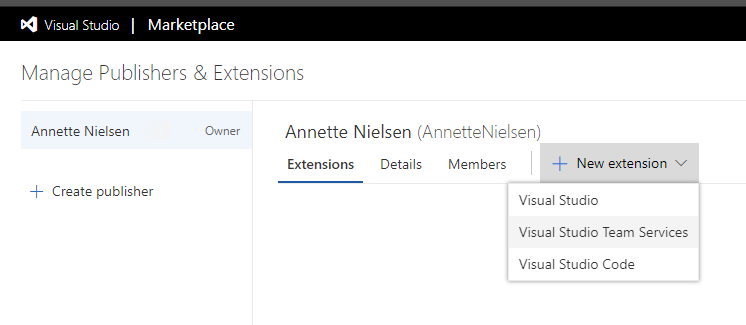
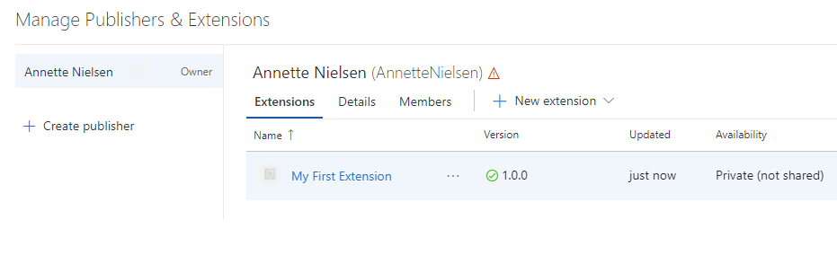
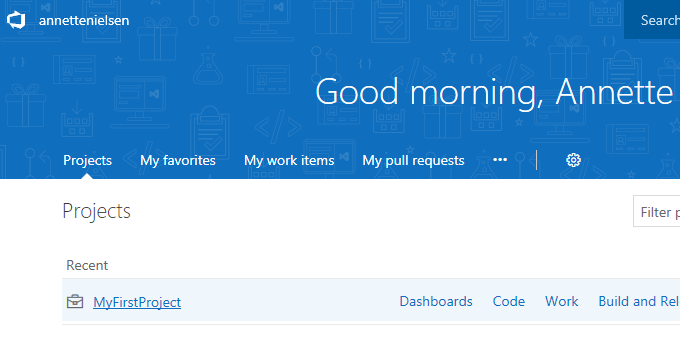
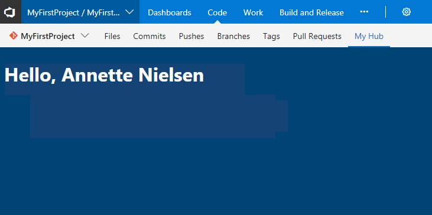

# Create a web extension for VSTS

Extensions are add-ins that extend and enhance Visual Studio Team Services (VSTS) and Team Foundation Server (TFS). You can develop an extension using standard web technologies like HTML, JavaScript, and CSS and make them available to all VSTS accounts or just the accounts you choose.

This tutorial will guide you through creating your first web extension.

You will:

> [!div class="checklist"]
> * Install required tools
> * Create an extension manifest
> * Add a hub contribution
> * Package and publish your extension to the Marketplace

[!INCLUDE [preview](../_data/get-help.md)]

## Prerequisites

To develop extensions you need:

1. A VSTS account where you have permission to install extensions to (i.e. you are the owner). [Create a personal VSTS account](https://app.vsaex.visualstudio.com/profile/account) if you don't already have one.

2. Install [Node.js](https://nodejs.org)

3. Install TFX by running `npm install -g tfx-cli` from a command prompt

> TFX is a command line tool that is used to package and publish extensions to the Marketplace.

## Create the extension

An extension is composed of a set of files, including a required manifest file, that you package into a .vsix file and publish to the Visual Studio Marketplace.

1. Start by creating a new directory for your extension:
   ```bash
   md my-first-extension
   ```

2. From this directory initialize a new NPM package manifest:
   ```bash
   npm init -y
   ```
   This file describes the libraries required by your extension.

3. Install the Microsoft VSS Web Extension SDK package and save it to your NPM package manifest:
   ```bash
   npm install vss-web-extension-sdk --save
   ```  
   This SDK includes a JavaScript library that provides APIs required for communicating with the page your extension will be embedded in.

4. Create an extension manifest file named `vss-extension.json` at the root of your extension directory with the following content:

    ```json
	{
		"manifestVersion": 1,
		"id": "my-first-extension",
		"publisher": "",
		"version": "1.0.0",
		"name": "My First Extension",
		"description": "A sample Visual Studio Services extension",
		"public": false,
		"targets": [
			{
				"id": "Microsoft.VisualStudio.Services"
			}
		],
		"contributions": [
			{
				"id": "my-hub",
				"type": "ms.vss-web.hub",
				"targets": [
					"ms.vss-work-web.code-hub-group"
				],
				"properties": {
					"name": "My Hub",
					"uri": "my-hub.html"
				}
			}
		],
		"files": [
			{
				"path": "my-hub.html",
				"addressable": true
			},
			{
				"path": "node_modules/vss-web-extension-sdk/lib",
				"addressable": true,
				"packagePath": "lib"
			}
		]
	}
    ```

	>[!NOTE]
    >The `public` property controls whether the extension is visible to everyone on the Visual Studio Marketplace. During development you should keep your extensions private.

5. Create a file named `my-hub.html` at the root of your extension directory with the following content:

	```html
	<!DOCTYPE html>
	<html xmlns="http://www.w3.org/1999/xhtml">
	<head>
		<script src="lib/VSS.SDK.min.js"></script>
	</head>
	<body>
		<script type="text/javascript">
		VSS.init();
		</script>
		<h1>Hello world!</h1>		
	</body>
	</html>
	```

	This will be the content for the view (also known as a hub) contributed into the VSTS web experience.

6. At this point your extension directory should look like this:

	```no-highlight
	|-- my-hub.html
	|-- node_modules
		|-- @types
		|-- vss-web-extension-sdk
	|-- package.json
	|-- vss-extension.json
	```

You're now ready to package, publish, and test your extension.

## Package and publish your extension

#### Create your publisher

All extensions, including extensions from Microsoft, live under a publisher. Anyone can create a publisher and publish extensions under it. Other people can also be given access to your publisher if you are developing extensions as a team.

1. Sign in to the [Visual Studio Marketplace Management Portal](https://aka.ms/vsmarketplace-manage)

2. If you don't already have a publisher, you'll be prompted to create one.

3. In the Create Publisher form, enter your name in the publisher name field. The ID field should get set automatically based on your name:
   	

>[!NOTE]
>Remember this ID. You will need to reference it later from your extension manifest file.

You're now ready to package your extension and upload (publish) it to the Marketplace. Keep this browser window open as you'll need to return here to upload your extension.

#### Package your extension

1. Open your extension manifest file (`vss-extension.json`) and set the value of the `publisher` field to the ID of your publisher. For example:
    ```json
	{
		...
		"id": "my-first-extension",
		"publisher": "AnnetteNielsen",
		...
	}
	```		

2. From a command prompt, run the TFX package command from your extension directory to create an extension package (.vsix) file:
   ```bash
   tfx extension create
   ```

3. Once this completes you will see a message indicating your extension has been successfully packaged:
   ```
   === Completed operation: create extension ===
   - VSIX: C:\my-first-extension\AnnetteNielsen.my-first-extension-1.0.0.vsix
   - Extension ID: my-first-extension
   - Extension Version: 1.0.0
   - Publisher: AnnetteNielsen
   ```

You will be uploading this file to the Marketplace in the next step.

#### Upload your extension

1. Return to the [Visual Studio Marketplace Management Portal](https://aka.ms/vsmarketplace-manage) and select your publisher from the drop-down at the top of the page if your publisher isn't already selected.

2. Tap the **New Extension** button and select **Visual Studio Team Services**:
   	

3. Tap the link in the center of the Upload dialog to open a browse dialog. Locate the .vsix file you created in the previous section and click **Upload**:
   

4. After a few seconds, your extension should appear in the list as a published extension. Don't worry, the extension is not publicly visible:
   

## Install your extension

To test your extension, you need to install it to a VSTS account. You must be the owner or have been given the necessary permissions to install an extension into a VSTS account. Because your extension is private, it must be shared with this account before it can be installed. 

1. From the Marketplace management portal, select your extension from the list, right-click, and choose **Share/Unshare** .

   

2. Click the **+ Account** button, enter the name of your account, and press enter.

   

3. Click the **X** to close this panel.

Your extension can now be installed into this account.

4. With your extension selected, tap *...*, and choose  **View Extension** to open the details page for your extension on the Marketplace.

   

   >[!NOTE]
   >Because your extension is private, only you (as the publisher of the extension) and members of the account your extension is shared with can see this page.

5. Click **Get it free** to start the installation process. The account you shared the extension with should already be selected, but if not, choose it.

   

6. Tap **Install**

Congratulations! Your extension is now installed into your account and is ready for use.

## Try your extension

Your extension contributed a view named "My Hub" to the project-level Code area.

1. Tap the **Proceed to account** button at the end of the installation wizard to navigate to the home page of the account the extension was installed to (`https://{youraccountname}.visualstudio.com`).

2. Click any of the projects listed to navigate into it:

   

> If there are no projects in your account, you will be prompted to create one.

2. Navigate to the Code area and then to the hub contributed by your extension (**My Hub**):

   


## Next steps

> [!div class="nextstepaction"]
> [Explore other tutorials](tutorials.md)

> [!div class="nextstepaction"]
> [Dive into sample extensions](https://github.com/Microsoft/vsts-extension-samples/)

> [!div class="nextstepaction"]
> [Learn about possible extensibility options](reference/targets/overview.md)
