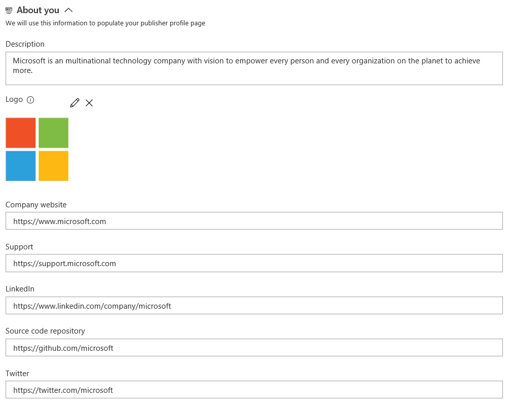

# Make your extension or integration public

The [Visual Studio Marketplace](https://marketplace.visualstudio.com) is a single place users can go to find and purchase extensions, tools, products, and services that extend Visual Studio, VSTS, Visual Studio Code, or Team Foundation Server. 

This page covers the required steps to make your integration or extension listing publicly available in the Marketplace. 

* Learn more about developing an [extension for VSTS](../index.md)
* Learn more about [packaging and publishing an extension to the Marketplace](./overview.md)
* Learn more about [packaging and publishing an integration to the Marketplace](./integration.md)

> As you are developing your extension or the content for your Marketplace page (for either an extension or integration), your extension can and should remain private.

## Qualifications

To have a public listing on the Marketplace, your integration or extension must meet the following qualifications:

1. Works with or extends one of the following Microsoft products or services:
   * Visual Studio, or
   * VSTS (formerly Visual Studio Online), or
   * Visual Studio Code, or
   * Visual Studio Team Foundation Server (2012, 2013, or 2015)
2. You (or your company) owns, develops, and is licensed to distribute and advertise the integration or extension.
3. The extension or integration is actively maintained.

Microsoft might also request a demo and to review the content planned for your Marketplace entry. For more details, refer to the [Visual Studio Marketplace Publisher Agreement](http://aka.ms/vsmarketplace-agreement), which you agreed to when creating your publisher.

## Process

The process to have a public VSTS listing for an integration or extension is the same. The publisher needs to be verified in order to do so. Only **verified** publishers can have public VSTS items in the Marketplace.

> **Developing for Visual Studio, Visual Studio for Mac or Visual Studio Code?** If so, you do not need to request verification. Verification is only required for VSTS integrations or extensions.

Once you are ready to publish a public VSTS listing to the Marketplace, follow these steps:

1. Visit http://marketplace.visualstudio.com/manage/publishers and login with the account using which you will publish and manage VSTS listings in Marketplace.
2. Select the publisher and through the **Details tab** apply for publisher verification. You will find the appropriate section towards the bottom of the tab.
3. Expect Microsoft to approve or respond within 3 business days to your verification request.

Once your publisher is verified, you need to set the [public flag](../develop/manifest.md#public-flag) to true in your manifest for your extension to be available publicly.

> **Important**: Once your publisher is verified, you will not be able to change its display name without contacting Microsoft.

# Marketplace Certified
> Certification is only applicable for publishers with one or more public VSTS/TFS extensions or integrations.

Through Marketplace Certified, we want to showcase publishers who have met the benchmarks of being a good publisher in Marketplace. Once certified, all your VSTS/TFS extensions and integrations will display the Marketplace Certified badge. This badge helps customers feel confident in acquiring and evaluating your offering.

Certification criteria:

1. For each public VSTS/TFS extension under this publisher:
   * Ensure presence of a valid privacy policy. Refer to [extension manifest](../develop/manifest.md) on how to add one.
   * Ensure presence of a valid license i.e. end user license agreement. Refer to [extension manifest](../develop/manifest.md) on how to add one.
   * Ensure presence of a valid support link. Refer to [extension manifest](../develop/manifest.md) on how to add one.
   * Ensure that all valid questions under the Q&A section are answered satisfactorily. We expect our certified publishers to respond to questions in a timely manner (within a week).
2. Publisher profile:
Through publisher profile, you have a way to showcase all your extensions in one place along with some publisher related information. To fill in the informatiom which shows up there:
   * Visit http://marketplace.visualstudio.com/manage/publishers and login with the account using which you publish and manage VSTS listings in Marketplace.
   * Select the publisher and fill in the **About you** section under the **Details tab**. For Microsoft publisher, this looks as follows: 
     
   * Save your changes and use 'View profile' action on the top to see how your profile page will appear to the consumers

Applying to be Marketplace Certified
You can apply to be a Marketplace Certified publisher from the manage page in Marketplace.
* Login into http://marketplace.visualstudio.com/manage/publishers with the account with which you publish and manage VSTS listings in Marketplace
* Select the publisher and visit the Certification tab. if you meet the criteria, if will present you with an option to apply for certification.
* Once applied, our Marketplace team will respond in 5-10 business days.
> Marketplace team will look at additional parameters such as install/get started counts and ratings for your extensions before granting certification. Microsoft reserves the right to reject and revoke the certification without any notice and reason.

# Contact

Send questions about publishing items to the Visual Studio Marketplace to [vsmarketplace@microsoft.com](http://aka.ms/vsmarketplace-contact).
