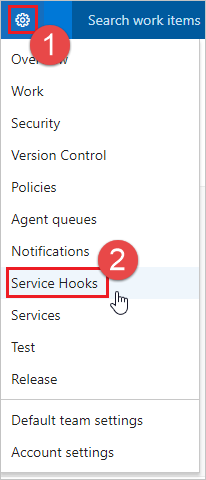
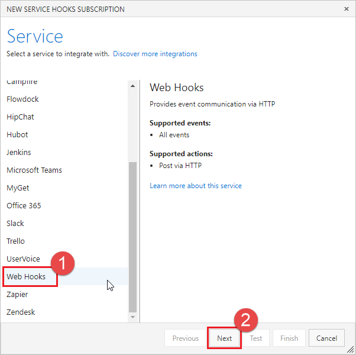
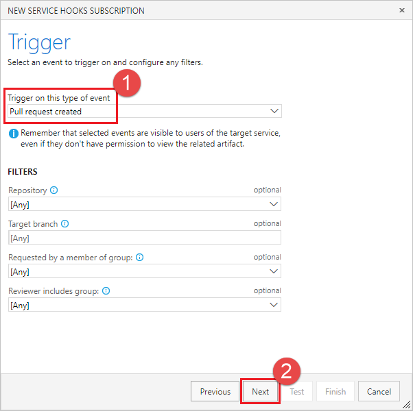
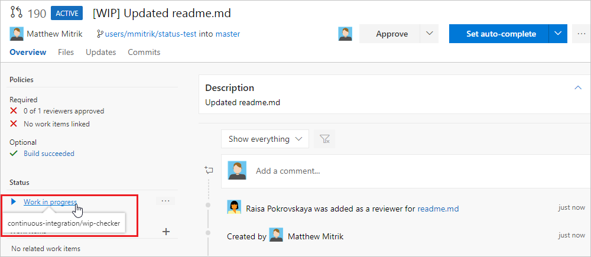

# Create a pull request status server

#### Team Services | TFS 2018 RC1 

The pull request (PR) workflow provides developers with an opportunity to get feedback on their code from peers as well as from automated tools.  Continuous integration (CI) can be done using the Team Services Build tools to build and test code.  You can perform additional validation on PRs by writing a status server that leverages service hooks and the PR [Status API](https://visualstudio.com/en-us/docs/integrate/api/git/).  This article guides you through the process of creating a status server to validate PRs in a Team Services Git repository.  

## Prerequisites
* A Team Services account with a Git repo
* Install [VS Code](http://code.visualstudio.com/Docs/setup).

## Install Node.js
To install Node.js, [download](https://nodejs.org/en/download/) the LTS release appropriate for your platform.  The download contains an installer, which you can run to install the Node.js runtime on your local machine.  When installing Node.js, be sure to also install the [npm package manager](https://www.npmjs.com/).

## Create a basic web server using Express
[Express] (https://expressjs.com/) is a lightweight web framework for Node.js that provides a number of HTTP utility methods that simplify creating a web server.  This framework will provide you with the basic functions needed to listen to PR events.

1. From the command line, create a new project folder for your web server.  

```
> mkdir pr-server
> cd pr-server
```

2. Use the `npm init` command to create a new `package.json` file for the project.

> npm init

  Accept the defaults for all of the options except the entry point.  Change it to `app.js` 

```
entry point: (index.js) app.js
```

3. Install Express in the pr-server directory, saving it to the dependencies list.

```
npm install express
```

4. Follow the [Hello world example](https://expressjs.com/en/starter/hello-world.html) for creating a simple Express app to build upon for the PR status server.  Open the project folder in VS Code.

``` 
code .
```

5. Create a new file `(Ctrl + N)` and paste in the following sample code.

``` javascript
const express = require('express')
const app = express()

app.get('/', function (req, res) {
  res.send('Hello World!')
})

app.listen(3000, function () {
  console.log('Example app listening on port 3000!')
})
```

6. Save the file as `app.js`

7. Run the basic web server using the following command:

```
node app.js
```

  Verify the server is running by browsing to `http://localhost:3000/`.

## Listen for HTTP POST requests
The web server is going to receive `POST` requests from Team Services, so you need to handle those requests in your server.

1. At the end of the `app.js` file, add the following code, and save the file.

``` javascript
app.post('/', function (req, res) {
    res.send('Received the POST')
})
```

2. Re-run your web server using the following command:

```
node app.js
```

## Configure a service hook for PR events
Service hooks are a Team Services feature that can alert external services when certain events occur.  For this sample, you'll want to set up a service hook for PR events, so the status server can be notified.

In order to receive the service hook notifications, you'll need to expose a port to the public internet.  The [ngrok](https://ngrok.com/) utility is very useful for doing this in a development environment.

1. [Download](https://ngrok.com/download) and unzip the appropriate ngrok release for your platform.  

2. Use ngrok to start listening on the same port as your sample server - port 3000.  Run the following command in a new command window.

```
ngrok http 3000
```

  Ngrok will create a public URL that forwards to `localhost:3000`.  Note that URL as you will need it in the next step.  It will look something like this:

```
http://c3c1bffa.ngrok.io
```

3. Browse to your Team Services project, e.g. https://youraccount.visualstudio.com/YourProjectName

4. From the navigation menu, hover over the **gear** and select **Service Hooks**.



5. Select the green plus `(+)` to create a new service hook subscription.


6. On the New Service Hooks Subscription dialog, select **Web Hooks** from the list of services, then select **Next**.



7. Select **Pull request created** from the list of event triggers, then select **Next**.



8. In the Action page, enter the URL from ngrok in the **URL** box.  Select **Test** to send a test event to your server.  


  In the ngrok console window, you'll see an incoming `POST` that returned a `200 OK`, indicating your server received the service hook event.  

```
HTTP Requests
-------------

POST /                         200 OK
```

  In the Test Notification window, select the Response tab to see the details of the response from your server.  You should see a content length of 17 that matches the length of the string from your POST handler (i.e. "Received the POST").


9. Close the Test Notification window, and select **Finish** to create the service hook.  

## Post status to PRs
Now that your server can receive service hook events when new PRs are created,update it to post back status to the PR.

1. Service hook requests include a JSON payload describing the event.  To help parse the JSON returned by the service hook, install the [body-parser](https://www.npmjs.com/package/body-parser) package.

```
npm install body-parser
```

2. Update `app.js` to use body-parser for parsing `application/json`.

```
var bodyParser = require('body-parser')

app.use(bodyParser.json());
```

3. To simplify making REST API call to Team Services, install the [vso-node-api](https://www.npmjs.com/package/vso-node-api) package.

```
npm install vso-node-api 
```

4. Update `app.js` to use the vso-node-api package, set up the details for a connection to your account, and get an instance of the Git API.

``` javascript
const vsts = require("vso-node-api");

const collectionURL = process.env.COLLECTIONURL;    
const token = process.env.TOKEN;

var authHandler = vsts.getPersonalAccessTokenHandler(token);
var connection = new vsts.WebApi(collectionURL, authHandler);

var vstsGit = connection.getGitApi();
```

5. Create an environment variable for your collection URL.

```
setx COLLECTIONURL "https://account.visualstudio.com/DefaultCollection"
```

6. Create a personal auth token (PAT) for your app to use, following these instructions: 
https://www.visualstudio.com/en-us/docs/integrate/get-started/authentication/pats.  You should create a new PAT for every service that you use to access your account, naming it appropriately.

7. Create an environment variable for your PAT.

```
setx TOKEN "yourtokengoeshere"
```

8. Update the `post()` function to read the PR details from the service hook payload. You'll need these values in order to post back status.

``` javascript
var repoId = req.body.resource.repository.id;
var pullRequestId = req.body.resource.pullRequestId;
var title = req.body.resource.title;
```

9. Build the status object to post on the PR.  

  `State` is an enum of type [GitStatusState](https://visualstudio.com/en-us/docs/integrate/api/git/contracts?#GitStatusState).  Use `succeeded` to indicate that the PR has passed the status check and is ready to merge.  

  The `description` is a string value that will be displayed to the user in the Status section and activity feed in the PR details view.

  The `targetUrl` is a URL that will be used to create a link for the description text in the Status section and activity feed.  This is the place where users can go to get more information about the status, for example, a build report or test run.  If no URL is specified, the description will appear as text with no link.

  The context `name` and `genre` are used to categorize the status and distinguish it from other services posting status.  

``` javascript
    var prStatus = {
        "state": "succeeded",
        "description": "Ready for review",
        "targetUrl": "http://www.visualstudio.com",
        "context": {
            "name": "wip-checker",
            "genre": "continuous-integration"
        }
    }
```

10. Instead of just blindly posting the `succeeded` status, inspect the PR title to see if the user has indicated if the PR is a work in progress by adding "WIP" to the title.  If so, change the status posted back to the PR.

``` javascript
    if (title.includes("WIP")) {
        prStatus.state = "pending";
        prStatus.description = "Work in progress"
    }
```

11. Finally, post the status using the `createPullRequestStatus()` method.  It requires the status object, the repo ID, and the pull request ID.  Output the response to the node console so you can see the result of the post.

``` javascript
vstsGit.createPullRequestStatus(prStatus, repoId, pullRequestId).then( result => {
    console.log(result);
});
```

12. The resulting method should look something like this:

``` javascript
app.post("/", function (req, res) {

    // Get the details about the PR from the service hook payload
    var repoId = req.body.resource.repository.id;
    var pullRequestId = req.body.resource.pullRequestId;
    var title = req.body.resource.title;

    // Build the status object that we want to post.
    // Assume that the PR is ready for review...
    var prStatus = {
        "state": "succeeded",
        "description": "Ready for review",
        "targetUrl": "http://www.visualstudio.com",
        "context": {
            "name": "wip-checker",
            "genre": "continuous-integration"
        }
    }

    // Check the title to see if there is "WIP" in the title.
    if (title.includes("WIP")) {

        // If so, change the status to pending and change the description.
        prStatus.state = "pending";
        prStatus.description = "Work in progress"
    }

    // Post the status to the PR
    vstsGit.createPullRequestStatus(prStatus, repoId, pullRequestId).then( result => {
        console.log(result);
    });

    res.send("Received the POST");
})
```

13. Save `app.js` and restart your node app.

```
node app.js
```

## Create a new PR to test the status server
Now that your server is running and listening for service hook notifications, create a pull request to test it out.  

1. Start in the files view.  Edit the readme.md file in your repo (or any other file if you don't have a readme.md).


2. Make an edit and commit the changes to the repo.


3. Be sure to commit the changes to a new branch so you can create a PR in the next step.


4. Select the **Create a pull request** link.


5. Add "WIP" in the title to test the functionality of the app.  Select **Create** to create the PR.


6. Once the PR has been created, you will see the status section, with the "Work in progress" entry and a message in the activity feed, both of which link to the URL specfied in the payload.



## Summary
In this article, you learned the basics of how to create a service that listens for PR events via service hooks and can post status messages using the status API.  For more information about the pull request status API see the [REST API documentation]().  