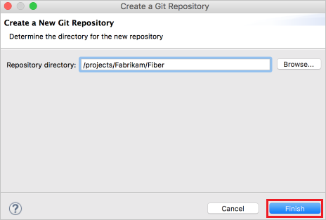

[//]: # (monikerRange: '>= tfs-2015')

# Share your code in Git using Eclipse
#### VSTS | TFS 2018 | TFS 2017 | TFS 2015

Share your Eclipse project with your team in a VSTS/TFS Git repo. If you don't have a VSTS account, you can [sign up](../accounts/create-account-msa-or-work-student.md) for one for free. Each account includes free, unlimited private Git repositories.

## Prerequisites

* A VSTS account. If you don't have one, you can [sign up](../accounts/create-account-msa-or-work-student.md) for one for free. Each account includes free, unlimited private Git repositories.

## Use Team Explorer Everywhere

[Team Explorer Everywhere](https://www.visualstudio.com/en-us/products/team-explorer-everywhere-vs.aspx) is an [open-source](https://github.com/Microsoft/team-explorer-everywhere) Eclipse plug-in to connect Eclipse to VSTS or Team Foundation Server. If you're working with VSTS/TFS and Eclipse, use this plugin to connect to your repos, builds, and work items. 

0. [Install the Team Explorer Everywhere plug-in](/vsts/java/download-eclipse-plug-in#_install-the-tee-plugin-for-eclipse).

0. Add the Team Explorer Everywhere view in Eclipse. Go to **Window, Show View** and select **Other...** Search for **Team Explorer**, select the **Team Explorer** view, and select **OK**.   

   

## Connect to VSTS

0. In the Team Explorer Everywhere view, select **Connect to VSTS or a Team Foundation Server** . 

   
   

0. If you know your VSTS or Team Foundation Server account URL, select the **Servers...** button under **Connect to a Team Foundation Server or VSTS account** to add your TFS server or account to the drop-down list. 
If you don't know your account information for VSTS, select **Browse Visual Studio Services** and select **Next**.

   

   Either choice will prompt for your credentials before continuing further. 

0. Select the team project where you will share your code from the **Team Project Selection** dialog and select **Finish**.

## Create a local Git repo for your Eclipse project

Before you can push your project to VSTS, you need to add it to a local Git repo.

> [!NOTE]
> If your code is already in a local Git repo, you can skip this step.

0. Right-click your project name in Project Explorer and select **Team, Share Project...** Select **Git** and select **Next**. 

0. Select **Create...** from the **Configure Git Repository** window and choose a folder for your local Git repo. Select **Finish**.

    

0.  Right-click your project in Project Explorer and select **Team, Commit...**. Stage your changes by dragging your files to the **Staged Changes** field, enter a commit message, then select **Commit**.

    

## Push your project to your VSTS/TFS repo

0. In Team Explorer Everywhere, select **Git Repositories**, then right-click the empty repo you want to push your Eclipse project to and select **Copy Clone URL**. If you don't have an empty Git repo created in VSTS/TFS yet, you can create one using [these instructions](create-new-repo.md).

    
    
0. In Package Explorer, right-click your project and Select **Team, Push Branch ...** . Paste the clone URL from the clipboard into the **URI** field and select **Next**. Make sure **Configure upstream for push and pull** is selected in the next window and select **Next**.

    
    
0. Review the changes and select **Finish** in the **Push Branch** window.

Your project code is now your VSTS Git repo.

## Troubleshooting

### What if the Git views for commit and push don't show up?

You can [download EGit](http://www.eclipse.org/egit/) to use Git with Eclipse.

## Next steps

> [!div class="nextstepaction"]
> [Learn more about using Git in the Git tutorial](tutorial/gitworkflow.md)

