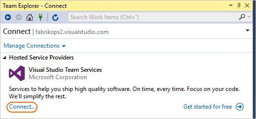
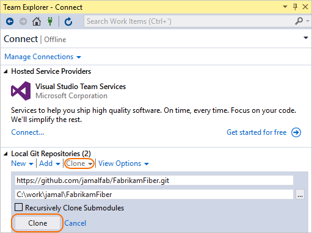
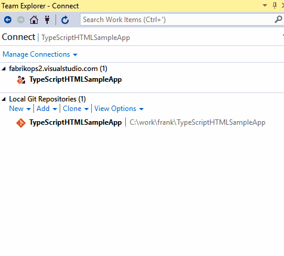

# Clone an existing Git repo

#### VSTS | TFS 2018 | TFS 2017 | TFS 2015 | VS 2017 | VS 2015

Create a complete local copy of an existing Git repo using by cloning it. 
Cloning a repo downloads all [commits](commits.md) and [branches](branches.md) in the repo and sets up a named relationship with the existing repo you cloned.
Use this relationship to interact with the existing repo, [pushing](pushing.md) and [pulling](pulling.md) changes to share code with your team.

>[!NOTE]
> By default, Git will assign the `origin` to the remote repo you clone from. Most users don't need more than one remote, so the tutorial uses `origin` in its steps. 
> [Learn more](creatingrepo.md#remotes) about setting up remotes to your Git repo.

In this tutorial you learn how to:

> [!div class="checklist"]
> * Get the clone URL to your repo
> * Clone a repo

## Video tutorial

<iframe src="https://channel9.msdn.com/series/Team-Services-Git-Tutorial/Git-Tutorial-Create-a-Git-repo-in-Visual-Studio-2015/player" width="560" height="315" allowFullScreen frameBorder="0"></iframe>

>[!TIP]
> Working from the command line? You can view our video overview using command line steps on [Channel9](https://channel9.msdn.com/series/Team-Services-Git-Tutorial/Git-Tutorial-Create-a-repo-from-the-command-line).

<a name="clone_url"></a>
## Get the clone URL to your repo

Before you can clone an existing repo, you'll need a URL that points to the existing repo. This URL represents the source of the repo you're going to copy during the clone.

If you're using VSTS or Team Foundation Server 2017, you can find this clone URL in the web portal. 
When viewing your repo from the **Code** tab in the interface, select **Clone** in the upper right.


If you need to clone a GitHub repo, you'll need to get the clone URL from the **Clone or download** button while viewing the repo on the web in GitHub. 

Other Git providers have similar buttons in their user interface to get the clone URL. 

Copy this URL into the clipboard or store it in a place where you can find it easily. You can't clone a repo without a clone URL.

## Clone a repo 

# [Visual Studio](#tab/visual-studio)

* [Clone from VSTS / Team Foundation Server](#clone-from-visual-studio-team-services--team-foundation-server)
* [Clone from another Git provider](#clone-from-another-git-provider)
* [Open a solution in Visual Studio from a cloned repo](#open-a-solution-in-visual-studio-from-a-cloned-repo)

### Clone from VSTS / Team Foundation Server

0. Open Team Explorer (go to **View** and select **Team Explorer** or use the Ctrl+\, Ctrl+M hotkey sequence) and open the **Connect** view. Go to **Projects**, then **Manage Connections** if you don't see the Connect view.
0. Select **Connect...** under **Hosted Service Providers**.

  

0. Choose your team's account from the drop-down in the dialog that appears and select which Team Projects to connect to Team Explorer. Select **Connect**. 

0. Clone the repository in one of the Team Projects by right-clicking the project and selecting **Clone...**. 
0. Enter the folder where Git will store the local repository in the **Local Git Repositories** section.
0. Select **Clone** to clone your repo. 

  

### Clone from another Git provider

If you are not using VSTS, you can still clone your repo in Team Explorer and work with your code in Visual Studio.

0. In Team Explorer, open the **Connect** view.
0. Select **Clone** under **Local Git Repositories** and enter the URL for your Git repo&mdash;this will be provided by your team or Git hosting 
provider. 
0. Select a folder where you want your cloned repo to be kept. 
0. Select **Clone** to clone the repo.   

  </ol>    

### Open a solution in Visual Studio from a cloned repo

Open a solution in a cloned repo in Visual Studio by right-clicking on the repository in the Team Explorer **Connect** view and selecting **Open**. 
You'll be taken to the **Home** view in Team Explorer. Double-click your project solution file in the **Solutions** area to open the solution in Solution Explorer.



# [Command Line](#tab/command-line)

### Prerequisites

* Ensure you have installed the [Git command line package](http://git-scm.com/download) for your platform as well as the 
right [Git Credential Manager](../set-up-credential-managers.md) before continuing.

You'll need a clone URL to tell Git what repository you want to clone to your computer. Use the URL you copied earlier during the [previous step](#clone_url) in this article.

Pass this clone URL to `git clone` to make a local copy of the repo:

```
git clone https://fabrikam.visualstudio.com/DefaultCollection/_git/Fabrikam
```

`git clone` clones the repository from the URL in a folder under the current one. You can pass in a folder name after the URL to create the repo in a specific location, for example:

```
git clone https://fabrikam.visualstudio.com/DefaultCollection/_git/Fabrikam C:\Repos\FabrikamFiber
```

---

## Next steps

> [!div class="nextstepaction"]
> [Save work with commits](commits.md)
