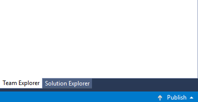
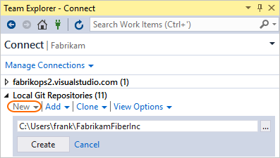
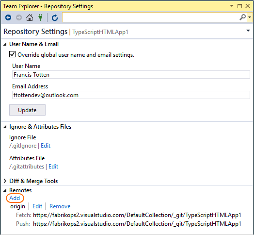

#  Create a new Git repo

###### Team Services | TFS 2015 & TFS 2017 | Visual Studio 2015 & 2017

## Overview

A Git repository, or repo, is a folder that you’ve told Git to help you track file changes in. 
You can have any number of repos on your computer, each stored in their own folder. 
Each Git repo on your system is independent, so changes saved in one Git repo don’t affect the contents of another.

A Git repo contains every version of every file saved in the repo. Git saves these files very efficiently, so having a large number of versions doesn’t mean that it uses a lot of disk space.
Storing each version of your files helps Git merge code better and makes working with multiple versions of your code quick and easy.

## Video tutorial

The following video explains what Git repos are, and shows you how to create them on your computer using Visual Studio 2015 Update 2.

<iframe src="https://channel9.msdn.com/series/Team-Services-Git-Tutorial/Git-Tutorial-Create-a-Git-repo-in-Visual-Studio-2015/player" width="560" height="315" allowFullScreen frameBorder="0"></iframe>

>[!TIP]
> Working from the command line? You can view our video overview using command line steps on [Channel9](https://channel9.msdn.com/series/Team-Services-Git-Tutorial/Git-Tutorial-Create-a-repo-from-the-command-line).

## Create a new repo

Manage any folder with source code or Visual Studio solution in Git by creating a repo for them. 
Later you can connect this Git repo to a remote Git repo to share your work with others. 

<ul class="nav nav-pills" style="padding-right:15px;padding-left:15px;padding-bottom:5px;vertical-align:top;font-size:18px;">
<li style="float:left;" data-toggle="collapse" data-target="#changeexample1">How to create a local repo</li>
<li style="float: right;"><a style="max-width: 374px;min-width: 120px;vertical-align: top;background-color:#AEAEAE;margin: 0px 0px 0px 8px;min-width:90px;color: #fff;border: solid 2px #AEAEAE;border-radius: 0;padding: 2px 6px 0px 6px;outline-style:none;height:32px;font-size:14px;font-weight:400" data-toggle="pill" href="#cmdline1">Command Line</a></li>
<li class="active" style="float: right"><a style="max-width: 374px;min-width: 120px;vertical-align: top;background-color:#007acc;margin: 0px 0px 0px 0px;min-width:90px;color: #fff;border: solid 2px #007acc;border-radius: 0;padding: 2px 6px 0px 6px;outline-style:none;height:32px;font-size:14px;font-weight:400" data-toggle="pill" href="#vs1">Visual Studio</a></li>
</ul>

<h6 style="padding-left:25px;">Team Services | TFS 2015 &amp; 2017 | Visual Studio 2015 (Update 2) and 2017</h6>

<h4 style="padding-left:25px;">From a new solution</h4>

Create a new Git repo for your new Visual Studio solution by selecting **Create new Git repository** when creating the solution:

   

  

<h4 style="padding-left:25px;">From an existing solution</h4>

To create a repo from an existing solution not in version control, select the **Publish** button in the bottom-right of the lower status bar .
This creates a new Git repo in the same directory as your solution and opens up the **Publish** view in Team Explorer so you can [push](pushing.md) your code to Visual Studio Team Services or 
another remote Git repository.

<h4 style="padding-left:25px;">In an empty folder</h4>
<ol>
<li style="margin-bottom:5px;">Open the **Connect** view in Team Explorer by choosing **Projects** then **Manage Connections** from the context menu. 
<li style="margin-bottom:5px;"> Under **Local Git Repositories**, select **New** and enter a folder where the repo will be created. This directory must be empty.  
<li style="margin-bottom:5px;"> Select **Create** to create the repo.

</ol>

<h4 style="padding-left:25px;">Connect a local repo to a remote</h4>

To connect a local repository to a hosted remote Git repository to share your work, go the **Settings** page in Team Explorer. Select **Repository Settings**.
Under **Remotes**, select **Add**.    

Enter `origin` in the **Name** field and enter the [clone URL](clone.md#clone_url) for your repo in the **Fetch** field. 
Make sure that **Push matches fetch** is checked and select **Save**. 

Open up a command prompt and navigate to the top-level folder containing your project's code, or a new folder if you are starting from scratch. 
Create the Git repository using the `init` command:  

<pre style="color:white;background-color:black;font-family:Consolas,Courier,monospace;padding:10px;padding-left:25px;margin-bottom:5px;">
&gt; git init .
Initialized empty Git repository in current directory
</pre>

Work in [branches](branches.md) to keep track of your work and create [commits](commits.md) to snapshot your changes into Git.   

Once you are ready to share your code, [get the clone URL](clone.md#clone_url) for the repository you want to connect to and then set up a remote relationship (in this case, `origin`) so your repo 
can [push](pushing.md) changes to a shared repo.

<pre style="color:white;background-color:black;font-family:Consolas,Courier,monospace;padding:10px;margin-bottom:5px;">
&gt; git remote add origin <a style="color: #b5bd68;">https://fabrikam.visualstudio.com/Fabrikam/_git/FabrikamFiber</A>
</pre>

[Push](pushing.md) your changes to the `origin` repository to share with others:

<pre style="color:white;background-color:black;font-family:Consolas,Courier,monospace;padding:10px">
&gt; git push origin users/frank/feature
</pre>

## What's next

[Save work with commits](commits.md)