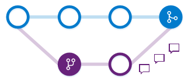
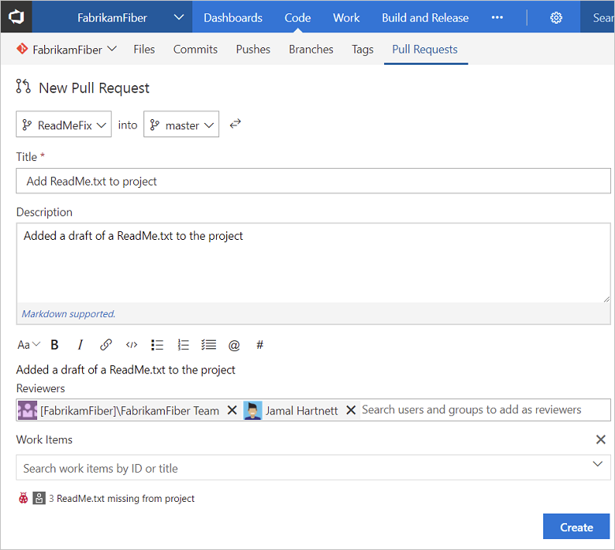

#  Create a pull request

#### VSTS | TFS 2015 & TFS 2017 | Visual Studio 2015 & 2017

[Git's workflow](gitworkflow.md) uses [branches](branches.md) to isolate work until you're ready to merge the changes into your default branch, such as `master`. 
The pull request is the collaborative process that lets the rest of the team discuss changes in a branch and agree to merge them once everyone approves.
Use pull requests to get early feedback from others on work in progress, even if you're not ready to merge the changes into another branch.

In this image, the purple branch is merged into the blue branch through a pull request. The changes are discussed by reviewers in the pull request before the code is merged.
When you complete the pull request, there is a merge commit (seen here as the filled blue commit) where the changes in the purple branch are now [merged](merging.md) in the blue branch. 

In this tutorial you learn how to:

> [!div class="checklist"]
> * Create a pull request
> * Complete a pull request

## Create a pull request

To create a pull request in VSTS:

0. [Push](pushing.md) your local branch.
0. Create a pull request for the branch in VSTS.   

     

0. You can also create a pull request from Visual Studio. Select the **Pull Requests** view when [connected to your Team Project](../../user-guide/connect-team-projects.md) and select **New Pull Request** to open a pull request for your current branch:   

     

0. Create the pull request. You should give a clear title for the pull request that describes the changes in the branch. In the description field give a clear explanation of how the changes are implemented along with any resources that might help reviewers understand the changes. You can include VSTS work items and hyperlinks to allow others to have as much context as possible when reviewing your changes.

0. Add any team member who you would like to review the changes. 

  

### Who reviews the pull request?

When you create the pull request, you can add others who need to review your changes. You can add users and groups to the pull request after it is created if the scope of the
review needs to expand. You can also associate the pull request with a task in VSTS to let others working with the task know changes are ready for review.

### How does the code review work?

Pull request reviewers will see the proposed updates to the branch in the form of file differences between the two branches. Reviewers can add comments on any of the changes and 
include notifications for other team members to answer a question or give other feedback. You can make changes and push commits to resolve issues brought up in the feedback and these 
changes are immediately reflected in the pull request.

If the changes need much more development to complete, you can abandon the pull request. You can later open up a new pull request to
revisit the changes and link to the conversations that took place in the abandoned pull request. 

You can also open up a pull request on a very early version of your code to ask for feedback from others, even if the code isn't ready to merge yet. 
Once you get the team's feedback, you can keep the pull request open to continue the conversation or abandon the pull request until your code is ready to be shared again. 

## Complete a pull request

Once all reviewers have approved the changes, you can now complete the pull request. You'll be prompted for a descriptive message about the changes proposed by the pull
request. You can choose to delete the pull request branch when the pull request is complete. Git retains the commit history in the `master` branch after the pull request is complete, 
so unless you plan on doing more work in the branch, it is safe to remove. 

### What happens when a pull request is merged?
You must resolve any [merge conflicts](merging.md) between the pull request branch the target branch. Git adds
a new commit (the *merge commit*) to the end of the master branch. This merge commit links the earlier history of both the master branch and the commits for the branch
that was merged as part of the pull request.

## Next steps

> [!div class="nextstepaction"]
> [Resolve merge conflicts](merging.md)