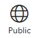

    

    <h1>Azure Devops Services Documentation</h1>
    
Collaborate across your organization with tools designed to start small and scale up as needed. Azure DevOps Services provides free private Git repositories, configurable Kanban boards, interactive backlogs, simple planning tools, high-performance pipelines, and extensive automated and cloud-based load testing.

<h2 id="start">Get Started with Azure Devops</h2>

Start with one service and add others as you need them.  
 
         <ul id="on-boarding" class="cardsY panelContent featuredContent">
            <li>             
                                    

                                        

                                            

                                                

                                                    

                                                        
                                                    

                                                

                                                

                                                    <h3><a href="/vsts/repos/get-started">Repos Get Started Guide</a></h3>
                                                    
Sign up and start developing code with distributed, flexible version control.

                                                

                                            

                                        

                                    

            </li>
            <li>                         
                                    

                                        

                                            

                                                

                                                    

                                                        
                                                    

                                                

                                                

                                                    <h3><a href="/vsts/work/get-started">Agile Get Started Guide</a></h3>
                                                    
Sign up and start using Agile tools to plan and track work.

                                                

                                            

                                        

                                    

            </li>
            <li>                                                
                                   

                                        

                                            

                                                

                                                    

                                                        
                                                    

                                                

                                                

                                                    <h3><a href="/vsts/pipelines/get-started">Pipelines Get Started Guide </a></h3>
                                                    
Sign up and start building and releasing apps with continuous integration and deployment.

                                                

                                            

                                        

                                    

            </li>      
                 </ul> 
<a id="devops-services" />
<h2>Azure Devops Services</h2>

Explore our most popular services with quickstarts, samples, and tutorials.
 
                        <ul id="devops-services-suite" class="cardsY panelContent featuredContent">
                            <li>
                                <a href="/vsts/index-work">
                                    

                                        

                                            

                                                

                                                    

                                                        
                                                    

                                                

                                                

                                                    <h3>Azure DevOps Boards</h3>
                                                    
The tools you need to effectively run your Agile team. Configurable Kanban boards, interactive backlogs, simple planning tools, and out-of-the-box support for Scrum&mdash;all integrated together for unparalleled traceability and reporting.

                                                

                                            

                                        

                                    

                                </a>
                            </li>
                            <li>
                                <a href="/vsts/index-repos">
                                    

                                        

                                            

                                                

                                                    

                                                        
                                                    

                                                

                                                

                                                    <h3>Azure DevOps Repos</h3>
                                                    
Everything you love about Git with free private repositories, pull requests, and code review. Collaborate with coworkers to make your code rock-solid&mdash;then integrate with CI/CD to get your code to production fast.

                                                

                                            

                                        

                                    

                                </a>
                            </li>
                            <li>
                                <a href="/vsts/index-pipelines">
                                    

                                        

                                            

                                                

                                                    

                                                        
                                                    

                                                

                                                

                                                    <h3>Azure DevOps Pipelines</h3>
                                                    
Test and deploy your code to production at lightning speed with high-performance pipelines. Start small and scale up as needed.

                                                

                                            

                                        

                                    

                                </a>
                            </li>
                            <li>
                                <a href="/vsts/index-packages">
                                    

                                        

                                            

                                                

                                                    

                                                        
                                                    

                                                

                                                

                                                    <h3>Sign up for Packages (Artifacts)</h3>
                                                    
Sign up and start using artifacts to support continuous integration and deployment of your apps.

                                                

                                            

                                        

                                    

                                </a>
                            </li>
                            <li>
                                <a href="/vsts/index-test">
                                    

                                        

                                            

                                                

                                                    

                                                        
                                                    

                                                

                                                

                                                    <h3>Azure DevOps Test Center</h3>
                                                    
Test early and often to release your app with confidence. Use Test Center to setup test plans and track and report manual tests, run automated test suites, and run cloud-based load tests.

                                                

                                            

                                        

                                    

                                </a>
                            </li>
                        </ul>
<a id="devops-services-supplemental" />
<h2>Azure Devops Services: Shared Features</h2>

Share information and gain insights using Wikis, Dashboards, and Analytics plus other features available to all Azure DevOps Services. 
 
                        <ul id="overview" class="cardsY panelContent featuredContent">
                            <li>
                                <a href="/vsts/project/project-vision-status">
                                    

                                        

                                            

                                                

                                                    

                                                        
                                                    

                                                

                                                

                                                    <h3>Project Summary</h3>
                                                    
Share your project vision and view cross project activity from the project summary.

                                                

                                            

                                        

                                    

                                </a>
                            </li>
                            <li>
                                <a href="/vsts/report/dashboards/index">
                                    

                                        

                                            

                                                

                                                    

                                                        
                                                    

                                                

                                                

                                                    <h3>Dashboards</h3>
                                                    
Monitor progress and trends to support improvement of team processes.

                                                

                                            

                                        

                                    

                                </a>
                            </li>
                            <li>
                                <a href="/vsts/report/analytics/what-are-analytics-views">
                                    

                                        

                                            

                                                

                                                    

                                                        
                                                    

                                                

                                                

                                                    <h3>Analytics views</h3>
                                                    
Define filter critera to support creation of Power BI reports using the Analytics service.

                                                

                                            

                                        

                                    

                                </a>
                            </li>
                            <li>
                                <a href="/vsts/project/wiki/index">
                                    

                                        

                                            

                                                

                                                    

                                                        
                                                    

                                                

                                                

                                                    <h3>READMEs &amp; Wikis</h3>
                                                    
Share information with your team and stakeholders.

                                                

                                            

                                        

                                    

                                </a>
                            </li>
                            <li>
                                <a href="/vsts/project/navigation/preview-features">
                                    

                                        

                                            

                                                

                                                    

                                                        
                                                    

                                                

                                                

                                                    <h3>Navigation Basics</h3>
                                                    
Choose an app, team, project or setting. Add work items, dashboards, and other artifacts.

                                                

                                            

                                        

                                    

                                </a>
                            </li>  
                            <li>
                                <a href="/vsts/report/powerbi/index">
                                    

                                        

                                            

                                                

                                                    

                                                        
                                                    

                                                

                                                

                                                    <h3>Power BI</h3>
                                                    
Use Power BI to drive ad hoc analysis, produce beautiful reports, and publish them for enterprise consumption.

                                                

                                            

                                        

                                    

                                </a>
                            </li>
                            <li>
                                <a href="/vsts/project/search/index">
                                    

                                        

                                            

                                                

                                                    

                                                        
                                                    

                                                

                                                

                                                    <h3>Search</h3>
                                                    
Quickly find the code or work items you need to access across your account
                                                        or collection.

                                                

                                            

                                        

                                    

                                </a>
                            </li>
                            <li>
                                <a href="/vsts/notifications/index">
                                    

                                        

                                            

                                                

                                                    

                                                        
                                                    

                                                

                                                

                                                    <h3>Notifications</h3>
                                                    
Define which events generate alerts or post messages in third party tools.

                                                

                                            

                                        

                                    

                                </a>
                            </li>
                            <li>
                                <a href="/vsts/organizations/public/index">
                                    

                                        

                                            

                                                

                                                    

                                                        
                                                    

                                                

                                                

                                                    <h3>Public Projects</h3>
                                                    
Open your projects for wider collaboration.

                                                

                                            

                                        

                                    

                                </a>
                            </li>  
                        </ul>
<a id="devops-services-settings" />
<h2>Azure Devops Services: Administrative Settings</h2>

Configure and customize resources to support your development, deployment, planning, and tracking. 
 
                        <ul id="settings" class="cardsY panelContent featuredContent">
                            <li>
                                <a href="/vsts/organizations/settings/index">
                                    

                                        

                                            

                                                

                                                    

                                                        
                                                    

                                                

                                                

                                                    <h3>Project Management</h3>
                                                    
Add, rename, and delete projects. 

                                                

                                            

                                        

                                    

                                </a>
                            </li>  
                            <li>
                                <a href="/vsts/organizations/settings/index">
                                    

                                        

                                            

                                                

                                                    

                                                        
                                                    

                                                

                                                

                                                    <h3>Project &amp; Organization Settings</h3>
                                                    
Configure resources for Azure Devops services.

                                                

                                            

                                        

                                    

                                </a>
                            </li>   
                            <li>
                                <a href="/vsts/organizations/security/index">
                                    

                                        

                                            

                                                

                                                    

                                                        
                                                    

                                                

                                                

                                                    <h3>Security &amp; Identity</h3>
                                                    
Manage permissions and access to your team projects and repositories.
                                                        

                                                

                                            

                                        

                                    

                                </a>
                            </li>
                           <li>
                                <a href="/vsts/organizations/accounts/index">
                                    

                                        

                                            

                                                

                                                    

                                                        
                                                    

                                                

                                                

                                                    <h3>Account Management</h3>
                                                    
Setup and manage your account and configure key settings to support your
                                                        teams.

                                                

                                            

                                        

                                    

                                </a>
                            </li>                     
                            <li>
                                <a href="/vsts/organizations/settings/work/inheritance-process-model">
                                    

                                        

                                            

                                                

                                                    

                                                        
                                                    

                                                

                                                

                                                    <h3>Customization</h3>
                                                    
Configure Agile tools and processes to meet your team's needs.

                                                

                                            

                                        

                                    

                                </a>
                            </li>
                            <li>
                                <a href="/vsts/organizations/settings/about-teams-and-settings">
                                    

                                        

                                            

                                                

                                                    

                                                        
                                                    

                                                

                                                

                                                    <h3>Scale &amp; Configure Teams</h3>
                                                    
Add teams and team administrators; configure team settings.

                                                

                                            

                                        

                                    

                                </a>
                            </li>    
                            <li>
                                <a href="/vsts/billing/index">
                                    

                                        

                                            

                                                

                                                    

                                                        
                                                    

                                                

                                                

                                                    <h3>Billing</h3>
                                                    
Manage subscriptions, extension purchases, and Azure Active Directory.

                                                

                                            

                                        

                                    

                                </a>
                            </li>
                            <li>
                                <a href="/vsts/marketplace/index">
                                    

                                        

                                            

                                                

                                                    

                                                        
                                                    

                                                

                                                

                                                    <h3>Manage Extensions</h3>
                                                    
Install or remove Marketplace extensions.

                                                

                                            

                                        

                                    

                                </a>
                            </li>
                        </ul>
<a id="devops-services-extensions" />
<h2>Azure Devops Services: Marketplace and Extensions</h2>

Discover, install, and build add-ons to customize and extend your Azure DevOps Experiences. 
 
                        <ul id="integration" class="cardsY panelContent featuredContent">
                            <li>
                                <a href="/vsts/marketplace/overview">
                                    

                                        

                                            

                                                

                                                    

                                                        
                                                    

                                                

                                                

                                                    <h3>Discover Extensions</h3>
                                                    
Browse the Visual Studio Marketplace and discover extensions for Azure Devops.

                                                

                                            

                                        

                                    

                                </a>
                            </li>
                            <li>
                                <a href="/vsts/extend/index">
                                    

                                        

                                            

                                                

                                                    

                                                        
                                                    

                                                

                                                

                                                    <h3>Develop Extensions</h3>
                                                    
Extend Azure Devops with custom web experiences, CI/CD tasks, and more.

                                                

                                            

                                        

                                    

                                </a>
                            </li>
                            <li>
                                <a href="/vsts/integrate/index">
                                    

                                        

                                            

                                                

                                                    

                                                        
                                                    

                                                

                                                

                                                    <h3>Build Apps</h3>
                                                    
Programmatically integrate with Azure Devops from custom apps and services.

                                                

                                            

                                        

                                    

                                </a>
                            </li>
                            <li>
                                <a href="/vsts/service-hooks/index">
                                    

                                        

                                            

                                                

                                                    

                                                        
                                                    

                                                

                                                

                                                    <h3>Service Hooks</h3>
                                                    
Create subscriptions and configure the integration of Azure Devops with
                                                        third-party apps.

                                                

                                            

                                        

                                    

                                </a>
                            </li>
                            <li>
                                <a href="/vsts/report/extend-analytics/index">
                                    

                                        

                                            

                                                

                                                    

                                                        
                                                    

                                                

                                                

                                                    <h3>Extend Analytics with OData</h3>
                                                    
Use the Analytics Service OData API's to create custom visualizations and reports.

                                                

                                            

                                        

                                    

                                </a>
                            </li>
                            <li>
                                <a href="/rest/api/vsts/index">
                                    

                                        

                                            

                                                

                                                    

                                                        
                                                    

                                                

                                                

                                                    <h3>REST APIs</h3>
                                                    
Interact with Azure Devops through standard REST APIs.

                                                

                                            

                                        

                                    

                                </a>
                            </li>
                            <li>
                                <a href="/vsts/extend/reference/client/core-sdk/index">
                                    

                                        

                                            

                                                

                                                    

                                                        
                                                    

                                                

                                                

                                                    <h3>TypeScript APIs</h3>
                                                    
Interact with Azure Devops through TypeScript APIs.

                                                

                                            

                                        

                                    

                                </a>
                            </li>
                        </ul>
                    </li>
                </ul>
     

<a href="/vsts/index-all">
<h2>Azure Devops Services Index</h2>
</a>
