[//]: # (monikerRange: '>= tfs-2017')

# Create a Java project release definition for continuous deployment with VSTS

In this exercise, you are going to create a Release Definition that will start the container images from the build lab. You will then create an Azure Container Service (ACS) and modify the Release to start containers in ACS.

> [!NOTE]
> These Hands-On Labs use a virtual machine with a Java environment configured by our partner, [Northwest Cadence](https://www.nwcadence.com/).
>
> **[Learn how to connect to the Java VM environment here](https://github.com/nwcadence/java-dev-vsts)**.

## Prerequisites

This exercise assumes you have completed the exercises to create a Team Project and have set up the Docker private VSTS agent. You should also have set up Maven package management and have a MyShuttleCalc package in the feed and created a build that creates and publishes Docker images to the Azure Container Registry. This exercise uses a team project named **jdev**, though your team project name may differ.

## Install a Marketplace Extension

In this task you will install a VSTS extension from the [VSTS Marketplace](https://marketplace.visualstudio.com/vsts). This extension contains build and release tasks - you are going to use the ReplaceTokens task in the Release.

1. Connect to the virtual machine with the user credentials which you specified when creating the VM in Azure.

1. Open Chrome and browse to `http://<youraccount>.visualstudio.com` (where `youraccount` is the account you created in VSTS).

1. Click on the shopping bag icon on the upper right and select "Browse Marketplace".

    

1. In the search toolbar, type "replacement" and press enter. You should see "Colin's ALM Corner Build & Release Tools" in the results.

    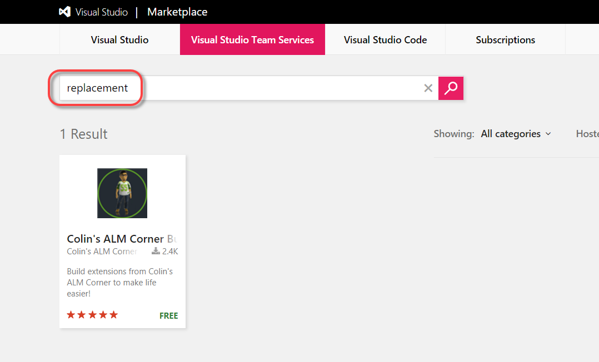

1. Click on "Colin's ALM Corner Build & Release Tools". Then click on the Install button.

    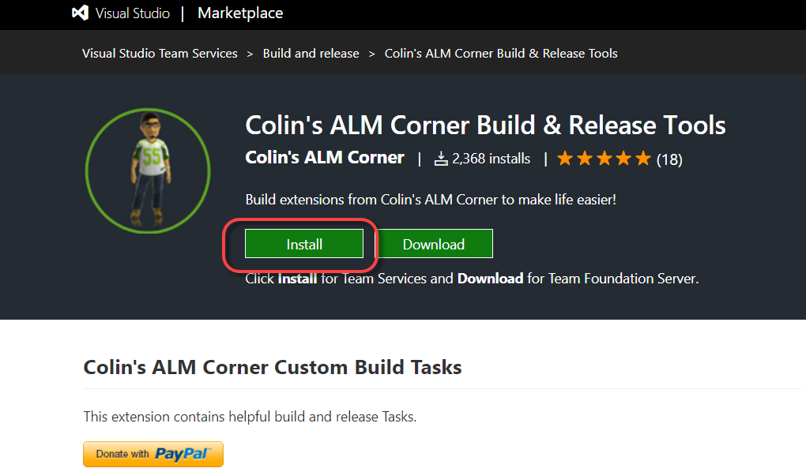

1. In the dialog that appears, ensure that your VSTS account is selected and click Continue. Once your permissions have been verified, click the Confirm button.

## Create a Release Definition

In this task you will create a Release Definition with a single environment called AzureVM. You will configure the release to run the MyShuttle application containers (one is a mysql container with the database and the second is a tomcat container running the MyShuttle war). You will also add an integration test run that will ensure that the app is working correctly.

1. Connect to the virtual machine with the user credentials which you specified when creating the VM in Azure.

1. Open Chrome and browse to `http://<youraccount>.visualstudio.com` (where `youraccount` is the account you created in VSTS).

1. Click on the `jdev` team project to navigate to it.

1. Under the "Build and Releases" hub, click on "Releases" and click the button in the page to create a new release definition.

    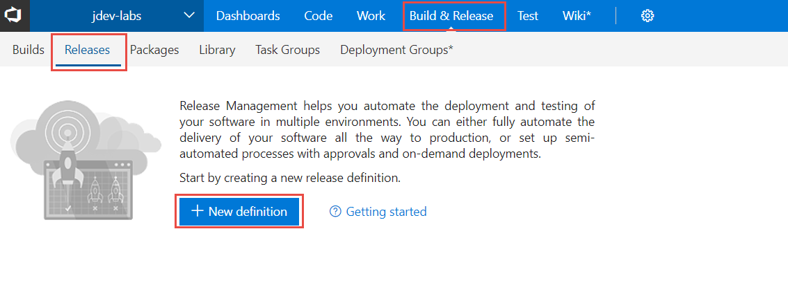

1. In the template flyout (on the right side), select an empty process as the template for the release definition.

    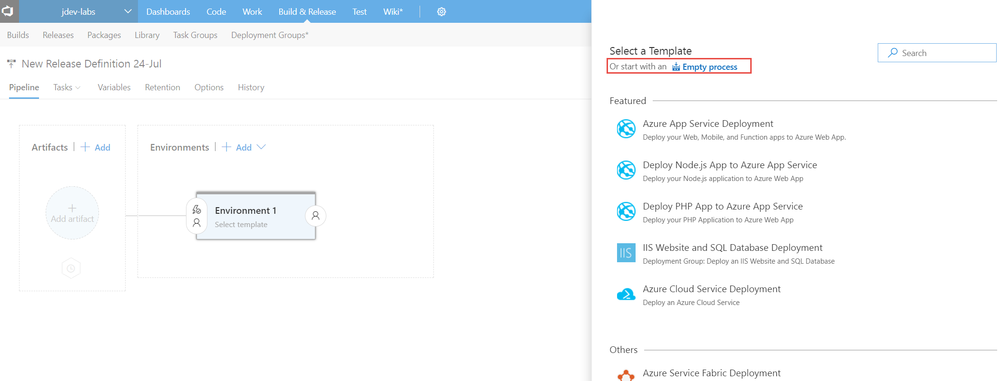

1. Click on Environment1 to open the properties flyout. Change the name to "AzureVM".

    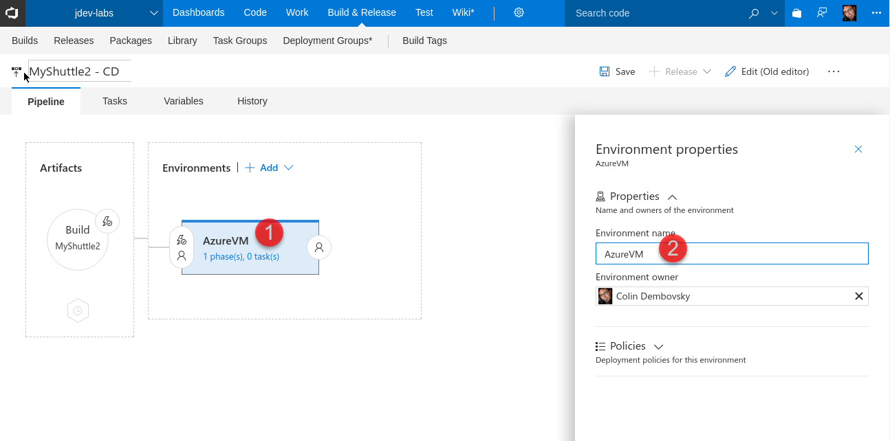

1. In the "Artifacts" component of the release definition, click on the "Add artifact" button to add a build definition as an artifact source to the release definition.

    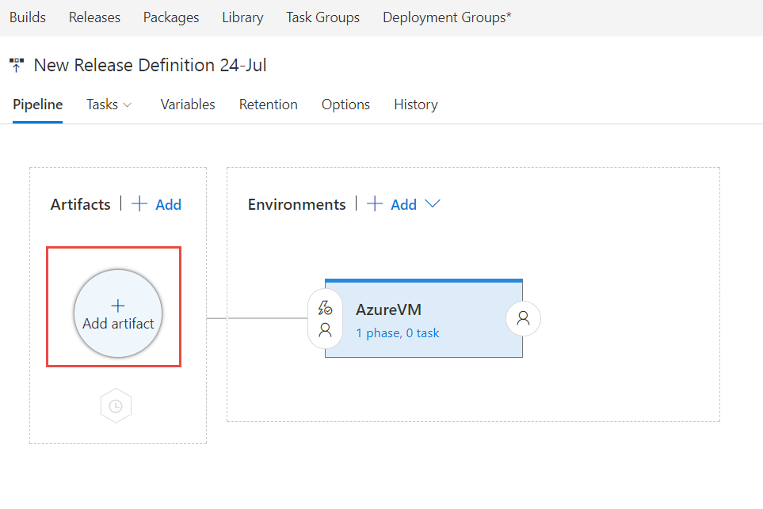

1. In the Artifacts flyout, choose the MyShuttle2 build definition as the artifact, keep the default version as latest and the default value of the source alias. Then press the "Add" button.

    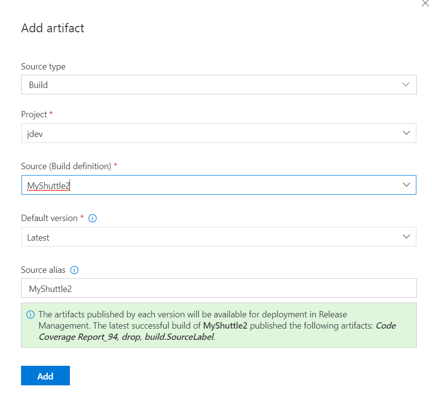

1. Click in the name of the release definition and rename it.

    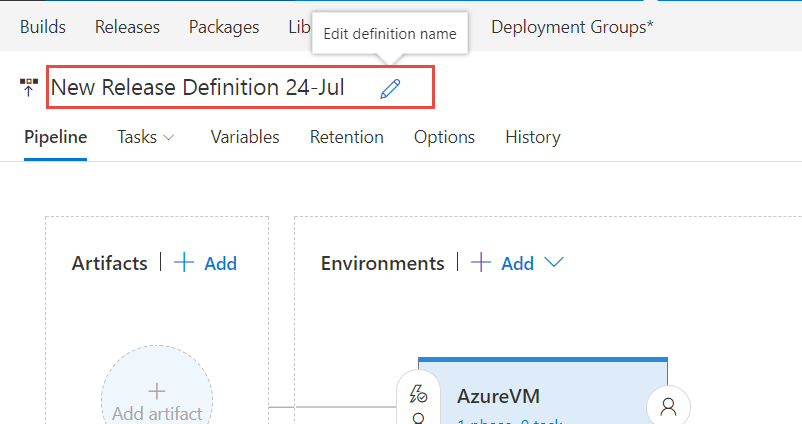

1. Click on the trigger icon on the Build Artifact. In the property flyout, ensure that the Continuous Deployment trigger is enabled. Set the branch filter to master so that only builds from the master branch trigger the deployment automatically.

    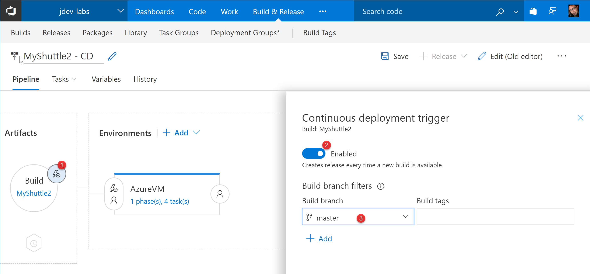

1. Click the link labelled "1 phase(s), 0 task(s)" in the AzureVM environment card to open the phases/tasks editor for the environment.

1. Click on the "Agent Phase" row and change the Queue to "default" so that your private agent executes the release tasks for this phase of the release.

    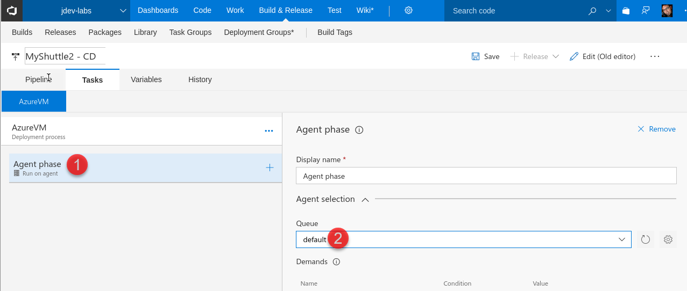

1. Click the "+" icon on the phase to add a new task. Type "replace" in the search box. Add a "Replace Tokens" task.

1. Set the following properties for the Replace Tokens task:

    | Parameter | Value | Notes |
    | --------------- | ---------------------------- | ----------------------------------------------------------- |
    | Source Path | `$(System.DefaultWorkingDirectory)/MyShuttle2/drop` | The path in which to search for tokenized files |
    | Target File Pattern | `*.release.*` | The file pattern to use to find tokenized files in the Source Path |

    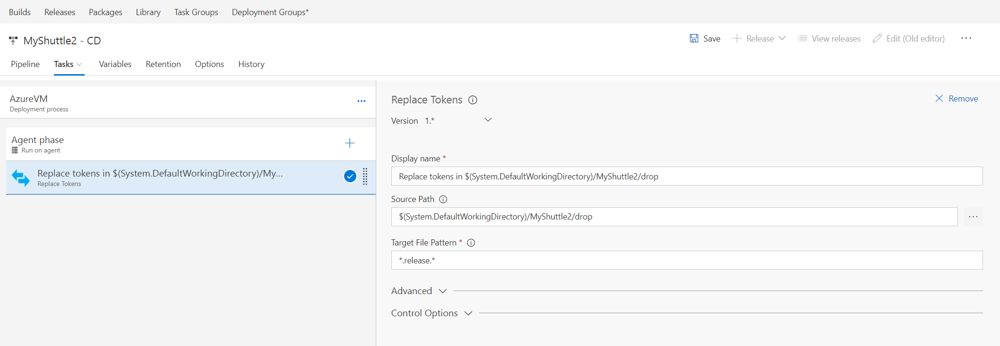

    > **Note**: There are 2 tokenized files that the release will take advantage of, both of which live in the root of the MyShuttle2 repo. The build process published these files so that they are available as outputs of the build, ready for use in the Release process. `docker-compose.release.yml` contains tokens for the host port, container image names and tags.  `testng.release.xml` contains tokens for the baseUrl to test. These tokenized files make it possible to "Build Once, Deploy Many Times" since they separate the environment configuration and the binaries from the build. The Replace Tokens task inject release variables (which you will define shortly) into the tokens in the files.

1. Click the "+" icon on the phase to add a new task. Type "docker" in the search box. Add a "Docker Compose" task.

1. Set the following properties for the Docker Compose task:

    | Parameter | Value | Notes |
    | --------------- | ---------------------------- | ----------------------------------------------------------- |
    | Container Registry Type | Azure Container Registry | The release will get images from an Azure Container Registry |
    | Azure subscription | `<your sub>` | The subscription with your Azure Container Registry |
    | Azure Container Registry | `<your acr>` | The container registry you created in a previous lab |
    | Docker compose file | `$(System.DefaultWorkingDirectory)/MyShuttle2/drop/docker-compose.release.yml` | The compose file to use for the release |
    | Action | Run service images | Sets the action to perform (in this case an `up` command) |
    | Build Images | Unchecked | Use the images that were built in the build process |

    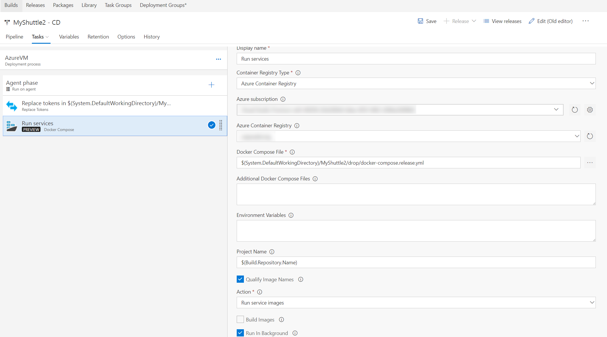

    > **Note**: This task will start the 2 container apps in the docker engine of the host VM.

1. Click the "+" icon on the phase to add a new task. Type "command" in the search box. Add a "Command Line" task.

1. Set the following properties for the Command Line task:

    | Parameter | Value | Notes |
    | --------------- | ---------------------------- | ----------------------------------------------------------- |
    | Tool | `java` | Invoke java |
    | Arguments | `-cp myshuttledev-tests.jar:test-jars/* org.testng.TestNG ../testng.release.xml` | Arguments for the java command to invoke the integration tests |
    | Advanced/Working folder | `$(System.DefaultWorkingDirectory)/MyShuttle2/drop/target` | Run the command in the correct folder |

    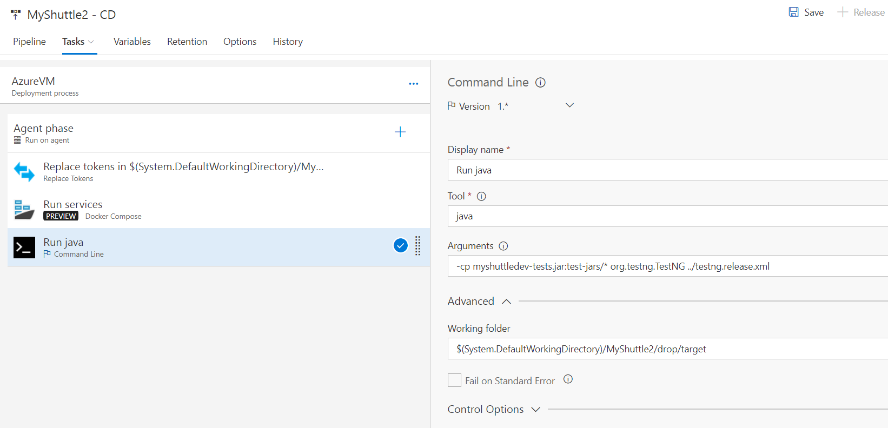

    > **Note**: This command invokes Java to run testNG tests. The run uses the `testng.release.xml` file which at this point in the release contains the correct `baseUrl` for the tests. If the tests fail, the release will fail.

1. Click the "+" icon on the phase to add a new task. Type "publish test" in the search box. Add a "Publish Test Results" task.

1. Set the following properties for the Publish Test Results task:

    | Parameter | Value | Notes |
    | --------------- | ---------------------------- | ----------------------------------------------------------- |
    | Test results files | `**/TEST-*.xml` | Invoke java |
    | Control Options/Continue on error | Checked | Uploads the results even if the tests from the previous step fail. |

    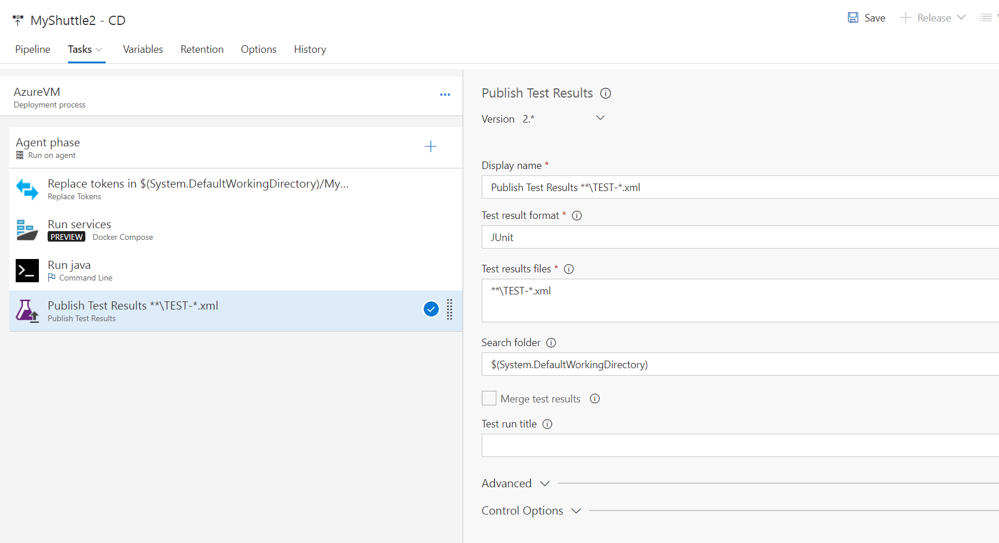

    > **Note**: This command grabs the JUnit test results file from the test run and publishes them to the release so that the test results are available in the Release summary.

1. You should have 4 tasks in this order:

    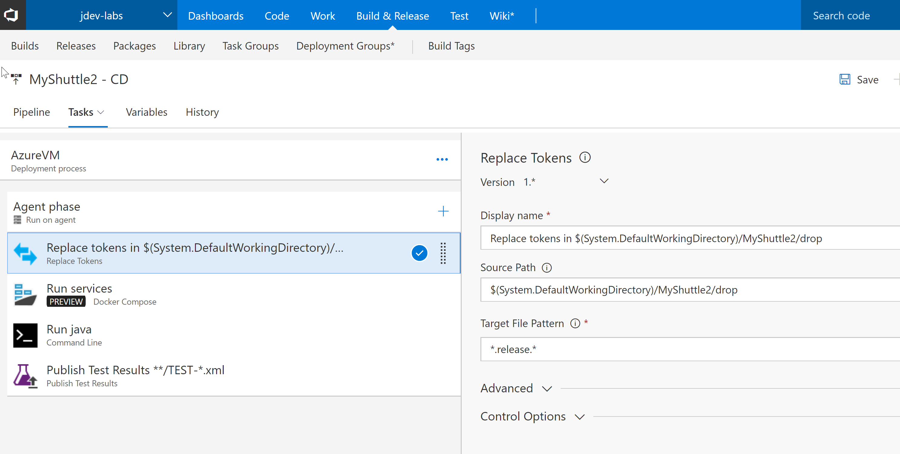

1. Click on the Variables tab. Enter the following variables and scopes:

    | Name | Value | Scope | Notes |
    | --------------- | ------------- | ---------------------------- | ----------------------------------------------------------- |
    | baseUrl | `http://10.0.0.4:8081/myshuttledev` | AzureVM | BaseUrl for test run |
    | DbImageName | `<your azure container reg>/db` | Release | Image name of the database container |
    | WebImageName | `<your azure container reg>/web` | Release | Image name of the web container |
    | HostPort | 8081 | AzureVM | The port to expose the web app to on the host |
    | Tag | $(Build.BuildNumber) | Release | The tag to use for the container images - tied to the build number. |

    

    > **Note**: You will need to use your azure container registry (e.g. `cdjavadev.azurecr.io`) in the image variables. Instead of using the `:latest` tag for the images, we explicitly use the build number, which was used to tag the images during the build. This allows us to "roll-forward" to previous tags for the images if we want to revert a release. The scope setting allows us to make variables that live at a release level (Release) or are environment-specific (like AzureVM). If you clone the environment to repeat this release in additional environments, you can just specify new values for the variables for those environments.

1. Click the Save button in the toolbar to save the definition.

1. Click the "+ Release" button and then click Create Release.

    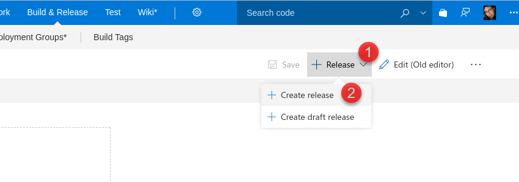

1. Click the queue button on the Create a new release dialog to start the release.

    

1. Click on Logs to view the logs from the release.

    

1. When the release completes, click on the Tests tab and then change the filter to see that the tests all succeeded.

    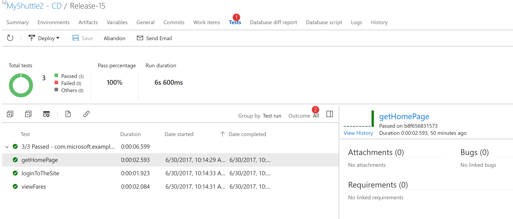

1. In Chrome, browse to `http://localhost:8081/myshuttledev/` to see the site running.

    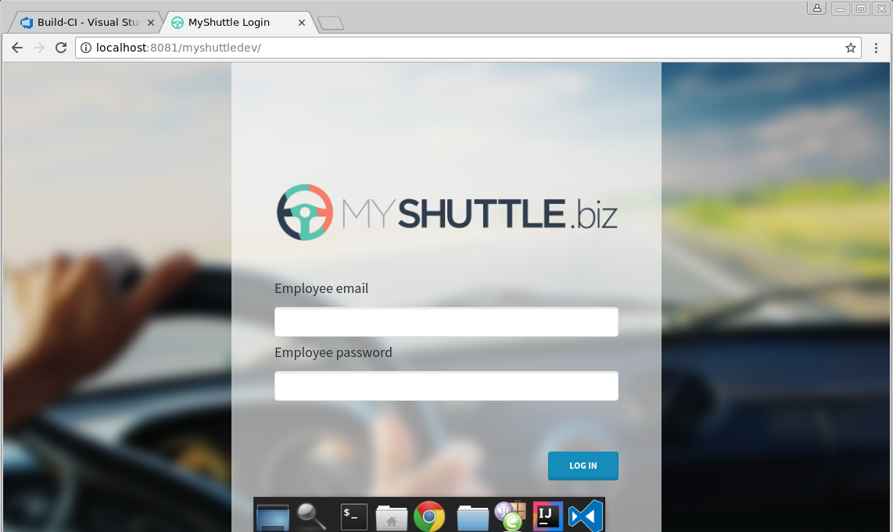

    > **Note**: You can log in by entering username `fred` and password `fredpassword`.
