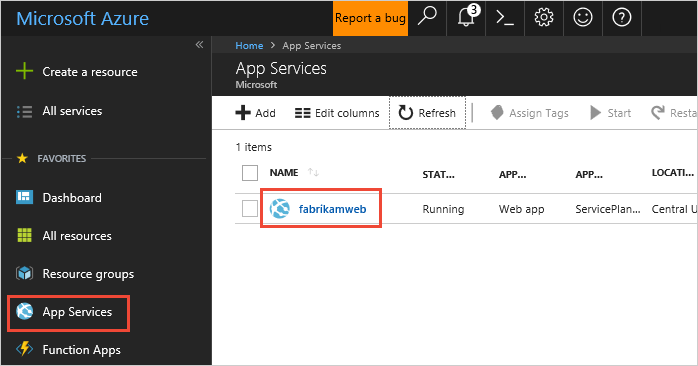
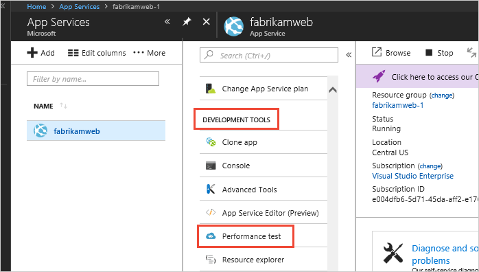
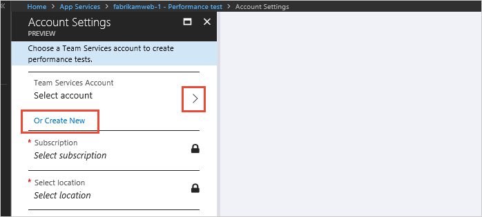
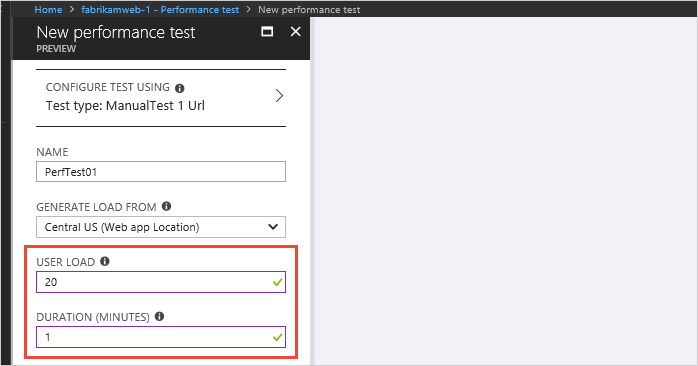
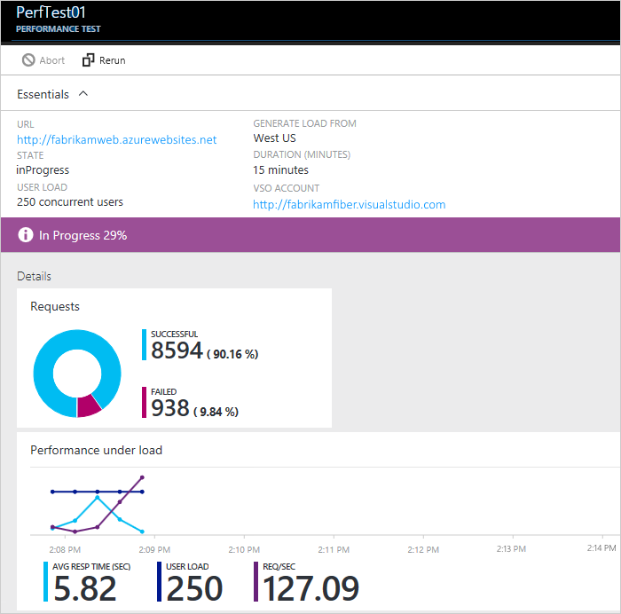
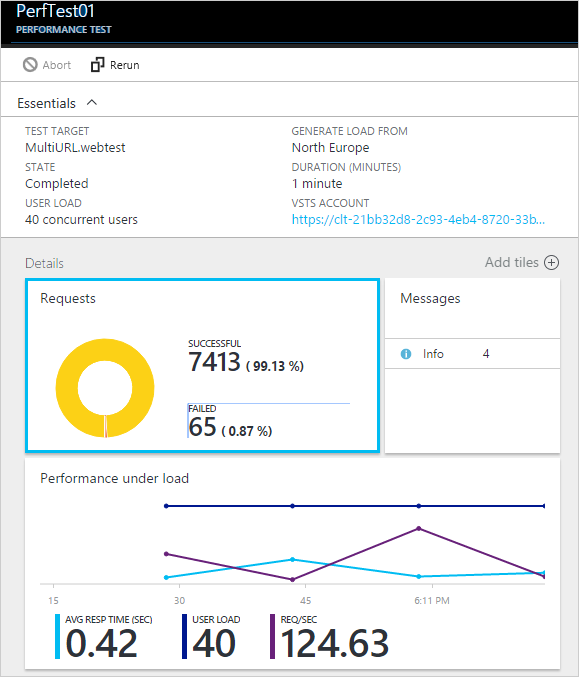
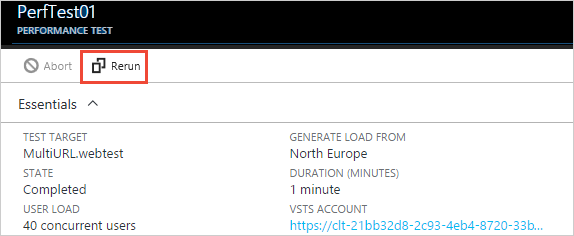

# Load test with the Azure portal

[!INCLUDE [version-header-ts](_shared/version-header-ts.md)] 

Check your web app's performance before you launch it or deploy updates to production. 
That way, you can better assess whether your app is ready for release. Feel more
confident that your app can handle the traffic during peak use or at your next marketing push.

## Prepare your environment

* You'll need an Azure subscription. You can get one free through [Visual Studio Dev Essentials](https://www.visualstudio.com/dev-essentials/).

* You'll need a [Visual Studio Team Services (VSTS)](https://www.visualstudio.com/products/what-is-visual-studio-online-vs) 
  account to keep your performance test history. A suitable account will be created 
  automatically when you set up your performance test. Or you can create a new account 
  or use an existing account if you're the account owner. 
  [What else can I do with a VSTS account?](reference-qa.md#Team ServicesAccount)

* Deploy your app for testing in a non-production environment. 
  Have your app use an App Service plan other than the plan used in production. 
  That way, you don't affect any existing customers or slow down your app in production. 

## Set up and run your performance test

1. Sign in to the [Azure Portal](https://portal.azure.com). 
   To use a VSTS account that you own, 
   sign in as the account owner.

1. Go to your web app.

   

1. In the **DEVELOPMENT TOOLS** section choose **Performance test**.

   
 
1. Now you'll link a [VSTS](https://www.visualstudio.com/products/what-is-visual-studio-online-vs) 
   account to keep your performance test history. Choose **Set Account**.

   

1. If you have a VSTS account to use, select that account. If you don't, create a new account.

   

1. Choose **+ New** to create a new performance test.

   

1. Set the details and run the test. Your web app's default URL is added automatically. 
   You can change the URL to test other pages (HTTP GET requests only). To simulate local conditions and reduce latency, 
   select a location closest to your users for generating load.

   

   You simulate load on your app by generating virtual users (customers) 
   who visit your web site at the same time. This will show how many 
   requests are failing or responding slowly.

   As an example, suppose you have an app that gave out coupons at last year's holiday sale. 
   This event lasted 15 minutes with a peak load of 100 concurrent customers. 
   You want to double the number of customers this year. You also want to improve 
   customer satisfaction by reducing the page load time from 5 seconds to 2 seconds. 
   So, you can test your updated app's performance with 250 users for 15 minutes.

   [What is the maximum test duration and number of concurrent users?](reference-qa.md#qaazure-limits)
   
1. Watch the progress in real time while the test runs. During the first minute, 
   the page loads slower than is required.

   

1. After the test is done, view the final results. You can see that the page loads much faster 
   after the first minute. This helps identify where you might start troubleshooting the problem.

   

## Test multiple URLs

You can also run performance tests incorporating multiple URLs
that represent an end-to-end user scenario by uploading a Visual
Studio Web Test file. Some of the ways you can create a
Visual Studio Web Test file are:

* [Capture traffic using Fiddler and export as a Visual Studio Web Test file](http://docs.telerik.com/fiddler/Save-And-Load-Traffic/Tasks/VSWebTest)
* [Create a load test file in Visual Studio](run-performance-tests-app-before-release.md)

To upload and run a Visual Studio Web Test file:
 
1. Follow the [steps above](#singletest) to open the **New performance test** blade.
   In this blade, choose the CONFIGFURE TEST USING option to open the 
   **Configure test using** blade.  

   

1. Check that the TEST TYPE is set to **Visual Studio Web Test** and select your HTTP Archive file.
   Use the  icon to open the file selector dialog.

   

   After the file has been uploaded, you see the list of URLs to be tested in the URL DETAILS section.
 
1. Specify the user load and test duration, then choose **Run test**.

   

1. After the test has finished, view the results in the two panes. The left pane
   shows the performance information as a series of charts.

   

   The right pane shows a list of failed requests, with the type of error and the number
   of times it occurred.

   

1. Rerun the test by choosing the **Rerun** icon at the top of the right pane.

   

## Next step

> [!div class="nextstepaction"]
> [Add app performance data](get-performance-data-for-load-tests.md)
