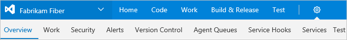

# Configure project and account settings

[!INCLUDE [temp](../_shared/version-vsts-tfs-all-versions.md)]

You use the administrative context to set team, team project, and account or collection settings. The hubs and pages available change based on what level of administrative context you're in. 

>[!NOTE]  
>The images you see from your web portal may differ from the images you see in this topic. These differences result from updates made to VSTS or your on-premises TFS and [options that you or your admin have enabled](../collaborate/preview-features.md?toc=/vsts/user-guide/toc.json&bc=/vsts/user-guide/breadcrumb/toc.json). However, the basic functionality available to you remains the same unless explicitly mentioned.  

>[!NOTE]  
>**Feature availability**: The features available to you depend on the platform (VSTS or on-premises TFS), TFS version, features enabled for your team project or collection, and your access level. New features are deployed regularly to VSTS. Many of these features are then made available to [on-premises TFS through regular updates](/vsts/release-notes/index).  

To get started, from a [supported web browser](../tfs-server/requirements.md#browsers) enter the following URL:

**VSTS:**
	<pre><code>https://<i>AccountName</i>.visualstudio.com/DefaultCollection/<i>ProjectName</i> </code></pre>

**TFS (on-premises):**   
	<pre><code>http://<i>ServerName</i>:8080/tfs/DefaultCollection/<i>ProjectName</i></code></pre>

>[!NOTE]  
>For TFS, the TFS administrator can configure the following elements: protocol (*https* vs *http*), port (*8080*), virtual directory (*tfs*), and collection name (*DefaultCollection*) (See [Web site settings and security](../security/websitesettings.md).) For example, a deployment configured on port 443 with no vdir, an FQDN, and a custom collection name might look like: *https://tfs.contoso.com/CustomCollection/ProjectName*. If the above pattern doesn't work for you, check with your TFS administrator.    
 
The web portal is one of several clients that can connect to a team project. Different clients support different features and functions. For a list of all clients that connect to VSTS or TFS, see [Tools and clients that connect to VSTS and TFS](tools.md?toc=/vsts/user-guide/toc.json&bc=/vsts/user-guide/breadcrumb/toc.json). 
 

## Settings   
You use the administrative context to set team, team project, and account or collection settings. The hubs and pages available change based on what level of administrative context you're in. 
 
  

## Administrative context and team, team project, and account/collection settings

From a user context, open the admin context by clicking the  gear Settings icon. The tabs and pages available differ depending on which admin context you access.

Below we show the admin context for the team project level. 

<a id="admin-intro" />

<a id="admin-intro-team-services" />  
**VSTS, TFS 2017.2** 

Open any admin page by clicking it's name. Click or hover over the gear icon to access other administrative options. Note that you can click any of the user-context hubs of **Home**, **Code**, **Work**, and so on to return to the user context. 

  

<a id="admin-intro-tfs-2017-1" />
**TFS 2017.1**  

Open any admin page by clicking it's name. Hover your mouse over a hub to access a drop-down menu of pages and other options for that hub. Click or hover over the gear icon to access other administrative options. Note that you can click any of the user-context hubs of **Home**, **Code**, **Work**, and so on to return to the user context.   

  
 

<a id="admin-intro-tfs-2017" /> 
**TFS 2017**  

Open any admin page by clicking it's corresponding hub. Hover your mouse over a hub to access a drop-down menu of pages and other options for that hub. Click or hover over the gear icon to access other administrative options. Note that you can click any of the user-context hubs of **Home**, **Code**, **Work**, and so on to return to the user context. 

  

<a id="admin-intro-tfs-2015" />

**TFS 2015, TFS 2013**  
Open any admin page by clicking it's corresponding hub.  
 
   

From within the admin context,  click one of the breadcrumb links to access the settings available at the account/collection, team project, or team level.

  
   

You must be a member of the listed administrator group or role to perform the tasks listed.  

> [!div class="mx-tdBreakAll"]  
> |Team settings|Team project settings|  
> |-------------|----------| 
> |Required membership: [Team administrator role](../work/scale/add-team-administrator.md)  - [Overview: Add team members](../work/scale/multiple-teams.md)  &#124; [Add team admins](../work/scale/add-team-administrator.md) - [Select backlog levels](../work/customize/select-backlog-navigation-levels.md) &#124; [Set working days](../work/scale/capacity-planning.md)  &#124; [Working with bugs](../work/customize/show-bugs-on-backlog.md) - [Work/Iterations & Areas (team defaults)](../work/scale/set-team-defaults.md) - [Work/Templates](../work/backlogs/work-item-template.md) - [Security (manage team-level permissions)](../work/scale/team-administrator-permissions.md) - [Notifications](../collaborate/manage-team-notifications.md)  For a complete overview of all team assets that you can configure, see  [Manage team assets](../work/scale/manage-team-assets.md) |Required membership:  [Project Administrators](../accounts/add-administrator-team-project.md)  -  [Overview: Add teams](../work/scale/multiple-teams.md) - [Work/Iterations & Areas (project-wide)](../work/customize/set-area-paths.md) - [Security (manage project-level permissions)](../security/permissions.md#team-project-level-permissions) - [Notifications](../collaborate/manage-team-notifications.md) - [Version Control (manage repository permissions)](../security/permissions.md#git-repository) - [Agent queues](../build-release/concepts/agents/pools-queues.md) - [Service hooks](../service-hooks/services/webhooks.md) - [Services](../build-release/concepts/library/service-endpoints.md) - [Test (manage test retention policies](../manual-test/getting-started/how-long-to-keep-test-results.md) 

> [!div class="mx-tdBreakAll"]  
> |Account settings (VSTS)|Collection settings (TFS)|  
> |-------------|----------| 
> |Required membership: [Project Collection Administrators](../security/set-project-collection-level-permissions.md?toc=/vsts/security/toc.json&bc=/vsts/security/breadcrumb/toc.json)  - [Overview: Create team projects](../accounts/create-team-project.md?toc=/vsts/accounts/toc.json&bc=/vsts/accounts/breadcrumb/toc.json)  &#124; [Rename team project](../accounts/rename-team-project.md?toc=/vsts/accounts/toc.json&bc=/vsts/accounts/breadcrumb/toc.json) [Delete team project](../accounts/delete-team-project.md?toc=/vsts/accounts/toc.json&bc=/vsts/accounts/breadcrumb/toc.json) &#124; [Change process](../work/customize/process/manage-process.md?toc=/vsts/work/customize/toc.json&bc=/vsts/work/customize/breadcrumb/toc.json) - [Settings: Set account preferences](../accounts/account-preferences.md?toc=/vsts/user-guide/toc.json&bc=/vsts/user-guide/breadcrumb/toc.json) &#124; [Change application access policies](../accounts/change-application-access-policies-vs.md?toc=/vsts/accounts/toc.json&bc=/vsts/accounts/breadcrumb/toc.json) [Change account owner](../accounts/change-account-ownership-vs.md?toc=/vsts/accounts/toc.json&bc=/vsts/accounts/breadcrumb/toc.json) &#124; [Delete your account](../accounts/delete-your-vsts-account.md?toc=/vsts/accounts/toc.json&bc=/vsts/accounts/breadcrumb/toc.json) &#124; [Recover your account](../accounts/recover-your-vsts-account.md?toc=/vsts/accounts/toc.json&bc=/vsts/accounts/breadcrumb/toc.json) - [Security (manage collection-level permissions)](../security/set-project-collection-level-permissions.md?toc=/vsts/security/toc.json&bc=/vsts/security/breadcrumb/toc.json) - [Process (customize work tracking)](../work/customize/process/manage-process.md?toc=/vsts/work/customize/toc.json&bc=/vsts/work/customize/breadcrumb/toc.json) - [Build (manage build policies)](../build-release/concepts/policies/retention.md) - [Agent pools (manage build agents)](../build-release/concepts/agents/pools-queues.md) (VSTS) - [Extensions (install/manage extensions)](../marketplace/install-vsts-extension.md) | Required membership: [Project Collection Administrators](../security/set-project-collection-level-permissions.md)  - [Overview: Create team projects](../accounts/create-team-project.md?toc=/vsts/accounts/toc.json&bc=/vsts/accounts/breadcrumb/toc.json)  &#124; [Rename team project](../accounts/rename-team-project.md?toc=/vsts/accounts/toc.json&bc=/vsts/accounts/breadcrumb/toc.json) &#124; [Delete team project](../accounts/delete-team-project.md?toc=/vsts/accounts/toc.json&bc=/vsts/accounts/breadcrumb/toc.json) - [Security (manage collection-level permissions)](..//security/set-project-collection-level-permissions.md?toc=/vsts/security/toc.json&bc=/vsts/security/breadcrumb/toc.json) - [Build (manage build policies)](../build-release/concepts/policies/retention.md) - >[Agent queues](../build-release/concepts/agents/pools-queues.md) - [Extensions (install/manage extensions)](../marketplace/install-vsts-extension.md?toc=/vsts/marketplace/toc.json&bc=/vsts/marketplace/breadcrumb/toc.json) |

**Server-level settings (TFS only)**

Required membership: [Team Foundation Administrators](../tfs-server/add-administrator-tfs.md#server) 

- [Overview: Choose team project/team](../work/scale/multiple-teams.md)  
- [Access levels (Stakeholder, Basic, Advanced)](../security/change-access-levels.md)  
- [Extensions (manage)](../marketplace/install-vsts-extension.md)   
- [Agent pools (manage build agents)](../build-release/concepts/agents/pools-queues.md)   

 

<!--- End of Admin context -->

## Related content  

Additional resources you may find of interest:

- [Work effectively from your account home page](../user-guideaccount-home-pages.md?toc=/vsts/user-guide/toc.json&bc=/vsts/user-guide/breadcrumb/toc.json)

