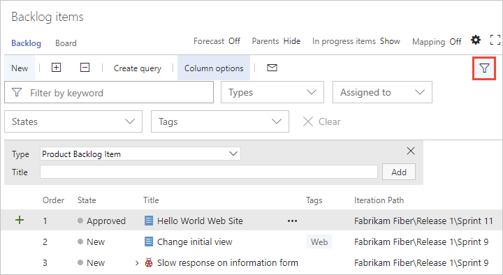
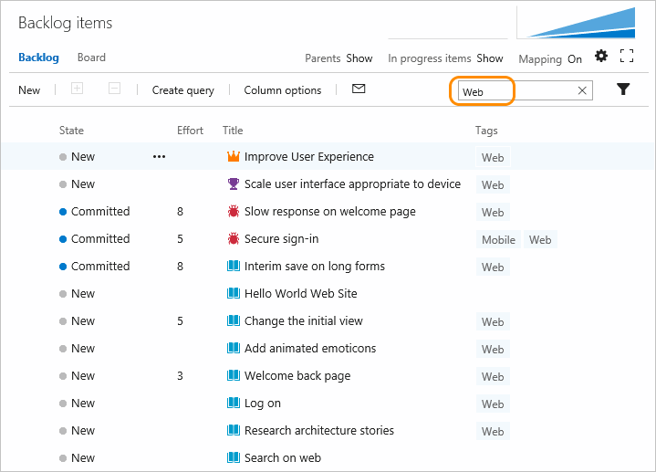

  

# Filter lists and boards 

[!INCLUDE [temp](../_shared/version-vsts-tfs-all-versions.md)] 


You can filter many of your page views using the  filter icon. In this way, you can find the items that are of most interest to you. 

Each view is already filtered based on the team project, team, or repository you've selected. The filter options vary depending on the page you're viewing. Here we show some of the most common filter functions. 


<!--- NEEDS UPDATING BASED ON FEATURES UNDER RELEASE  

How keep this simple; 

Filter audit: 
* Code>Commits: Simple history, Author, From date, To date 
* Code>Pushes
* Code>Branches (Filter icon is there, but doesn't appear active. 
* Code> Pull Request (In active filter icon) - Keyword or ID  
* Code> Pull Request> Search 
* Work>Work Items - Keyword, Types, Assigned to, States, Area, Tags 
* Work> Board (Kanban) - Keyword, Types, Assigned To, Tags, Iteration, Parent Work Item 
* Work>Backlogs - Keyword, Types, Assigned to, States, Tags
* Work>Sprint Backlogs - Keyword, Types, Assigned to, States, Tags
* Work>Taskboard 

--> 

<a id="filter"></a>
 
## Filter lists  

Most directory views provide one or more filter functions. Here we show you how to use filtering to find items of interest to you. 

If you have many items listed in your product or portfolio backlog&mdash;and you want to focus on a subset of them&mdash;you can filter the set. 


## Code: Filter commits, branches, pull requests. 


- [Commit history](../git/commit-history.md) 
- [Working with Git tags](../git/how-to/git-tags.md) 


## Work tracking: Filter your backlogs and boards  
Filter based on keywords or fields (VSTS, TFS 2018)    

On the Work Items, Backlogs, Boards, and Query Results pages, you can filter your view using by typing a keyword or using one or more of the fields provided, such as work item type, assigned to, state, and tags. 

### Keyword filter

Based on the keyword that you enter, the filter function will list work items based on any visible/displayed column or field, including tags. Also, you can enter a value for an ID, whether or not the ID field is visible.  



> [!TIP]    
> The filter criteria ignores the following characters when the field value starts with the character: ```{, (, [, !, @, #, $, %, ^, &, *, ~, `, ', "```. 

The filtered set is always a flat list, even if you've selected to show parents on a backlog page. 


> [!NOTE]   
> Another item to note is that all team backlogs and boards are filtered based on team settings. To learn more, go here. 

<!---
> [!NOTE]   
> **Feature availability**: The ability to filter your backlog or a query based on the Work Item Type, Assigned To, or State fields is available from VSTS. For queries, you must enable the [New Queries Experience](../work/track/queries-preview.md). 


## Filter based on keywords (TFS) 

You can use keywords to filter your backlogs or queries. The filter function lists those work items based on any visible/displayed column or field, including tags, based on the keyword that you enter. Also, you can enter a value for an ID, whether or not the ID field is visible.  

Here, we filter the backlog to only show items that include 'Web' in any one of the displayed column fields. 

  

The filtered set is always a flat list, even if you've selected to show parents.  
-->

### Filter based on work item tags
If you've [added tags to your work items](../work/track/add-tags-to-work-items.md), you can filter your backlogs, Kanban boards, and query results using the  tag filter. For backlogs and query results, add Tags as a column option prior to filtering on tags.  

To learn more about filtering using tags, see [Add tags to work items to categorize and filter lists and boards, Filter lists using tags](../work/track/add-tags-to-work-items.md#filter)
 


## Related notes  
- [Filter your Kanban board](../work/kanban/filter-kanban-board.md)
- [Tags](../work/track/add-tags-to-work-items.md) 
- [Set column options](../work/backlogs/set-column-options.md)  


 
