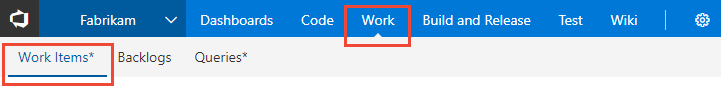

# Navigate to an application or functional area  

When navigating within the VSTS user interface, there are four levels supported:  
- *Account-level*, which supports navigation to a team project or repository that you have access to providing "me pages"   
- *Team project or repository level*, which supports navigation to one or more applications or functional views for a team project   
- *Within a functional view*, you may then have a choice of options to select a specific artifact depending on the functional area you've selected  
- *Settings*, which supports an administrative context for configuring settings at the account/collection or team project level   
- *Account profile*, which supports setting personal preferences, notifications, and enabling/disabling preview features   

## Open an application 
<--- Support horizontal navigation --> 

In horizontal navigation mode, you navigate to a different application by clicking one of the hubs in the horizonal blue bar. 

Within a hub, you then select a page within the horizontal tabs available.

<---Optionally, you can choose a page to open from the hub menu of options. --> 

<--- Support vertical navigation --> 

In vertical navigation mode, you navigate to a different application by clicking the  waffle icon and then selecting from one of the applications listed.  

Within an application, you navigate to different functional areas by clicking one of the tabs provided in the vertical pane.  

 
Guide to navigating within the web portal for Visual Studio Team Services (VSTS) and Team Foundation Server (TFS). 

The web portal provides support for teams to collaborate through the planning, development, and release cycles. You use the web portal to perform both software development and administrative tasks.  

You can manage source code, plan and track work, define builds, run tests, and manage releases. The web portal connects you to the team project defined for an account in Visual Studio Team Services (VSTS) or within an on-premises Team Foundation Server (TFS). 

If you don't have a team project yet, create one in [VSTS](../accounts/create-account-msa-or-work-student.md?toc=/vsts/accounts/toc.json&bc=/vsts/accounts/breadcrumb/toc.json) or set one up in an [on-premises TFS](../accounts/create-team-project.md). If you don't have access to the team project, [get invited to the team](../work/scale/multiple-teams.md#add-team-members).
  
To be written

Now that you have an understanding of how the user interface is structure, it's time to get started using it.  As you can see, there are a lot of features and functionality.  

If all you need is a code repository and bug tracking solution, then start with the [Git get started guide](../git/gitquickstart.md) and [Manage bugs](../work/backlogs/manage-bugs.md?toc=/vsts/work/work-items/toc.json&bc=/vsts/work/work-items/breadcrumb/toc.json).  

To start planning and tracking work, see [Get started with Agile tools to plan and track work](../work/backlogs/overview.md?toc=/vsts/work/work-items/toc.json&bc=/vsts/work/work-items/breadcrumb/toc.json).

## Related content 
- [Configure project and account settings](configure-project-account-settings.md)