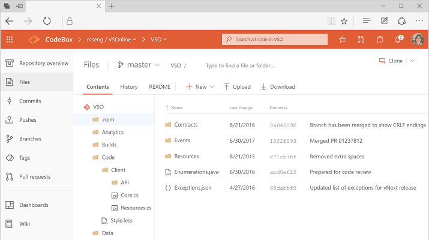
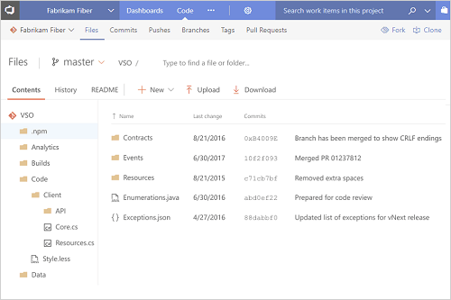
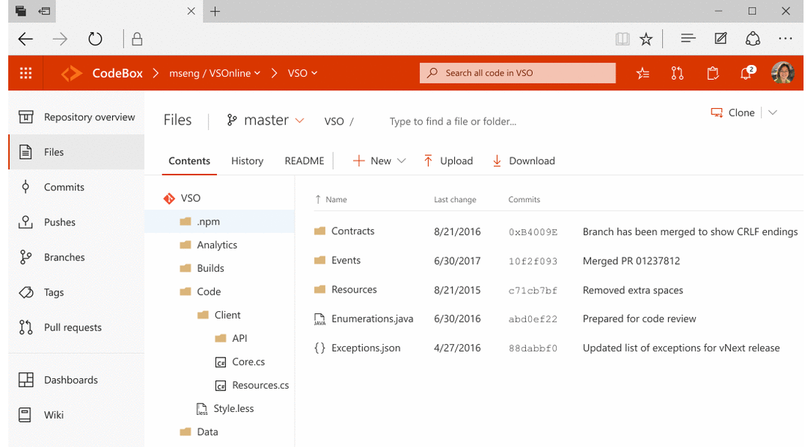

# Navigation basics 

Here's what you need to know to get up and running using Azure CodeX or once of it's apps.  

- **Start page**: use to switch an app or a team project 
- **Search box**: use to find code, work items, or a wiki page 
- **Your profile menu**: use to set personal preferences, notifications, and preview features  
- **Settings**: use to add teams, manage security, and configure other project and account-level elements 

Each app provides you with one or more pages which support a number of features and functional operations. Within a functional view, you may then have a choice of options to select a specific object or artifact, many of which may be associated with a team. 

# [Vertical navigation](#tab/vertical)

**CodeX** uses vertical navigation to select applications&mdash;such as **CodeBox**, **CodeLaunch**, and **CodePlan**&mdash;and pages within those apps. With VSTS, you can choose between vertical and horizontal navigation by selecting the option through [Preview Features](enable-preview-feature.md).

 

# [Horizontal navigation](#tab/horizontal)

**VSTS** and **TFS** uses hortizontal navigation to select an application hub&mdash;such as **Code**, **Work**, and **Build and Release**&mdash;and pages within those apps. With VSTS, you can choose between vertical and horizontal navigation by selecting the option through [Preview Features](enable-preview-feature.md).

 

---

<!---
<table>
<tbody valign="top">
<tr>
<td>
 
</td>
<td>
<ul>
<li>[Add an artifact or team](create-new-artifact-team.md)</li>
<li>[Work with Favorites](work-with-favorites.md)</li>
<li>[Go to a different app, hub, page](go-to-app-hub-page.md)</li>
<li>[Filter basics](filter-basics.md)</li>
<li>[Search across your code base or work items](search-basics.md)</li>
<li>[Enable a preview feature ](enable-preview-feature.md)</li>
<li>[Navigate to a different team project](go-to-team-project.md)</li>
<li>[Switch teams (Dashboards, Work)](../settings/switch-team-context.md?toc=/vsts/navigation/toc.json&bc=/vsts/navigatio/breadcrumb/toc.json)</li>
</ul>
</td>
</tr>
</tbody>
</table>
 

<table>
<tbody valign="top">
<tr>
<td>
 
</td>
<td>
<ul>
<li>[Add an artifact or team](create-new-artifact-team.md)</li>
<li>[Favorites](work-with-favorites.md)</li>
<li>[Go to a different app, hub, page](go-to-app-hub-page.md)</li>
<li>[Filter basics](filter-basics.md)</li>
<li>[Search across your code base or work items](search-basics.md)</li>
<li>[Enable a preview feature](enable-preview-feature.md)</li>
<li>[Navigate to a different app](go-to-app-hub-page.md)</li>
<li>[Navigate to a different team project](go-to-team-project.md)</li>
<li>FAQs</li>
</ul>
</td>
</tr>
</tbody>
</table>

-->

## Resources 

- [Project & Account Settings](../teams/index.md) 
