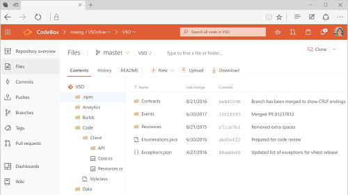

# Navigation basics

[!INCLUDE [temp](../_shared/version-vsts-tfs-all-versions.md)]

<table>
<tbody valign="top">
<tr>
<td>

</td>
<td>
<ul>
<li>[Add an artifact or team](create-new-artifact-team.md).</li>
<li>[Work with Favorites](work-with-favorites.md)</li>    
<li>[Go to a different app, hub, page]( go-to-app-hub-page.md)</li>   
<li>[Filter basics](filter-basics.md)</li>
<li>[Search across your code base or work items](search-basics.md)</li>
<li>[Enable a preview feature ](enable-preview-feature.md)</li>
<li>[Navigate to a different team project](go-to-team-project.md)</li> 
<li>[Switch teams (Dashboards, Work)](../settings/switch-team-context.md?toc=/vsts/navigation/toc.json&bc=/vsts/navigatio/breadcrumb/toc.json)</li>   
</ul>
</td>
</tr>
</tbody>
</table>
 

## Resources 

- [Project & Account Settings](../settings/index.md) 