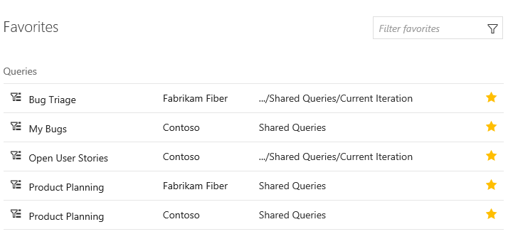
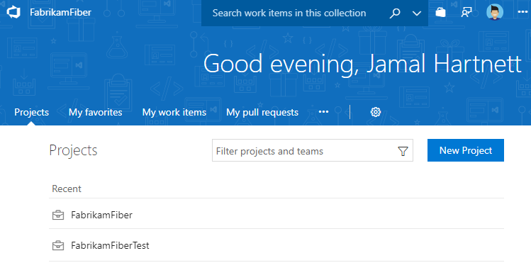

# Work with Favorites  

**VSTS | TFS 2018 | TFS 2017.1**  

> [!NOTE]  
> **Feature availability**: The features described in this topic are available from Visual Studio Team Services (VSTS) and TFS 2017.1 and later versions. To upgrade to TFS 2017.1, go to the [Visual Studio downloads page](https://www.visualstudio.com/downloads/download-visual-studio-vs).  

By favoriting an artifact or view, you can quickly access it. You favorite an item by clicking the  star icon. The favorited item will then show up easily from one or more directory lists.  

You can favorite the following artifacts: 

- Build definitions, 
- Code repositories, 
- Work item queries, and more &mdash   
- Team projects   
- Repositories   
- Work item queries   
- Plans (requires installation of the [Delivery Plans extension](../work/scale/review-team-plans.md))
- Build definitions  
- Test plans

## Favorites: Open items you've marked as Favorites  

Open the **Favorites** page to quickly access any object or item that you've marked as a favorite. 

   

Favorited objects include:

 

## Mark an object as a favorite 

- To mark a team project or team as a favorite, go to the **Projects** page and click the  star icon next to the team or team project.   
<!--- Not supported at account level: To mark a git branch as a favorite, open the **Code>Branches** page and click the  star icon next to the branch you want to add.  -->  
- To mark a query as a favorite, open the **Work>Queries** page and drag the query into the My Favorites area. 
- To mark a plan as a favorite, open the **Work>Plans** page and click the  star icon next to a plan.  
- To mark a build definition as a favorite, open the **Build&Release>All Definitions** page and click the  star icon next to the build definition.    
- To mark a test plan as a favorite, open the **Test>Test Plans** page and click the  star icon next to a test plan from the menu that shows All test plans. 

### Remove an item from your favorites list 
To remove an item from your favorites list, click the  favorited icon. 

   

### Filter the list of favorites  

To filter the list, type a keyword in the *Filter favorites* box. The list will filter based on keyword matches to the title or team project name associated with the favorited item. 

To access these pages, open your web browser and click the  

<b>https://<i>AccountName</i>.visualstudio.com/_projects</b>

You'll see something similar to the following welcome page.

   

 

## Related content

- [Enable preview features](enable-preview-features.md)  

